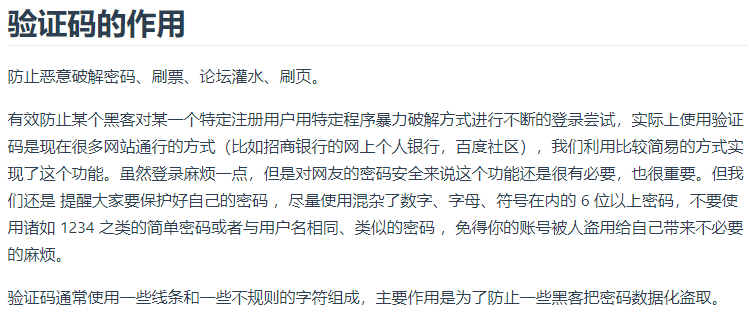
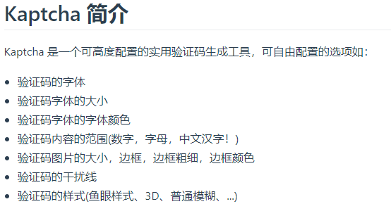
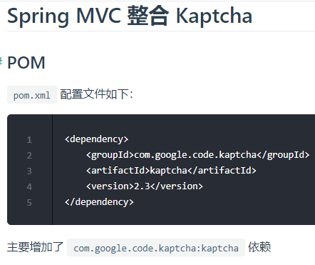
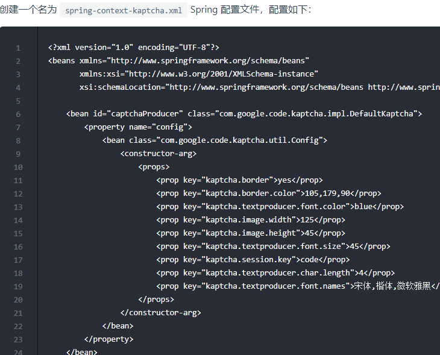
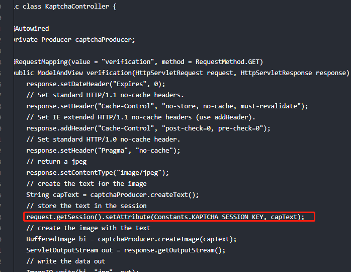
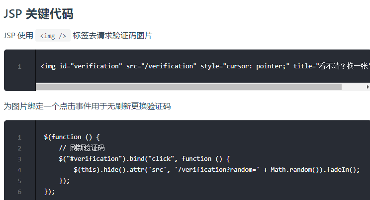

# 验证码

验证码本质上就是一张临时生成的图片：可以使用java.awt.Graphics2D类和java.awt.BufferedImage类绘图生成验证码图片。

> 示例： FirstServletProject

# Kaptcha

Kaptcha是一个基于SimpleCaptcha的验证码开源项目。官网地址：http://code.google.com/p/kaptcha/

## Kaptcha 详细配置表

<table>
    <thead>
        <tr>
            <th>Constant</th>
            <th>描述</th>
            <th>默认值</th>
        </tr>
    </thead>
    <tbody>
        <tr>
            <td>kaptcha.border</td>
            <td>图片边框，合法值：yes , no</td>
            <td>yes</td>
        </tr>
        <tr>
            <td>kaptcha.border.color</td>
            <td>边框颜色，合法值： r,g,b (and optional alpha) 或者 white,black,blue.</td>
            <td>black</td>
        </tr>
        <tr>
            <td>kaptcha.image.width</td>
            <td>图片宽</td>
            <td>200</td>
        </tr>
        <tr>
            <td>kaptcha.image.height</td>
            <td>图片高</td>
            <td>50</td>
        </tr>
        <tr>
            <td>kaptcha.producer.impl</td>
            <td>图片实现类</td>
            <td>com.google.code.kaptcha.impl.DefaultKaptcha</td>
        </tr>
        <tr>
            <td>kaptcha.textproducer.impl</td>
            <td>文本实现类</td>
            <td>com.google.code.kaptcha.text.impl.DefaultTextCreator</td>
        </tr>
        <tr>
            <td>kaptcha.textproducer.char.string</td>
            <td>文本集合，验证码值从此集合中获取</td>
            <td>abcde2345678gfynmnpwx</td>
        </tr>
        <tr>
            <td>kaptcha.textproducer.char.length</td>
            <td>验证码长度</td>
            <td>5</td>
        </tr>
        <tr>
            <td>kaptcha.textproducer.font.names</td>
            <td>字体</td>
            <td>Arial, Courier</td>
        </tr>
        <tr>
            <td>kaptcha.textproducer.font.size</td>
            <td>字体大小</td>
            <td>40px.</td>
        </tr>
        <tr>
            <td>kaptcha.textproducer.font.color</td>
            <td>字体颜色，合法值： r,g,b 或者 white,black,blue.</td>
            <td>black</td>
        </tr>
        <tr>
            <td>kaptcha.textproducer.char.space</td>
            <td>文字间隔</td>
            <td>2</td>
        </tr>
        <tr>
            <td>kaptcha.noise.impl</td>
            <td>干扰实现类</td>
            <td>com.google.code.kaptcha.impl.DefaultNoise</td>
        </tr>
        <tr>
            <td>kaptcha.noise.color</td>
            <td>干扰 颜色，合法值： r,g,b 或者 white,black,blue.</td>
            <td>black</td>
        </tr>
        <tr>
            <td>kaptcha.obscurificator.impl</td>
            <td>图片样式：
                 水纹 com.google.code.kaptcha.impl.WaterRipple
                  鱼眼 com.google.code.kaptcha.impl.FishEyeGimpy
                  阴影 com.google.code.kaptcha.impl.ShadowGimpy</td>
            <td>com.google.code.kaptcha.impl.WaterRipple</td>
        </tr>
        <tr>
            <td>kaptcha.background.impl</td>
            <td>背景实现类</td>
            <td>com.google.code.kaptcha.impl.DefaultBackground</td>
        </tr>
        <tr>
            <td>kaptcha.background.clear.from</td>
            <td>背景颜色渐变，开始颜色</td>
            <td>light grey</td>
        </tr>
        <tr>
            <td>kaptcha.background.clear.to</td>
            <td>背景颜色渐变， 结束颜色</td>
            <td>white</td>
        </tr>
        <tr>
            <td>kaptcha.word.impl</td>
            <td>文字渲染器</td>
            <td>com.google.code.kaptcha.text.impl.DefaultWordRenderer</td>
        </tr>
        <tr>
            <td>kaptcha.session.key</td>
            <td>session key</td>
            <td>KAPTCHA_SESSION_KEY</td>
        </tr>
        <tr>
            <td>kaptcha.session.date</td>
            <td>session date</td>
            <td>KAPTCHA_SESSION_DATE</td>
        </tr>
    </tbody>
</table>