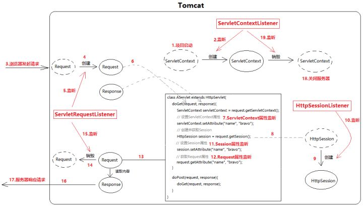

# 常用的监听器(6+2)

---
    6个常规监听器
        |---ServletContext
                |---ServletContextListener（生命周期监听）
                |---ServletContextAttributeListener（属性监听）
        |---HttpSession
                |---HttpSessionListener（生命周期监听）
                |---HttpSessionAttributeListener（属性监听）
        |---ServletRequest
                |---ServletRequestListener（生命周期监听）
                |---ServletRequestAttributeListener（属性监听）
                
    2个感知监听(感知监听都是Session相关的)
        |---HttpSessionBindingListener
        |---HttpSessionActivationListener                
---

>6个常规监听器，分属三类，分别对应JavaWeb三大域对象（除去JSP的Page域）：ServletContext、HttpSession(Session域)、ServletRequest(Request域)。共三对，每一对都包括1个生命周期监听和1个属性监听。

所谓生命周期监听器，就是监听三大域对象的创建和销毁。每当Tomcat创建或销毁三大域对象，都会被这些监听器察觉，然后就会回调监听器的方法.

属性监听器则专门监听三大域对象get/setAttribute()。每当我们给域对象设置值或者从里面取值，都会被它们监听到，然后还是触发回调监听器的方法.

# 为什么需要监听器?以及使用场景?

使用ServletContext，可以创建一个具有所有其他servlet可以访问的应用程序范围的属性，我们可以在web.xml中将ServletContext init参数初始化为String。

在上面的场景中，我们可以为应用程序启动事件创建一个Listener，以读取 context init parameters并创建数据库连接并将其设置为context属性以供其他资源使用。
