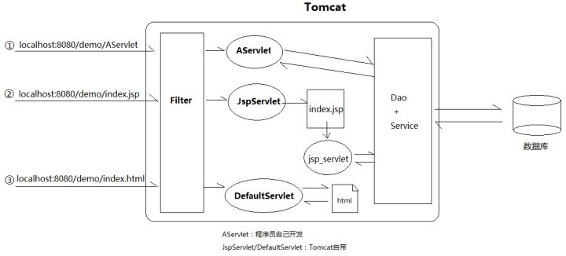
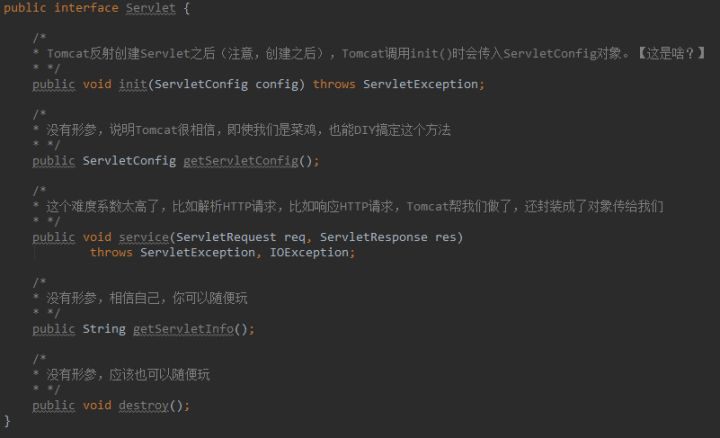
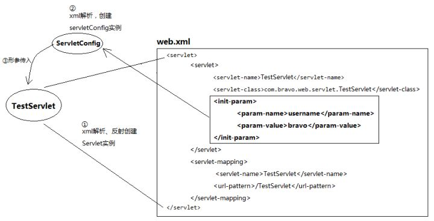
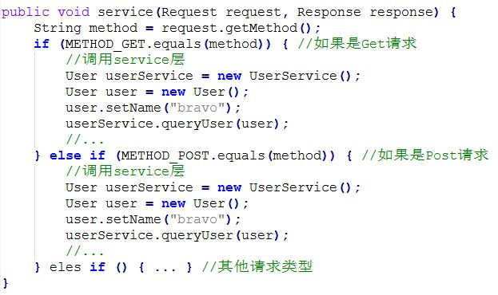
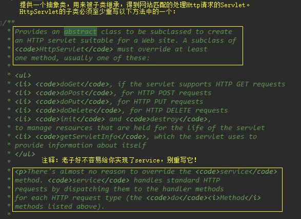
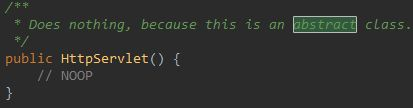
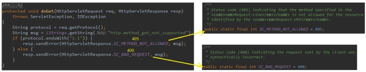
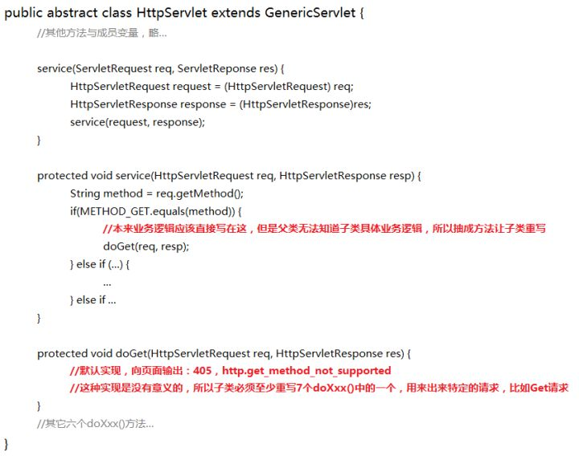
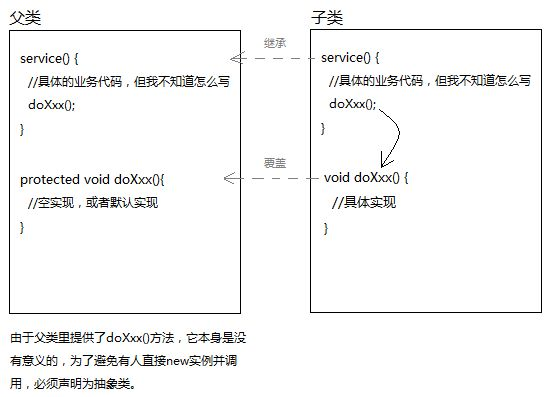

# Servlet

Servlet是Server Applet（运行在服务端的小程序）,Tomcat其实是Web服务器和Servlet容器的结合体,

什么是Web服务器？Web服务器的作用说穿了就是：将某个主机上的资源映射为一个URL供外界访问。

Servlet容器，顾名思义里面存放着Servlet对象,我们为什么能通过Web服务器映射的URL访问资源？肯定需要写程序处理请求，主要3个过程：接收请求,处理请求,响应请求

其中接收请求和响应请求是共性功能，且没有差异性,访问淘宝和访问京东，都是接收http://www.xxx.com/brandNo=1的请求，响应给浏览器的都是JSON数据。于是，大家就把接收和响应两个步骤抽取成Web服务器：

但处理请求的逻辑是不同的。没关系，抽取出来做成Servlet，交给程序员自己编写。但是Servlet并不擅长往浏览器输出HTML页面，所以出现了JSP.

等Spring家族出现后，Servlet开始退居幕后，取而代之的是方便的SpringMVC。SpringMVC的核心组件DispatcherServlet其实本质就是一个Servlet。但它已经自立门户，在间接继承HttpServlet的基础上，又做了封装.

---



编程学习越往后越是如此，我们能做的其实很有限。大部分工作，框架都已经帮我们做了。只要我们实现xxx接口，它会帮我们创建实例，然后搬运到它合适的位置，然后一套既定的流程下来，肯定会执行到。

进入Tomcat阶段后，我们开始全面面向接口编程。但是“面向接口编程”这个概念，最早其实出现在JDBC阶段。我就问你，JDBC接口是你自己实现的吗？别闹了，你导入MySQL的驱动包，它给你搞定了一切。

# 如何编写一个Servlet



最难的地方在于形参，然而Tomcat会事先把形参对象封装好传给我(ServletConfig等)...除此以外，既不需要我写TCP连接数据库，也不需要我解析HTTP请求，更不需要我把结果转成HTTP响应，request对象和response对象帮我搞定了。

Servlet里主要写的代码都是业务逻辑代码。和原始的、底层的解析、连接等没有丝毫关系。最难的几个操作，人家已经给你封装成形参传进来了。

总的来说，Tomcat已经替我们完成了底层封装，并且传入三个对象：ServletConfig、ServletRequest、ServletResponse。

# ServletConfig



# Request/Response
  
HTTP请求到了Tomcat后，Tomcat通过字符串解析，把各个请求头（Header），请求地址（URL），请求参数（QueryString）都封装进了Request对象中。通过调用等等方法，都可以得到浏览器当初发送的请求信息。

```java
request.getHeader();
request.getUrl()；
request.getQueryString();
...
```

至于Response，Tomcat传给Servlet时，它还是空的对象。Servlet逻辑处理后得到结果，最终通过response.write()方法，将结果写入response内部的缓冲区。Tomcat会在servlet处理结束后，拿到response，遍历里面的信息，组装成HTTP响应发给客户端。

Servlet的init、service、destroy是生命周期方法。init和destroy各自只执行一次，即servlet创建和销毁时。而service会在每次有新请求到来时被调用。也就是说，我们主要的业务代码需要写在service中。

但是，浏览器发送请求最基本的有两种：Get/Post，于是我们必须这样写：



我不想直接实现javax.servlet接口,于是，发现了GenericServlet，是个抽象类。

# GenericServlet


我们发现GenericServlet做了以下改良：

- 提升了init方法中原本是形参的servletConfig对象的作用域（成员变量），方便其他方法使用
init方法中还调用了一个init空参方法，如果我们希望在servlet创建时做一些什么初始化操作，可以继承GenericServlet后，覆盖init空参方法
- 由于其他方法内也可以使用servletConfig，于是写了一个getServletContext方法
- service竟然没实现

放弃GenericServlet。于是我们继续寻找，又发现了HttpServlet：

# HttpServlet


它继承了GenericServlet,HttpServlet已经实现了service方法：


HttpServlet的service方法已经替我们完成了复杂的请求方法判断。但是，我翻遍整个HttpServlet源码，都没有找出一个抽象方法。所以为什么HttpServlet还要声明成抽象类呢？

一个类声明成抽象方法，一般有两个原因：

1. 有抽象方法
2. 没有抽象方法，但是不希望被实例化



>HttpServlet做成抽象类，仅仅是为了不让new。



它为什么不希望被实例化，且要求子类重写doGet、doPost等方法呢？


protected修饰，希望子类重写,如果我们没重写会怎样？
                   


浏览器页面会显示：405（http.method_get_not_supported）

也就是说，HttpServlet虽然在service中帮我们写了请求方式的判断。但是针对每一种请求，业务逻辑代码是不同的，HttpServlet无法知晓子类想干嘛，所以就抽出七个方法，并且提供了默认实现：报405、400错误，提示请求不支持。

但这种实现本身非常鸡肋，简单来说就是等于没有。所以，不能让它被实例化，不然调用doXxx方法是无用功。

Filter用到了责任链模式，Listener用到了观察者模式，Servlet也不会放过使用设计模式的机会：模板方法模式。上面的就是。



# 小结：如何写一个Servet？

不用实现javax.servlet接口,不用继承GenericServlet抽象类,只需继承HttpServlet并重写doGet()/doPost(),父类把能写的逻辑都写完，把不确定的业务代码抽成一个方法，调用它。当子类重写该方法，整个业务代码就活了。这就是模板方法模式



# JSP和Servlet如何学习?

Servlet和JSP只是Java EE众多技术中的两个，其他Java EE技
术还有Java消息服务(JMS)，企业Java对象(EJB)、 JavaServer Faces以及Java持久化等

所以，我们还是应该学习与掌握Servlet与JSP的基础知识，只需注意一下“度”，并没有太多必要花费太多时间去系统掌握其各种技术细节，而应该把精力放在理解Servlet的工作原理，以及Servlet与像Tomcat这样的Servlet容器之间的关系即可。

# JSP

与Servlet现在仍然是Java Web开发的基础不太一样，JSP现在己经用得越来越少了，但如果不学习它，后面的很多内容没法学习。所以，掌握JSP的基础知识，能看懂JSP代码，并且具备动手编写一些简单JSP页面的技能，仍然是需要的。

## Servlet

如果你深刻理解了Servlet的生命周期，就可以在底层做很多事情。在Request进来的时候，进行拦截，进行权限的判定。也可以在Response发给client的时候，进行拦截，统一检查、统一附加。所以Servlet不仅要学，而且要学深，学透。”

## Servlet与Servlet容器

Servlet容器(例如Tomcat)也仅仅不过是一个Java程序,Servlet容器就是用来装Servlet的。Servlet容器负责servlet的创建、执行和销毁。Servlet它必须被部署到Servlet容器中.

有了servlet之后，用户在浏览器的地址栏中输入URL发来请求，Web服务器接收到该请求后，并不是将请求直接交给Servlet，而是交给Servlet容器。当Servlet容器接受到Web服务器传来的请求，发现处理请求的资源是Servlet时，然后Servlet容器(Web容器)创建两个对象HTTPServletRequest和HTTPServletResponse, 然后，它根据URL找到正确的servlet, 并为请求创建一个线程, Servlet容器实例化Servlet，然后它调用servlet service()方法, 然后基于HTTP method，service()方法调用doGet()或doPost()方法对请求进行处理,Servlet方法生成动态页面并将其写入response, servlet线程完成后,这个response由Servlet容器返回给Web服务器，Web服务器包装这个响应，以HTTP响应的形式发送给Web浏览器。

Web browser ---> Web Server ------> servlet Container(web container) ----> GenericServlet ---> HttpServlet ---> OurServelt ----> find resource and generate response ---> servlet Container(web container)----> Web Server ----> Web browser

#### Servlet容器和Web服务器如何处理一个请求

1. Web服务器接收到HTTP请求
2. Web服务器将请求转发给servlet容器
3. 如果容器中存在所需的servlet，容器就会检索servlet，并将其加载到容器的地址空间中(load servlet)
4. 容器调用servlet的init()方法对servlet进行初始化(该方法只会在servlet第一次被载入时调用）
5. 容器调用servlet的service()方法来处理HTTP请求，即，读取请求中的数据，创建一个响应。servlet会被保留在容器的地址空间中，继续处理其他的HTTP请求
6. Web服务器将动态生成的结果返回到正确的location。

#### JVM扮演的角色

1. 使用servlet，就要允许JVM为处理每个请求分配独立的Java线程，这也是Servlet容器主要的优势之一。
2. 每一个servlet都是一个拥有能响应HTTP请求的特定元素的Java类。
3. Servlet容器的主要作用是将请求转发给相应的servlet进行处理，并在JVM处理完请求后，将动态生成的结果返回至正确的location。
4. 在大多数情况下，servlet容器运行在独立的JVM中，但如果容器需要多个JVM，也有相应的解决方案。

#### servlet容器(web容器)能提供什么？

我们知道需要由servlet容器来管理和运行servlet，但是为什么要这样做呢？使用servlet容器的原因有：

	Communication Support(通信支持) - Servlet容器提供“Web服务器”与“servlet和JSP”之间的简单通信方式。
	而不需要构建server socket来侦听来自Web服务器的任何请求，解析请求并生成响应。
	所有这些重要且复杂的任务都是由容器完成的，
	容器知道自己与web服务器之间的协议，所以你的servlet不用担心web服务器(如Apache）和你自己的web代码之间的API，只需要考虑如何在servlet中实现业务逻辑(如处理一个订单）

	Lifecycle and Resource Management (生命周期和资源管理) - servlet Container负责管理(take care of managing the
	life cycle of servlet.)servlet的生命周期。 
	Container负责将servlet类加载到内存中，初始化servlet，调用servlet方法并销毁它们。
	Container还提供JNDI等实用程序，用于资源池和管理,有了servlet容器，你不需要太多的考虑资源管理

	Multithreading Support (多线程支持 ) - 容器为每个到这个servlet的请求创建一个新线程，当每个请求处理完成时(servlet已经运行完相应的http服务方法)，线程dies.
	因此，servlet不会针对每个请求进行初始化，也就是多个请求共用一个servlet,
	从而节省了时间和内存。这并不是说你不需要考虑线程安全性，其实你还会遇到同步问题，不过这样能使你少做很多工作.

	JSP支持 - JSP看起来不像普通的java类，Web容器提供对JSP的支持。应用程序中的每个JSP都由容器
	编译并转换为Servlet，然后容器像其他管理servlet一样管理它们。
	Every JSP in the application is compiled by container and converted to 
	Servlet and then container manages them like other servlets.

	其他任务Miscellaneous Task  - Web容器管理资源池，执行内存优化，运行垃圾收集器，提供安全配置，支持多个应用程序，
	热部署以及场景背后的其他几项任务，使我们的生活更轻松。

	Servlet是Java EE服务器驱动的技术，用于在Java中创建Web应用程序。 javax.servlet和javax.servlet.http包提供了用于编写我们自己的servlet的接口和类。

	所有servlet都必须实现javax.servlet.Servlet接口，该接口定义了servlet生命周期方法。
	 实现通用服务时，我们可以扩展随Java Servlet API提供的GenericServlet类。
	 HttpServlet类提供了诸如doGet(）和doPost(）之类的方法，用于处理特定于HTTP的服务。

	大多数情况下，使用HTTP协议访问Web应用程序，这就是为什么我们主要扩展HttpServlet类。

### 与CGI程序相比，Servlet具有以下优点:

1. Servlet是单实例多线程的运行方式，每个请求在一个独立的线程中运行，而提供服务的Servlet实例只有一个
2. Servlet使用标准的API，被更多的Web服务器所支持。 
3. Servlet使用Java编写，因此拥有Java程序语言的所有优点，包括容易开发和平台独立性。 
4. Servlet在处理时间，内存利用率方面提供了更好的性能，因为servlet使用多线程的好处，
并且为每个请求创建一个新线程，这比使用CGI为每个请求加载创建新对象更快。
5. Servlet与平台和系统无关，使用Servlet开发的Web应用程序可以在任何标准Web容器上运行，
如Tomcat，JBoss，Glassfish服务器以及Windows，Linux，Unix，Solaris，Mac等操作系统。
6. Servlet是健壮的，因为容器负责servlet的生命周期，我们不需要担心内存泄漏，安全性，垃圾收集等。
7. Servlet是可维护的，学习曲线很小，因为我们需要注意的是我们的应用程序的业务逻辑。

### Servlet容器的分类(基于工作模式)

1. 独立的Servlet容器

当我们使用基于Java技术的Web服务器时，Servlet容器作为构成Web服务器的一部分而存在。然而大多数的Web服务器并非基于Java，因此，就有了下面两种Servlet容器的工作模式。

2. 进程内的Servlet容器

Servlet容器由Web服务器插件和Java容器两部分的实现组成。Web服务器插件在某个Web服务器内部地址空间中打开一个JVM(Java虚拟机），使得Java容器可以在此JVM中加载并运行Servlet。如有客户端调用Servlet的请求到来，插件取得对此请求的控制并将它传递(使用JNI技术）给Java容器，然后由Java容器将此请求交由Servlet进行处理。进程内的Servlet容器对于单进程、多线程 的服务器非常适合，提供了较高的运行速度，但伸缩性有所不足。

3. 进程外的Servlet容器

Servlet容器运行于Web服务器之外的地址空间，它也是由Web服务器插件和Java容器两部分的实现组成的。Web服务器插件和Java容器(在外部JVM中运行）使用IPC机制(通常是TCP/IP）进行通信。当一个调用Servlet的请求到达时，插件取得对此请求的控制并将其传递(使用IPC机制）给Java容器。进程外Servlet容器对客户请求的响应速度不如进程内的Servlet容器，但进程外容器具有更好的伸缩性和稳定性。

### Tomcat

学习Servlet技术，就需要有一个Servlet运行环境，也就是需要有一个Servlet容器，本文用的是Tomcat。Tomcat是一个免费的开放源代码的Servlet容器,最新的Servlet和 JSP规范总是能在Tomcat中得到体现,Tomcat和IIS、Apache等Web服务器一样，具有处理HTML页面的功能，另外它还是一个Servlet和JSP容器，独立的 Servlet容器是Tomcat的默认模式。不过，Tomcat处理静态HTML的能力不如Apache，我们可以将Apache和Tomcat集成在一起使用，Apache作为HTTP Web服务器，Tomcat作为Web容器。

Tomcat服务器接受客户请求并做出响应的过程如下：

1）客户端(通常都是浏览器）访问Web服务器，发送HTTP请求。 
2）Web服务器接收到请求后，传递给Servlet容器。 
3）Servlet容器加载Servlet，产生Servlet实例后，向其传递表示请求和响应的对象。 
4）Servlet实例使用请求对象得到客户端的请求信息，然后进行相应的处理。 
5）Servlet实例将处理结果通过响应对象发送回客户端，容器负责确保响应正确送出，同时将控制返回给Web服务器。

#### Tomcal conf/server.xml(简化版)

1. 核心组件是Catalina Servlet容器，它是所有其他Tomcat组件的顶层容器
2. Server元素表示整个Catalina servlet容器。
3. Server中可以有多个Service。
4. Service是存活在Server内部的中间组件，它将一个或多个连接器(Connector）组件绑定到一个单独的引擎(Engine）上。在Server中，可以包含一个或多个Service组件。
5. Executor表示可以在Tomcat中的组件之间共享的线程池。
6. 连接器(Connector）处理与客户端的通信，它负责接收客户请求，以及向客户返回响应结果。在Tomcat中，有多个连接器可以使用。
8. Engine元素表示与特定的Catalina服务相关联的整个请求处理机器。它接收并处理来自一个或多个连接器的所有请求，并将完成的响应返回给连接器，以便最终传输回客户端。
9. HHost表示一个虚拟主机，一个引擎可以包含多个Host。
10. 在Tomcat中，每个Service只能包含一个Servlet引擎(Engine）。引擎表示一个特定的Service的请求处理流水线。作为一个Service可以有多个连接器，引擎从连接器接收和处理所有的请求，将响应返回给适合的连接器，通过连接器传输给用户。用户允许通过实现Engine接口提供自定义的引擎，但通常不需要这么做。
11. Context元素表示一个Web应用程序，它在特定的虚拟主机中运行。什么是Web应用程序呢？Servlet规范中，对Web应用程序做出了如下的定义：“一个Web应用程序是由一组Servlet、HTML页面、类，以及其他的资源组成的运行在Web服务器上的完整的应用程序。它可以在多个供应商提供的实现了Servlet规范的Servlet容器中运行”。一个Host可以包含多个Context(代表Web应用程序），每一个Context都有一个唯一的路径。用户通常不需要创建自定义的Context，因为Tomcat给出的Context接口的实现(类StandardContext）提供了重要的附加功能.每个Web应用程序都基于Web应用程序存档(WAR）文件，或者包含相应的解包内容的相应目录

```xml
<?xml version="1.0" encoding="UTF-8"?>
<Server port="8005" shutdown="SHUTDOWN">
  <Service name="Catalina">
    <!--The connectors can use a shared executor, you can define one or more named thread pools-->
    <!--
    <Executor name="tomcatThreadPool" namePrefix="catalina-exec-"
        maxThreads="150" minSpareThreads="4"/>
    -->
    <Connector port="8080" protocol="HTTP/1.1"
               connectionTimeout="20000"
               redirectPort="8443" />
	<!-- A "Connector" using the shared thread pool-->
    <!--
    <Connector executor="tomcatThreadPool"
               port="8080" protocol="HTTP/1.1"
               connectionTimeout="20000"
               redirectPort="8443" />
    -->
    <!-- Define an AJP 1.3 Connector on port 8009 -->
    <Connector port="8009" protocol="AJP/1.3" redirectPort="8443" />
    <Engine name="Catalina" defaultHost="localhost">
      <!-- Use the LockOutRealm to prevent attempts to guess user passwords
           via a brute-force attack -->
      <Realm className="org.apache.catalina.realm.LockOutRealm">
        <Realm className="org.apache.catalina.realm.UserDatabaseRealm"
               resourceName="UserDatabase"/>
      </Realm>
      <Host name="localhost">
         <Context path="" docBase="WORKDIR" reloadable="true"/>  
      </Host>
    </Engine>
  </Service>
</Server>
```
