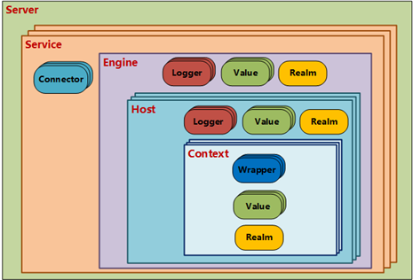
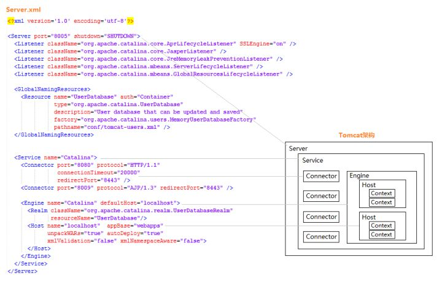
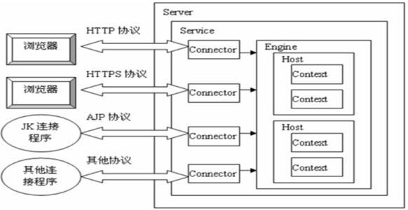
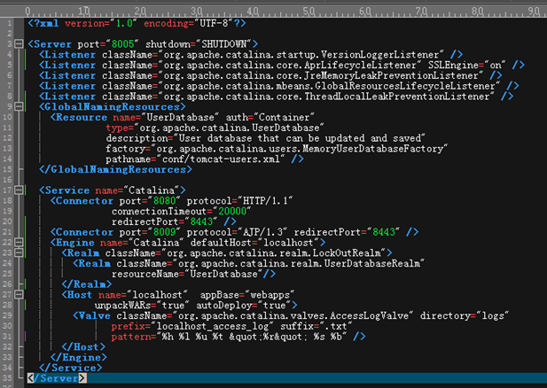

# Tomcat的组件以及作用

    Tomcat按功能划分为不同的组件，这些组件都可以通过/conf/server.xml文件中可定义和配置，
    包括Server, Service, Connector, Engine等，一般可分为以下四类：







    1. 顶级组件：位于配置层次的顶级，并且彼此间有着严格的对应关系，有Server组件、Service组件；
    2. Connector(连接器)：连接器只有Connector组件
    3. 容器：如Engine处理对一个Service的所有请求(解释见下)，Host处理特定虚拟主机的所有请求
    4. 被嵌套的组件：位于一个容器当中，但不能包含其它组件



# Server组件

    Server表示Tomcat的一个实例，因此，它必须是/conf/server.xml配置文件中的根标签
    
    默认配置为监听8005端口,以接收shutdown命令，8005端口默认仅允许通过本机访问.
    
    一个Server可以包含多个Service组件，但通常情下只为一个Server指派一个Service

# Service组件

    Service主要用于关联"一个Engine"和与此Engine相关联的"多个Connector"，
    每个Connector通过一个特定的端口和协议接收请求，并将其转发至关联的Engine进行处理。

    因此，Service可以包含一个Engine、包含一个/多个Connector
    
    通常需要给Service命名，可以方便管理员在日志文件中识别不同Service产生的日志。

    如默认配置中Server只包含一个名为"Catalina"的service，而service里包含两个Connector，
    其中一个监听8080端口接收HTTP请求，另一个监听8009端口接收AJP协议的请求。

# Connector

    Connector通过一个特定的TCP端口接收特定协议的客户端请求.并将其转发至关联的Engine进行处理.
    
    Tomcat通过Connector组件接收HTTP请求,然后把http请求中的信息解析并封装成对象,交给关联的Engine进行处理.
    engine处理完成后返回给Connector,然后Connector向客户返回结果.

    修改监听http请求的端口

```xml
<Connector port="8080" protocol="HTTP/1.1" connectionTimeout="20000" redirectPort="8443" />
```

# Engine（Tomcat引擎）

    一个Engine元素必须嵌套在Service元素内，它可以包含多个host组件.
    
    一个Engine可以配置多个Connector，但这些Connector必须使用不同的端口
    
    Engine表示处理与特定Service相关联的所有请求处理。它接收和处理来自一个或多个连接器的所有请求，
    并检查每一个请求的头首部信息以确定此请求应该发往哪个Host，并将完成的响应返回到连接器，以便最终返回给client.

# Host组件

    Host（虚拟主机）,一个Engine至少要包含一个Host组件

1. name：此Host的虚拟主机名称；
2. appBase：此Host的webapps目录，即WAR文件解压后的存放目录路径；可以使用基于$CATALINA_HOME的相对路径；
3. autoDeploy：在Tomcat处于运行状态时放置于appBase目录中的应用程序文件是否自动进行部署；默认为true；
4. unpackWars：在启用此webapps时是否对WAR格式的文件进行解压展开；默认为true。

---

    默认配置中定义了一个主机名为"localhost"的Host，而webapps目录为$CATALINA_BASE相对的"webapps"，
    也可用绝对路径来配置其他目录,比如appBase=C:/xzj-webapps

# Context

    Host内部可以有Context, Context（上下文）表示在特定Host中运行的Web应用程序，一个Context对应一个Web应用程序

    一个Host可以有多个Context，通常不建议将Context定义在server.xml文件中，
    而是每一个context定义使用一个单独的XML文件进行，目录为$CATALINA_HOME/conf/<engine name>/<host name>。

    可以看到server.xml默认没有定义Context，但默认存在/conf/Catalina/localhost这个目录,这个下面就可以存放
    Engine名字为Catalina,Host名字为localhost的Context上下文的配置文件.

>注意: 所有的web应用程序在启动的时候都会加载 $CATALINA_HOME/conf/context.xml这个默认的context.xml文件,它里面会默认加载$CATALINA_HOME/conf/web.xml，web.xml定义了Tomcat提供的DefaultServlet，主要用来处理静态资源请求；当然对于每个自己的应用程序的web.xml也会被加载.

```xml
<Host name="localhost"  appBase="webapps" unpackWARs="true" autoDeploy="true">
        <!-- 这个配置的意思是把webapps/test文件夹下的内容暴露到
            path="/"下，这样我们直接访问localhost:8080/就可以访问test下的内容了,
            而且访问相对于test路径的内容也没问题-->
        <Context path="/" docBase="test" debug="0" privileged="true"/>
      </Host>
```
