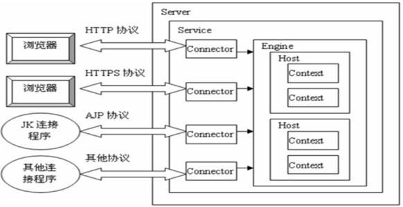

# 1. 什么是JavaEE规范?和JavaWeb的区别?

SUN公司的JavaEE规范：JDBC，JNDI，EJB，RMI，JSP，Servlets，XML，JMS，Java IDL，JTS，JTA，JavaMail，JAF.Servlet和JSP只是Java EE众多技术中的两个，其他Java EE技术还有Java消息服务(JMS)，企业Java对象(EJB)、 JavaServer Faces以及Java持久化等

还有一一个组织，专门搞开源的，叫Apache。搞出了一个叫Tomcat的服务器。Tomcat也没完全实现JavaEE规范的13种核心技术，Tomcat只实现了部分,其中重要的是Servlet和JSP。而其他服务器比如JBoss、Weblogic啥的都是完全支持JavaEE规范的。所以人们往往更愿意叫Tomcat为轻量级的服务器，也有叫它Servlet/JSP容器的。

听到这，你不禁大叫：不对啊，我记得自己写的程序里有用到JMS啊，还可以运行哩！

啊，那是因为你自己手动导了JMS包...但是你安装了Tomcat后另外导过Servlet/JSP的包吗？没有嘛！人家tomcat自己按照JavaEE规范实现了Servlet/JSP规范，都整到自己Tomcat源码里了。

所以我更愿意称自己是JavaWeb程序员，而不是JavaEE程序员。JavaEE其实很重.

# 2. Apache Tomcat

Tomcat是一个Java WEB应用服务器,注意哦,是Java Web应用服务器,不是Java EE应用服务区,这是有区别的,Tomcat也被称为Servlet容器，但不是Java EE容器.因为Tomcat只实现了部分JavaEE规范.

>Tomcat服务器 = Web服务器的功能(处理静态资源请求) + Servlet/JSP容器（Web容器）

JSP/Servlet容器的基本功能是把动态资源转换成静态资源。


>Tomcat是用Java语言编写的，需要运行在Java虚拟机上，所以一般需要先安装JDK，以提供运行环境。

Tomcat实现了几个Java EE规范，包括Java Servlet、Java Server Pages（JSP），Java Expression Language(Java EL)和WebSocket等，这些是都下载Tomcat安装包默认提供的，可以在Tomcat源码目录中看到相关Java EE 规范API源码引用：


 此外，官网还提供了另外一些Java EE规范的实现，如JMX Remote等，要使用的话需要另外下载，放到Tomcat安装目录/lib中.
 
 >可以说Tomcat是一个不完整的Java EE应用服务器。
 
# 如何学习Servlet/JSP/Tomcat
 
我们还是应该学习与掌握Servlet与JSP的基础知识，只需注意一下“度”，并没有太多必要花费太多时间去系统掌握其各种技术细节，而应该把精力放在理解Servlet的工作原理，以及Servlet与像Tomcat这样的Servlet容器之间的关系即可。

# 3. Tomcat与Servlet

Tomcat实现的几个Java EE规范最重的是Servlet，因为实现了Servlet规范，所以Tomcat也是一个Servlet容器，可以运行我们自己编写的Servlet处理动态请求。
 
平时用的Struts2、SpringMVC框架就是基于Servlet，所以我们可以在这些框架的基础上进行快速开发，然后部署到Tomcat中运行。
 
# 5. Tomcat与WEB/HTTP请求
        
 Tomcat的Connector组件实现了HTTP请求的解析，Tomcat通过Connector组件接收HTTP请求并解析，然后把解析后的信息封装成对象,交给Servlet处理：
 
对于静态资源（html/js/jpg等）请求，Tomcat提供默认的Servlet来处理并响应；
 
对于动态请求，可以映射到自己编写的Servlet应用程序来处理。
 
# 6. Tomcat与Nginx/Apache的应用架构
        
 Nginx、Apache都是目前主流的Web服务器，也可以作为反向代理服务器；它们在处理大量并发的请求连接、连接会话管理和静态内容请求等方面相比Tomcat更具优势。
 
所以一般在实际应用中，先是通过Nginx（或Apache）反向代理服务器接收请求，匹配分离动态/静态请求（动静分离）;

如果是静态请求，则转发到另外的Nginx WEB服务器上，返回静态内容；如果是动态请求，则转发到后面的Tomcat应用服务器，处理动态请求的业务逻辑。
 
 
 
# 7. Tomcat的安装目录说明

1. conf: 包容配置文件,如server.xml,web.xml.
2. lib: Tomcat使用的库文件存放目录，如Servlet规范的API库；
3. webapps: 我们的应用程序部署目录，可以通过server.xml文件配置.Java Web网站通常会被打包为.war文件， Tomcat在运行时会动态地发现并解压它。
4. bin: 启动、关闭和其他脚本， * .sh文件（对于Unix系统）是* .bat文件的功能重复（对于Windows系统）
5. logs: 默认的日志文件存放目录，如访问日志，可以通过server.xml文件配置到其他目录；
6. temp: 临时文件的工作目录，如上传大文件时的缓存数据会存储到这里；
7. work: Tomcat工作目录，如存放JSP编译后的Servlet源文件和字节码文件。

Tomcat的安装目录由环境变量$CATALINA_HOME表示，可以手动设置，可以由/bin/catalina.sh命令脚本自动设置该环境变量，如果使用多个Tomcat实例，需要为每个实例定义$ CATALINA_BASE环境变量。

# 8. Tomcat配置文件

>Tomcat的配置文件默认存放在$CATALINA_HOME/conf目录中，主要有以下几个：

1. server.xml： Tomcat核心配置文件，包含Service, Connector, Engine, Realm, Valve, Hosts主组件的相关配置信息。
2. context.xml：为部署在Tomcat实例上的web应用程序提供的默认配置文件，每个webapp都可以使用独有的context.xml,通常放置于webapp目录的META-INF子目录中，常用于定义会话管理器，Realm以及JDBC等。
3. web.xml：为部署在Tomcat实例上的所有web应用程序提供部署描述符，通常用于为webapp提供默认的servlet定义和基本的MUIME映射表。(定义了DefaultServlet和JspServlet,查看Tomcat/conf/web.xml)
4. tomcat-users.xml：Tomcat自带的manager默认情况下会用到此文件；在Tomcat中添加/删除用户，为用户指定角色等将通过编辑此文件实现。
5. logging.properties：定义日志相关的配置信息，如日志级别、文件路径等。

# 9. WEB应用部署目录结构

 我们的应用程序一般会打包成归档格式（.war），然后放到Tomcat的应用程序部署目录。而webapp有特定的组织格式，通常包含了servlet代码文件、HTML/jsp页面文件、类文件、部署描述符文件等等，相关说明如下：

1. /：web应用程序的根目录，可以存放HTML/JSP页面以及其他客户端浏览器必须可见的其他文件（如js/css/图像文件）。在较大的应用程序中，还可以选择将这些文件划分为子目录层次结构。
2. /WEB-INF：此webapp的所有私有资源目录，用户浏览器不可能访问到的，通常web.xml放置于此目录。
3. /WEB-INF/web.xml：此webapp的私有的部署描述符，描述组成应用程序的servlet和其他组件（如filter），以及相关初始化参数和容器管理的安全性约束。
4. /WEB-INF/classes：此webapp自有的Java程序类文件（.class）及相关资源存放目录。
5. /WEB-INF/lib：此目录存放webapp自有的JAR文件，其中包含应用程序所需的Java类文件（及相关资源），例如第三方类库或JDBC驱动程序。
6. /META-INF: 此webapp的所有私有资源目录，用户浏览器不可能访问到的，通常context.xml放置于此目录。

# 10. Tomcat的架构



Tomcat按功能划分为不同的组件，这些组件都可以通过/conf/server.xml文件中可定义和配置，包括Server, Service, Connector, Engine等，一般可分为以下四类：


1. 顶级组件：位于配置层次的顶级，并且彼此间有着严格的对应关系，有Server组件、Service组件；
2. 连接器：连接客户端（客户端可以是浏览器或Web服务器）请求到Servlet容器，连接器只有Connector组件，
3. 容器：如Engine处理对一个Service的所有请求(解释见下)，Host处理特定虚拟主机的所有请求
4. 被嵌套的组件：位于一个容器当中，但不能包含其它组件

如server.xml默认配置（删除注释内容）如下：

## 10.1 Server组件

Server表示Tomcat的一个实例，因此，它必须是/conf/server.xml配置文件中的最外层元素,默认配置表示监听在8005端口以接收shutdown命令，默认仅允许通过本机访问。

## 10.2 Service组件

Service主要用于关联一个Engine和与此Engine相关联的Connector，每个Connector通过一个特定的端口和协议接收请求，并将其转发至关联的Engine进行处理。

因此，Service可以包含一个Engine、有一个或多个Connector；而一个Server可以包含多个Service组件，但通常情下只为一个Server指派一个Service。通常需要给Service命名，可以方便管理员在日志文件中识别不同Service产生的日志。

>如默认配置中server只包含一个名为"Catalina"的service，而service里包含两个Connector，其中一个监听8080端口接收HTTP请求，另一个监听8009端口接收AJP协议的请求。

## 10.3 Connector

Connector（连接器）通过一个特定的TCP端口接收特定协议的客户端请求，并将其转发至关联的Engine进行处理,以及向客户返回响应结果.一个Engine可以配置多个Connector，但这些连接器必须使用不同的端口。

## 10.4 Engine组件

Engine（Tomcat引擎）表示处理与特定Service相关联的所有请求处理，即Servlet容器引擎。它接收和处理来自一个或多个连接器的所有请求，并检查每一个请求的HTTP首部信息以辨别此请求应该发往哪个Host或Context，并将完成的响应返回到连接器，以便最终传输回客户端。

一个Engine元素必须嵌套在Service元素内，它可以包含多个host组件.

## 10.5 Host组件

Host（虚拟主机）类似于Apache中的虚拟主机,一个Engine至少要包含一个Host组件.常用属性说明：
        
1. name：此Host的虚拟主机名称；
2. appBase：此Host的webapps目录，即存放归档后的WAR文件的目录路径；可以使用基于$CATALINA_HOME的相对路径；
3. autoDeploy：在Tomcat处于运行状态时放置于appBase目录中的应用程序文件是否自动进行deploy；默认为true；
4. unpackWars：在启用此webapps时是否对WAR格式的归档文件先进行展开；默认为true。
        
>如默认配置中定义了一个主机名为"localhost"的Host，而webapps目录为$CATALINA_BASE相对的"webapps"，即前面说到的默认目录，也可用绝对路径来配置其他目录,比如appBase=C:/xzj-webapps

## 10.6 Context

Host内部可以有Context, Context（上下文）表示在特定虚拟主机(Host)中运行的Web应用程序，一个Context对应一个Web应用程序，而里面的Wrapper可以理解为一个个Servlet程序。

一个Host可以有多个Context，通常不建议将Context定义在server.xml文件中，而是每一个context定义使用一个单独的XML文件进行，其文件的目录为$CATALINA_HOME/conf/<engine name>/<host name>。

可以看到server.xml中默认没有定义Context，但存在/conf/context.xml，在前面说过,此context.xml为部署与此Tomcat实例上所有的web应用程序提供的默认配置文件，删除注释后其内容如下：

通过它可以找到默认的和各web应用程序提供部署描述符文件web.xml，/conf/web.xml定义了Tomcat提供的DefaultServlet处理程序，主要用来处理静态资源请求；而各webapp的web.xml可以定义其他的动态请求url映射到不同Servlet程序处理。

```xml
<Host name="localhost"  appBase="webapps" unpackWARs="true" autoDeploy="true">
        <!-- 这个配置的意思是把webapps/test文件夹下的内容暴露到
            path="/"下，这样我们直接访问localhost:8080/就可以访问test下的内容了,
            而且访问相对于test路径的内容也没问题-->
        <Context path="/" docBase="test" debug="0" privileged="true"/>
      </Host>
```

## 修改Tomcat监听的端口

默认情况下， Tomcat监听的是8080端口，如果希望监听其他端口，可以在conf文件夹下的Server.xml内查找以下内容并改之：

```xml
<Connector port="8080" protocol="HTTP/1.1"
connectionTimeout="20000"
redirectPort="8443" />
```

# 关于Tomcat的学习策略

1. 必须指出，在现代互联网应用中Tomcat的地位在下降，一是现在普遍采用`前后端分离`的
Web应用架构，`全部由静态资源`组成的Web前端通常部署在`Nginx等对静态资源更友好`的
Server而不是Tomcat上，二是Web Server日益退化为`仅提供数据服务而不是生成HTML`的角色.

# 参考:

- [Tomcat(一) Tomcat是什么：Tomcat与Java技术 Tomcat与Web应用 以及 Tomcat基本框架及相关配置](https://blog.csdn.net/tjiyu/article/details/54590258)
- [Tomcat(二) Tomcat实现：Servlet与web.xml介绍 以及 源码分析Tomcat实现细节](https://blog.csdn.net/tjiyu/article/details/54590259)
- [Tomcat(三) Tomcat安装配置：Tomcat+Nginx+keepalived 实现动静分离、Session会话保持的高可用集群](https://blog.csdn.net/tjiyu/article/details/54591126)