# POM

POM 代表项目对象模型.

# 查找依赖的顺序:

1. find jar: local repo(本地仓库)
2. private service repo(Enterprise企业私有仓库)
3. central repo(中央仓库)

# Maven

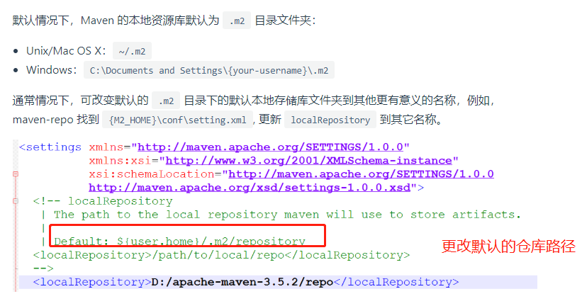


    idea配置更新快照版本
    
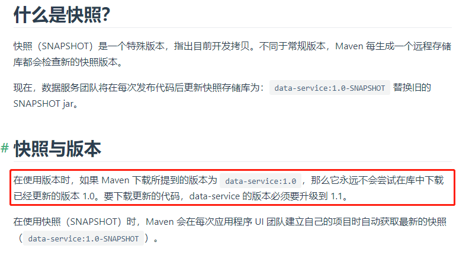


    idea配置自己的Maven
    


    使用maven刷新项目
    
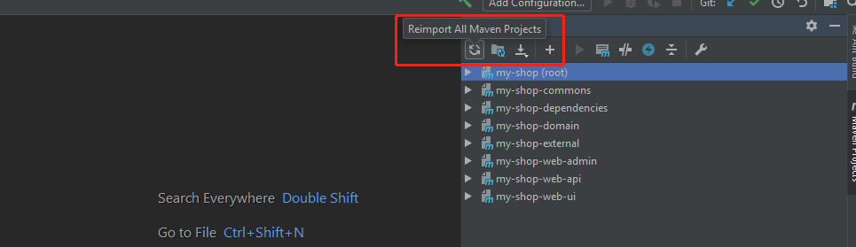

# Maven 常用命令

- 查看maven版本: mvn -version
- mvn package: 打包JAR/WAR/EAR
- mvn compile (just compile)编译源代码
- mvn -dmaven.test.skip=true 只打包不测试（跳过测试）
- mvn install -DskipTests 或 mvn install -Dmaven.test.skip=true(跳过测试)
- 源码打包:mvn source:jar或mvn source:jar-no-fork

3. mvn test(要在不创建应用程序JAR/WAR/EAR文件的情况下仅运行JUnit测试)
4. mvn clean(总是建议在编译和构建我们的应用程序代码之前清理所有内容--删除构建目录)
5. mvn –help
6. mvn install(要编译，构建(构建成jar/war/ear文件)并且安装到本地maven存储库)
7. mvn –version

9. mvn test package (运行JUnits并创建JAR/WAR/EAR[To compile, tests and assemble去编译，测试，然后组装成jar/war/ear文件]---注意：在maven和gradle中，我们可以管道两个或更多命令执行它们。)
10. mvn deploy(将应用程序WAR/EAR文件部署到服务器)
11. mvn jetty:run(要在Jetty嵌入式服务器上运行---run on Jetty embedded server)
12. mvn jetty:run-war(构建WAR文件，并且部署并运行它到嵌入式jetty服务器中)
13. mvn jar(从已经编译好的class文件创建JAR文件)
14. mvn eclipse:eclipse(生成项目和所有Eclipse所需的文件)
15. mvn eclipse:clean(清理Eclipse所需的所有文件)
16. mvn help:describe -Dplugin=eclipse(查看eclipse插件的所有命令)
17. Goal Prefix:eclipse(目标前缀是eclipse)

mvn test (compile and run unit tests)
mvn package (compile, run unit tests, and build the distributable package)
mvn install (all of the above, and install distributable package into local repository.Install is very useful if you need to build other packages which depend on changes to this package)
mvn deploy (all of the above, and install package into remote (aka public) repository for sharing with other developers)

# Maven配置文件Scope解释

>scope有compile、test、runtime、provided、system，其中默认的值是compile

1. Compile:缺省值，适用于所有阶段(编译，测试，运行)，会随着项目一起发布，是一个比较强的依赖。打包的时候需要包含进去。
2. Test: 表示依赖项目仅仅参与测试相关的工作，只在测试时使用，用于编译和运行测试代码。不会随项目发布。比较典型的如junit,junit只有在执行单元测试时候需要，当我们进行真正项目发布的时候junit是不需要进行编译和发布的。
3. runtime: 被依赖项目无需参与项目的编译，适用运行和测试阶段。与compile相比，跳过编译而已，举例说明一下：在代码中调用了一个接口一个方法，这个接口并没有对应的实现。这段代码在编译期间并不会报错，但是在代码运行的时候会出现问题。jdbc驱动可以使用runtime的scope，因为只有在真正运行的时候才会调用到驱动的代码。
4. provided: 打包的时候不打包进去,别的设施(例如web容器)会提供。该依赖参与编译，测试，运行等周期。相当于compile，但是在打包阶段做了exclude的动作,例如servlet相关的jar,容器会提供,所以我们项目发布的时候这个包是不需要打到包里的
5. 从参与度(编译，测试，运行)来说，也provided相同，不过被依赖项不会从maven仓库抓，而是从本地文件系统拿，一定需要配合systemPath属性使用。

# Nexus

Nexus 是一个强大的仓库管理器，极大地简化了内部仓库的维护和外部仓库的访问,[download](https://www.sonatype.com/).

## 为什么使用Nexus

如果没有私服，我们所需的jar都需要通过maven中央仓库和第三方的Maven仓库(如阿里云等)下载到本地，而一个团队中的所有人都重复的从maven仓库下载构件无疑加大了仓库的负载和浪费了外网带宽，如果网速慢的话，还会影响项目的进程。很多情况下项目的开发都是在内网进行的，连接不到maven仓库怎么办呢？开发的公共构件怎么让其它项目使用？这个时候我们不得不为自己的团队搭建属于自己的maven私服，这样既节省了网络带宽也会加速项目搭建的进程，当然前提条件就是你的私服中拥有项目所需的所有构件。

- 如果公司开发组的开发环境全部内网，这时如何连接到在互联网上的Maven中央仓库呢？
- 如果公司经常开发一些公共的组件，如何共享给各个开发组，使用拷贝方式吗？如果这样，公共库升级了怎么办？

## Windows下使用Nexus

- [http://www.luyixian.cn/news_show_3701.aspx](http://www.luyixian.cn/news_show_3701.aspx)
- [https://cloud.tencent.com/developer/article/1492820](https://cloud.tencent.com/developer/article/1492820)
- [https://www.cnblogs.com/dingyingsi/p/3687077.html](https://www.cnblogs.com/dingyingsi/p/3687077.html)
- [https://www.funtl.com/zh/nexus/](https://www.funtl.com/zh/nexus/#%E6%9C%AC%E8%8A%82%E8%A7%86%E9%A2%91)


### 分组


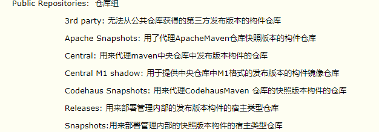


### 创建各种仓库

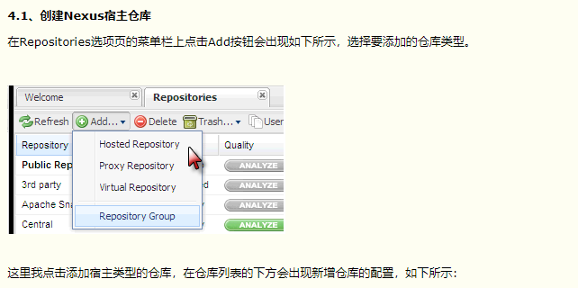
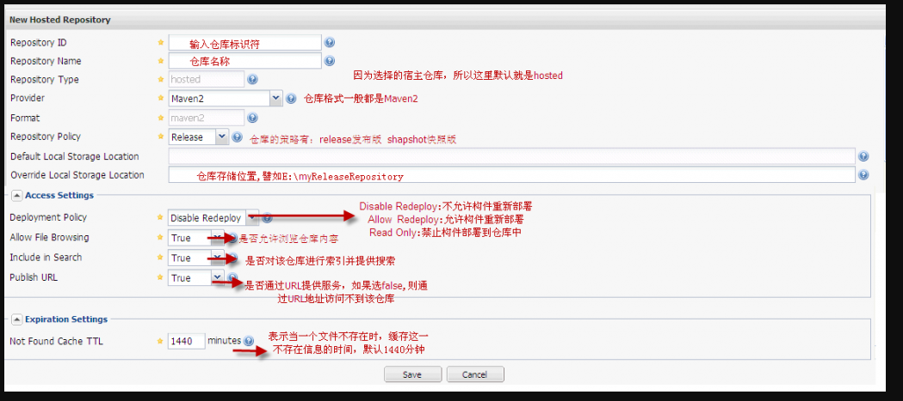


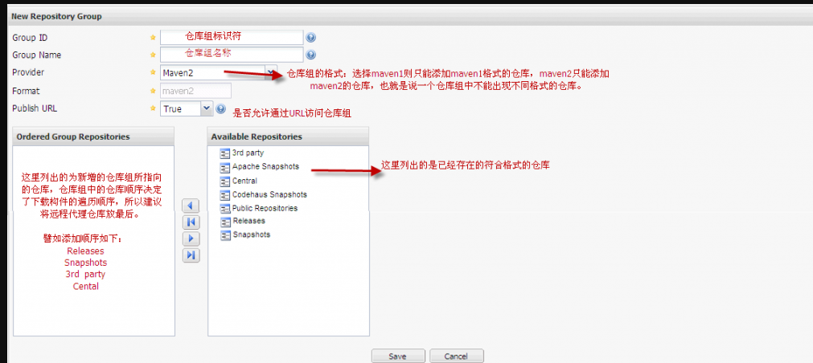

### 从私服下载jar的配置

> 注意,如果修改的是Maven的conf/settings.xml,那么就不用配置单个项目了,因为这个项目所使用的maven都会自动使用settings.xml中的配置.如果修改的是单个项目的pom.xml,则对其他项目无效.

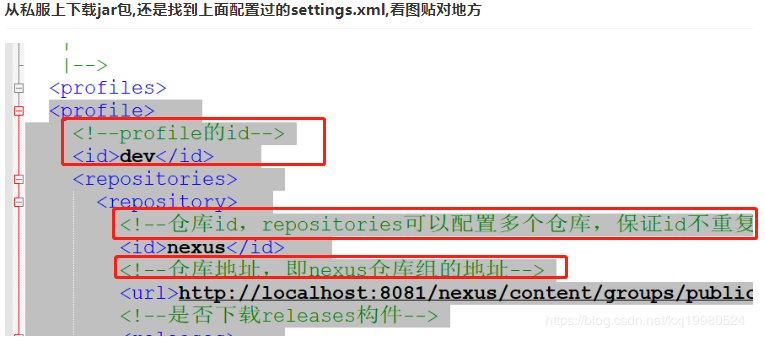
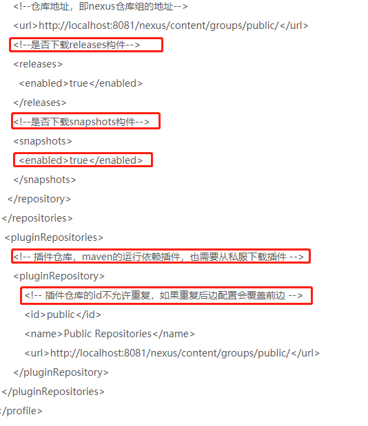
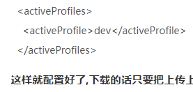

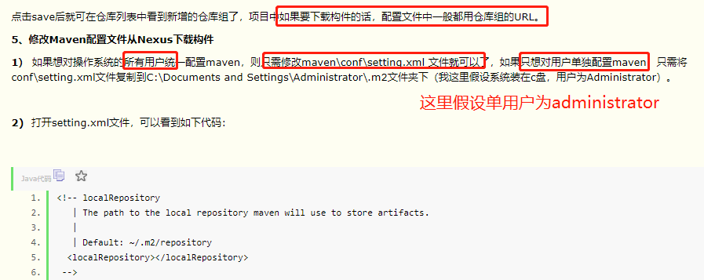
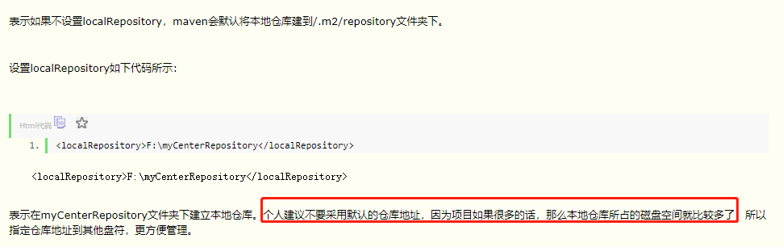
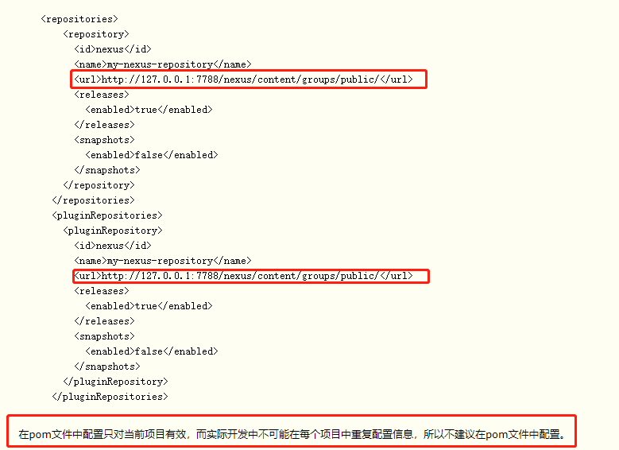

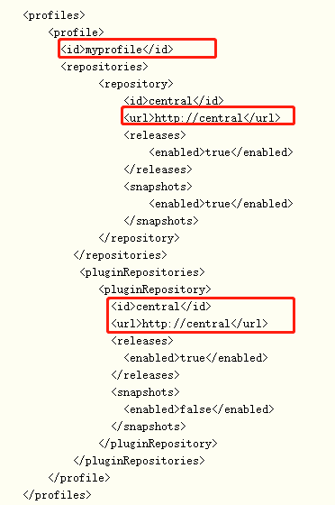
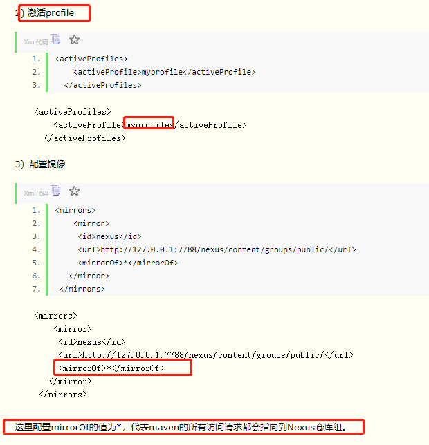

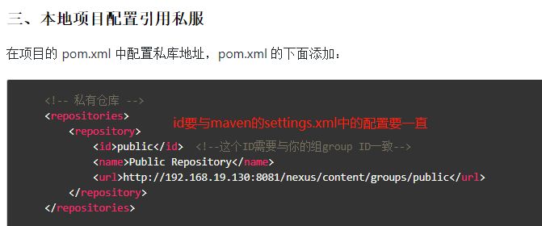

### 上传jar到私服

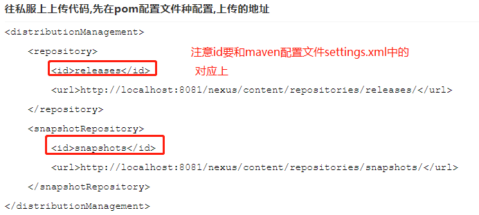
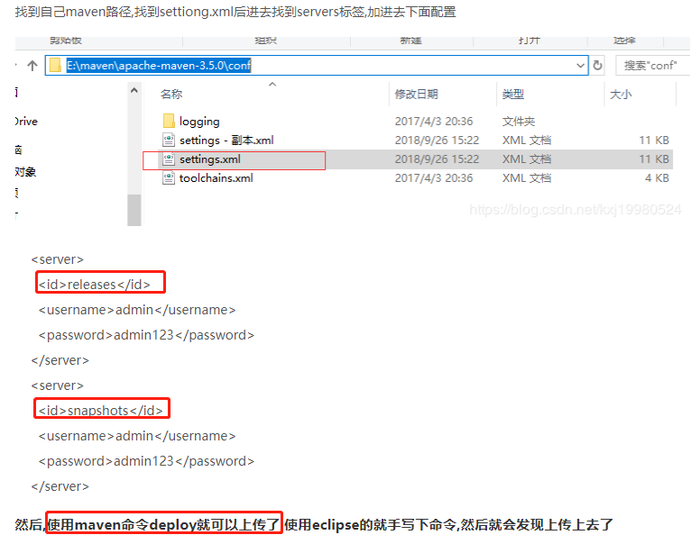

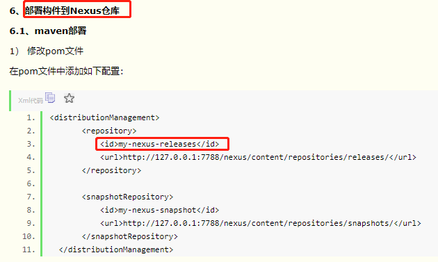
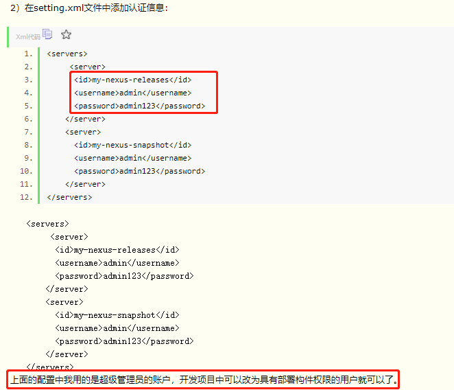
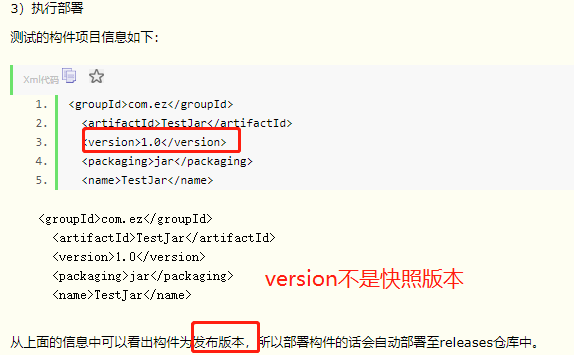
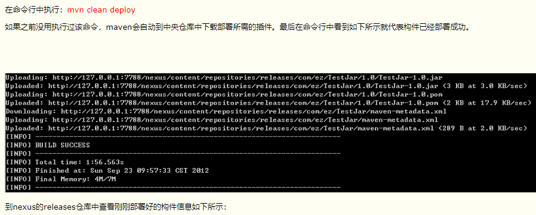
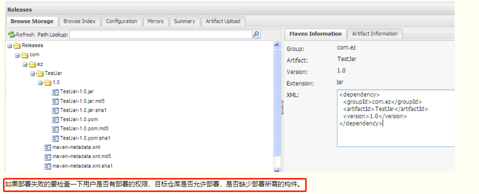


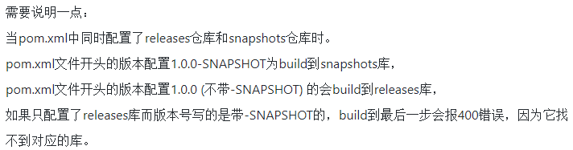

### 其他注意事项


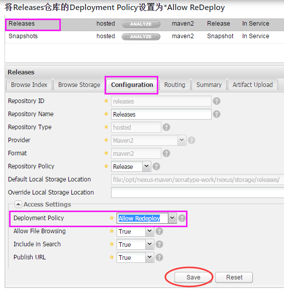


## Linux下使用

- [https://yq.aliyun.com/articles/7427](https://yq.aliyun.com/articles/7427)

# 解决Maven无法自动下载依赖的问题

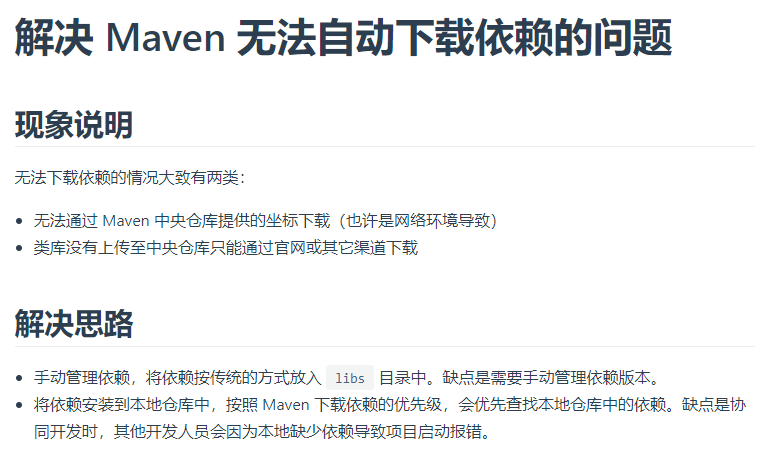

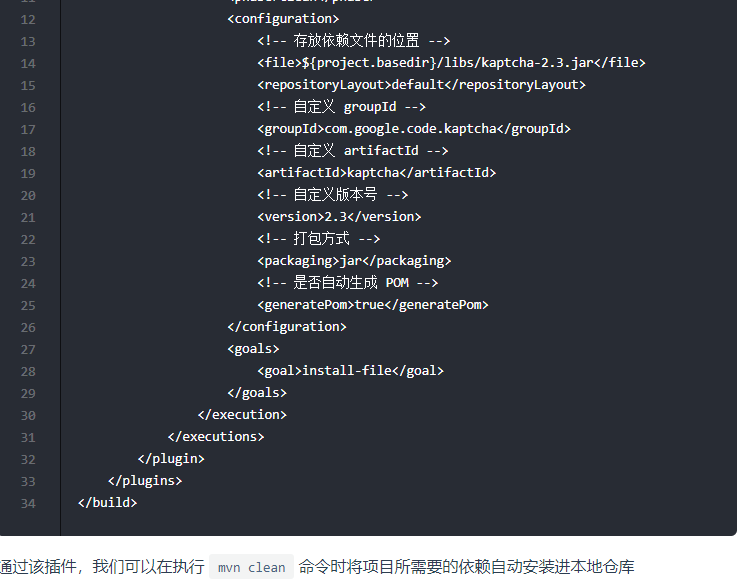

# Maven镜像仓库替换为阿里云镜像仓库

## 第一种方式: 直接修改Maven配置文件.

```shell
# 修改maven配置文件: $MAVEN_HOME/conf/settings.xml, 或者在$USER_HOME/.m2/下面添加一个settings.xml文件,里面添加:
<!-- 阿里镜像仓库 -->
<mirrors>
<mirror>
    <id>alimaven</id>
    <name>aliyun maven</name>
    <url>
        http://maven.aliyun.com/nexus/content/groups/public/
    </url>
    <mirrorOf>central</mirrorOf>
</mirror>
</mirrors>
```

## 第二种: 修改某一个项目,直接引用alimaven

```xml
<repositories>
    <repository>  
        <id>alimaven</id>  
        <name>aliyun maven</name>  
        <url>http://maven.aliyun.com/nexus/content/groups/public/</url>  
        <releases>  
            <enabled>true</enabled>  
        </releases>  
        <snapshots>  
            <enabled>true</enabled>  
        </snapshots>  
    </repository>  
</repositories>  
```
