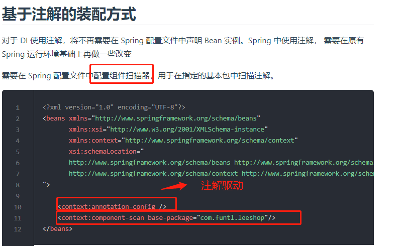

# 理解“IoC”与“DI”间的关系

“控制反转(IoC： Inversion of Control）”和“依赖注入(DI：Dependency Injection）” ，IOC控制反转实际上就是将对象的创建权交给了Spring，程序员无需自己手动实例化对象
spring就是充当一个对象工厂的角色。

DI(依赖注入): ”指的是不让对象本身自己解决自己的依赖(即自己new出自己所需要的对象），而是让一个专门的外部对象(称为IoC容器）创建好相关对象，再将它们提供(即“注入”）给需要用到它的对象，比如， IoC容器发现A“依赖”于B，于是它在new A时，自动new一个B对象，并且设置A的相应字段引用这个B对象，这样一来， A对象自己就不需写代码去创建B对象了。

简单说: DI就是IoC的具体实现.

Spring中把每一个需要管理的对象称为Spring Bean(简称Bean),而Spring管理这些Bean的容器,称为Spring IoC容器。

# Spring IoC容器的功能

- 创建Bean的能力
- 扫描和识别Bean之间依赖关系的能力
- 装配Bean的能力

SpringIoC容器(即ApplicationContext对象） 负责创建Bean，并通过容器将Bean注入到需要它的其他Bean中.

外界通过IoC容器获取Bean实例的两种方式

- 按类型: `<T> T getBean(Class<T> requiredType)`
- 按bean的名称(例如@Bean(name = "beanContainer")): `Object getBean(String name)`

# Spring常用的IoC容器类型

ApplicationContext实现了N多的接口，并且派生出了若干个子类,常用的有:

- XmlWebApplicationContext: bean配置放在xml中
- ClassPathXmlApplicationContext: bean配置放在classpath下的xml中    
- AnnotationConfigApplicationContext: 在独立的Java应用程序中使用,bean配置信息由注解所提供
- AnnotationConfigWebApplicationContext: 在独立的Web应用程序中使用,bean配置信息由注解所提供
- FileSystemXmlApplicationContext：这类似于ClassPathXmlApplicationContext，除了可以从文件系统中的任何位置加载xml配置文件

# SpringIoC容器的工作原理

通过在Bean上附加一些注解,例如@Configuration，@ComponentScan,@Bean,SpringIoC就知道了哪些Bean可以用，以及它们之间的依赖关系是什么样的，从而可以实现Bean的装配.

# 用于声明Bean的注解

* @Component组件，没有明确的角色，通常用于定义普通的没有特殊含义的Bean。
* @Service在业务逻辑层(service层)使用,通常用于标识那些包容了“业务逻辑(business logic)”的Bean。
* @Repository:表示带注释的类是“存储库(Repository)”,此注释用作@Component的特化，并且建议与DAO类一起使用(advisable to use with DAO classes.),在数据访问层(dao层）使用， 通常用于标识那些包容了数据存取(Data Access）代码的Bean
* @Controller在展现层使用，它即Spring MVC中的控制器。
* @Configuration：用于标识“配置类”， Spring Boot项目在启动时会自动扫描并加载标记有此注解的类,在@Configuration注解修饰的类中把@Bean附加于特定的方法之上，方法返回的对象将成为一个Spring可以管理的Bean。

> @Service和@Repository都派生自@Component,但没有添加任何的特性,@Controller也派生自@Component。

# 传统xml方式中,如何配置基于注解驱动 

