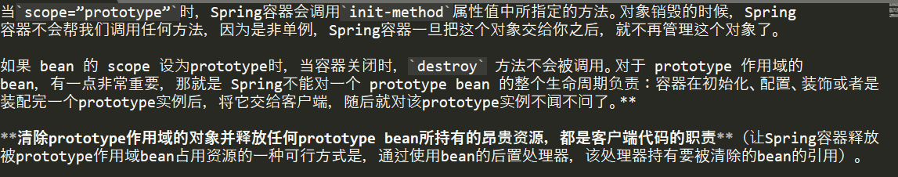
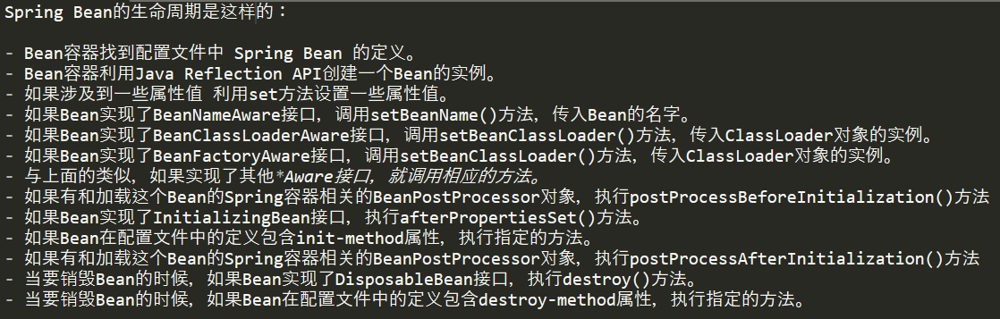
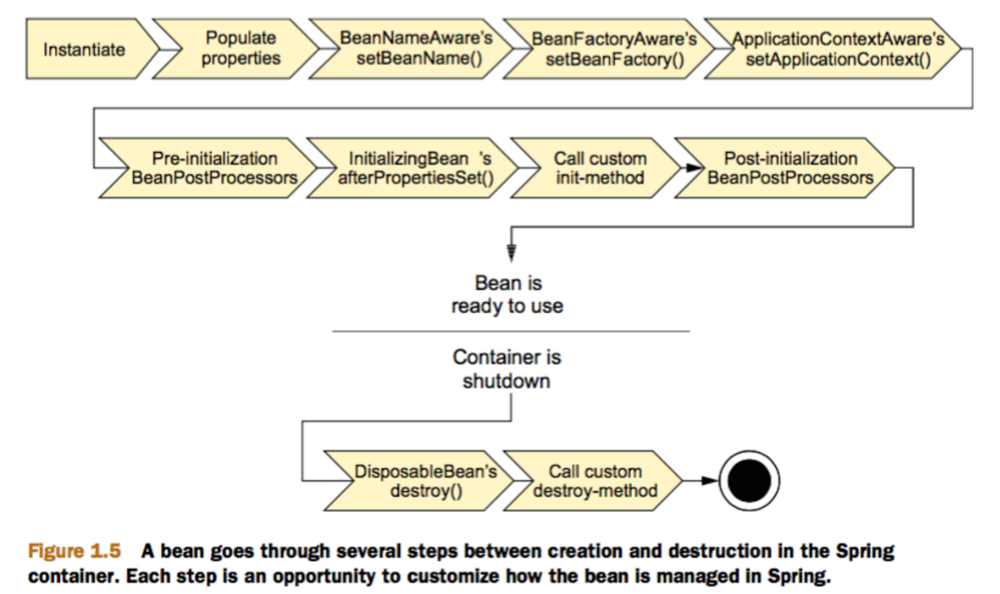
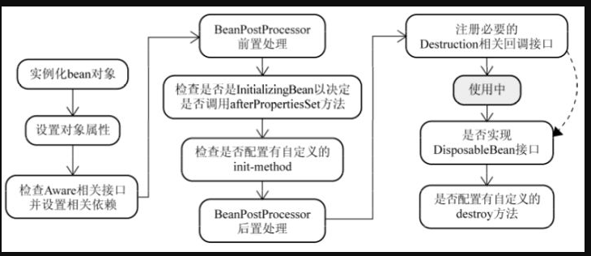

# Bean的作用域

Spring只帮我们管理单例模式 Bean 的**完整**生命周期，对于 prototype 的 bean ，Spring 在创建好交给使用者之后则不会再管理后续的生命周期。



## 旧版本的Spring的bean的作用域(5种)


> Singleton：Spring容器共享这个实例。使用此范围时，请确保bean没有共享成员变量，否则可能导致数据不一致问题


## 新spring版本bean的作用域是6种

singleton, prototype,request,session,application,websocket

最后四种request,session,application,websocket仅在Web应用程序中可用。后4种在实际中用的也不多.

>问: 向一个Singleton Bean注入一个Prototype Bean，后者会被实例化几次？

答: prototype bean使用一次,就实例化一次.

# Spring IoC容器中的Bean生命周期

1. 初始化
2. 依赖注入
3. setBeanName方法(接口BeanNameAware)
4. setBeanFactory方法(接口BeanFactoryAware)
5. setApplicationContext方法(接口ApplicationContextAware(需要容器实现ApplicationContext接口才会被调用))
6. postProcessBeforeInitialization方法(BeanPostProcessor的预初始化方法(注意，它是针对全部bean生效))
7. 自定义初始化方法(@PostConstruct标注方法)
8. afterPropertiesSet方法(接口InitializingBean)
9. postProcessAfterInitialization方法(BeanPostProcessor的后初始化方法(注意，它是针对全部bean生效))
10. 生存期
11. 自定义销毁方法(@PostDestroy标注方法)
12. destroy方法(接口DisposableBean)






## 在Bean初始化之后和Bean销毁之前做一些事情的方式

- 通过实现InitializingBean的afterPropertiesSet()和实现DisposableBean接口的destroy(),这种方法比较简单，但是不建议使用。因为这样会将Bean的实现和Spring框架耦合在一起.
- 在bean的配置文件中指定init-method和destroy-method方法,需要注意的是自定义的init-method和post-method方法可以抛异常但是不能有参数。这种方式比较推荐，因为可以自己创建方法，无需将Bean的实现直接依赖于spring的框架
- 使用@PostConstruct和@PreDestroy注解,注意:为了注解可以生效，需要在配置文件中定义org.springframework.context.annotation.CommonAnnotationBeanPostProcessor这个bean或者添加context:annotation-config.

## 重要的Aware

Aware子接口均继承于`org.springframework.beans.factory.Aware`标记接口.

- **ApplicationContextAware**: 获得ApplicationContext对象,可以用来获取所有Bean definition的名字。
- **BeanFactoryAware**:获得BeanFactory对象，可以用来检测Bean的作用域。
- **BeanNameAware**:获得Bean的名字。
- **ResourceLoaderAware**:获得ResourceLoader对象，可以获得classpath中某个文件。
- **ServletContextAware**:在一个MVC应用中可以获取ServletContext对象，可以读取context中的参数。
- **ServletConfigAware**： 在一个MVC应用中可以获取ServletConfig对象，可以读取config中的参数。

## BeanPostProcessor

上面的*Aware接口是针对某个实现这些接口的Bean定制初始化的过程，Spring同样可以针对容器中的所有Bean，或者某些Bean定制初始化过程，只需提供一个实现BeanPostProcessor接口的类即可。 

该接口中包含两个方法，postProcessBeforeInitialization和postProcessAfterInitialization。postProcessBeforeInitialization方法会在容器中的Bean初始化之前执行， postProcessAfterInitialization方法在容器中的Bean初始化之后执行。

要将实现BeanPostProcessor的Bean像其他Bean一样定义在配置文件中

```xml  
<bean class="com.spring.service.CustomerBeanPostProcessor"/>
```
