# REST的由来

REST是国外的一个博士论文中提出的,“REST(Representational State Transfer）-表现状态转换”,简单的说就是一种软件的架构风格,让访问的api看上去更优雅.(RESTful只是一种风格，并不是强制的标准)

# 请求方式
    
    可以通过 GET、 POST、 PUT、 PATCH、 DELETE 等方式对服务端的资源进行操作。其中：
    
    GET：用于查询资源
    POST：用于创建资源
    PUT：用于更新服务端的资源的全部信息
    PATCH：用于更新服务端的资源的部分信息
    DELETE：用于删除服务端的资源。

这里，使用“用户”的案例进行回顾通过 GET、 POST、 PUT、 PATCH、 DELETE 等方式对服务端的资源进行操作。

    【GET】          /users                # 查询用户信息列表
    【GET】          /users/1001           # 查看某个用户信息
    【POST】         /users                # 新建用户信息
    【PUT】          /users/1001           # 更新用户信息(全部字段)
    【PATCH】        /users/1001           # 更新用户信息(部分字段)
    【DELETE】       /users/1001           # 删除用户信息

- 在REST风格的设计中，如果是简单的参数，往往会通过URL直接传递，在Spring MVC可以使用注解@PathVariable进行获取，这样就能够满足REST风格传递参数的要求.
- 对于那些复杂的参数，例如，你需要传递一个复杂的资源需要十几个甚至几十个字段，通常会使用Json字符串来封装它们，然后将它放到HTTP请求的Body中，以POST方式提交给服务器。这样Server端可以使用注解@RequestBody将Json数据转换为Java对象。
    
# 区分传统的Web API和RESTful API。

    功能 传统的Web API 					verb  RESTful API 		verb
    查询 /user/query?name=tom    		GET   /user?name=tom 	GET
    详情 /user/getInfo?id=1 		 		GET   /user/1 			GET
    创建 /user/create?name=tom   		POST  /user 			POST
    修改 /user/update?id=1&name=jerry	POST  /user/1 			PUT
    删除 /user/delete?id=1 			    GET   /user/1 			DELETE

# restful命名风格

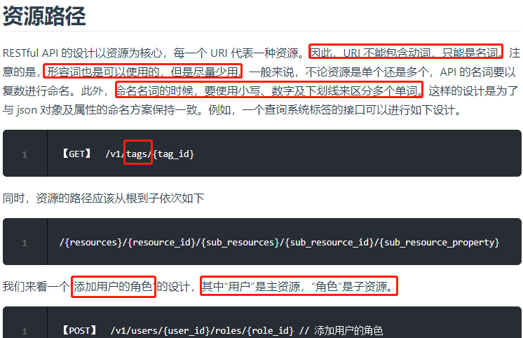
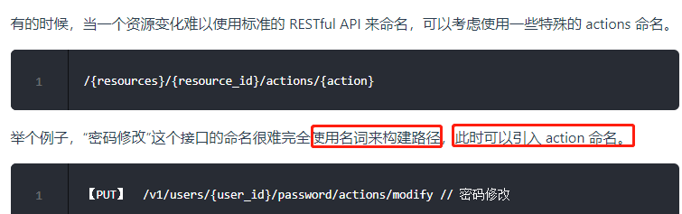
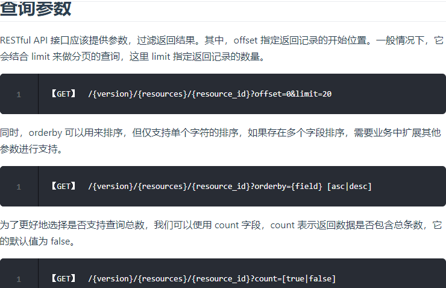
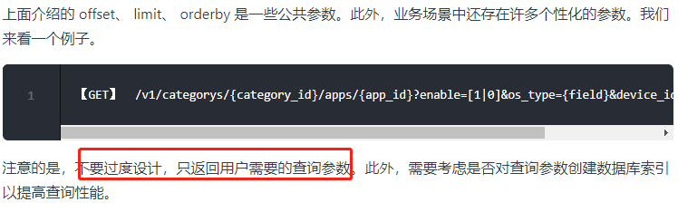
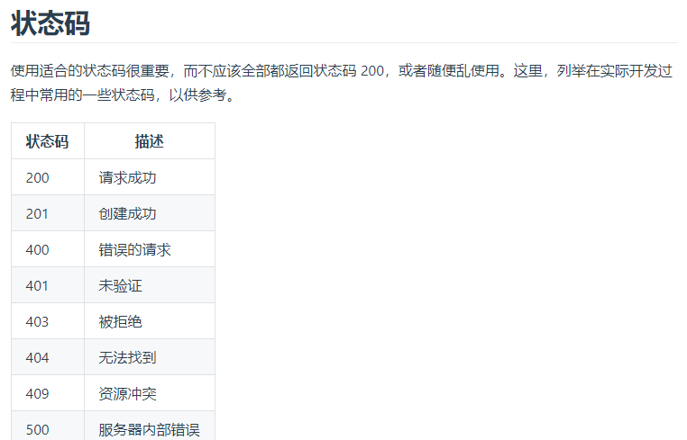
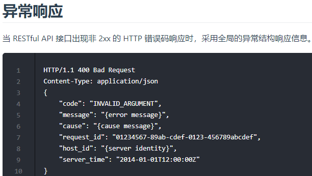
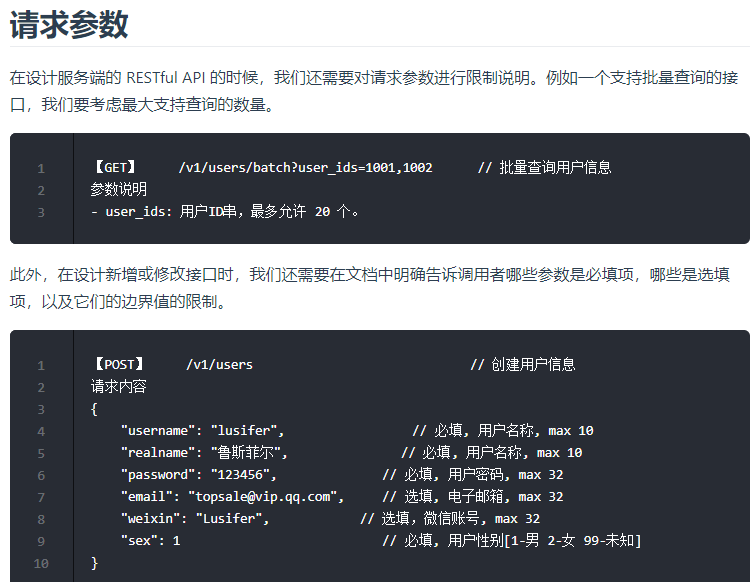
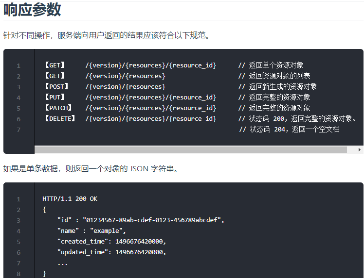
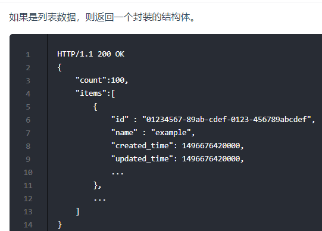
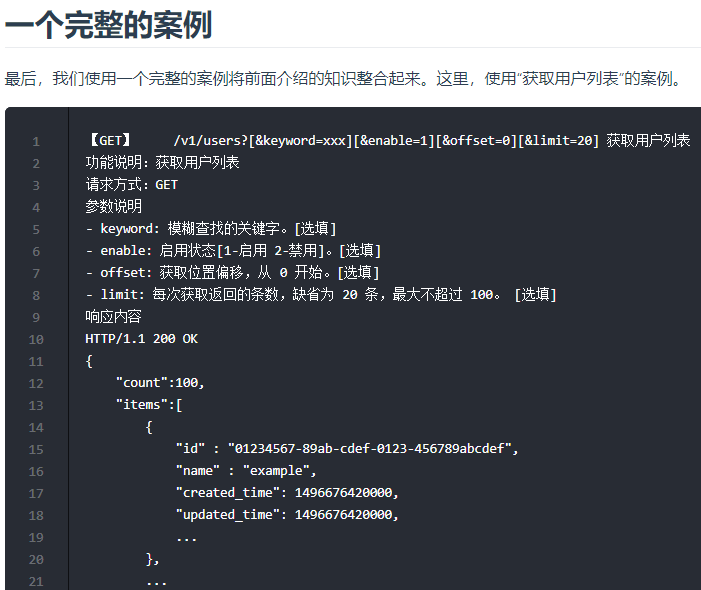
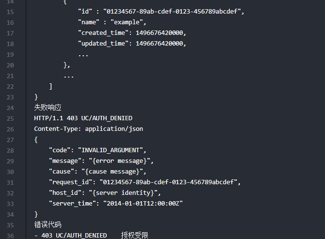
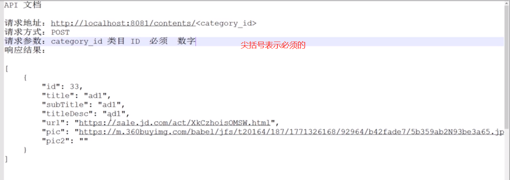

# 配置 Swagger2 接口文档引擎

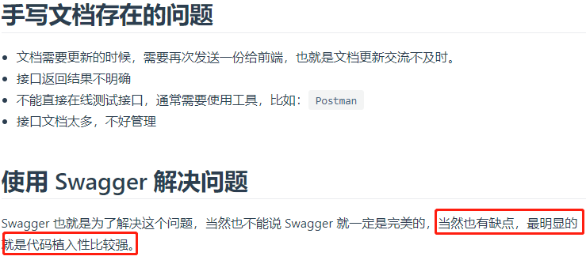
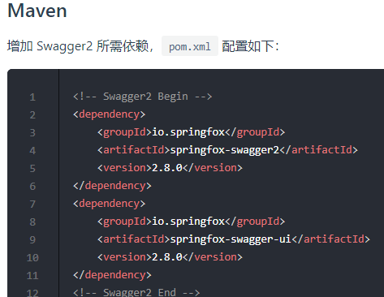
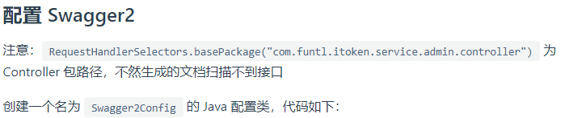

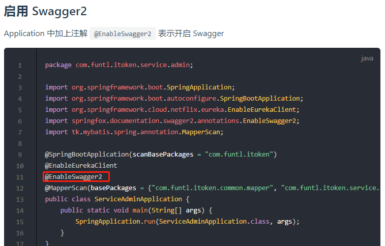
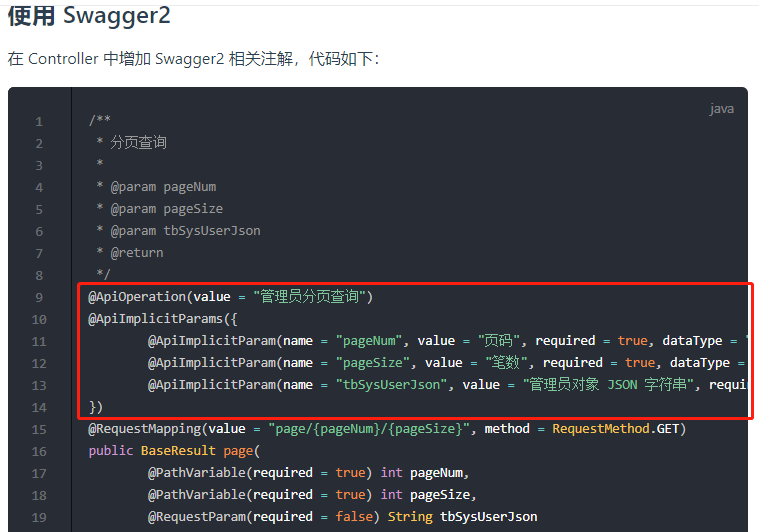
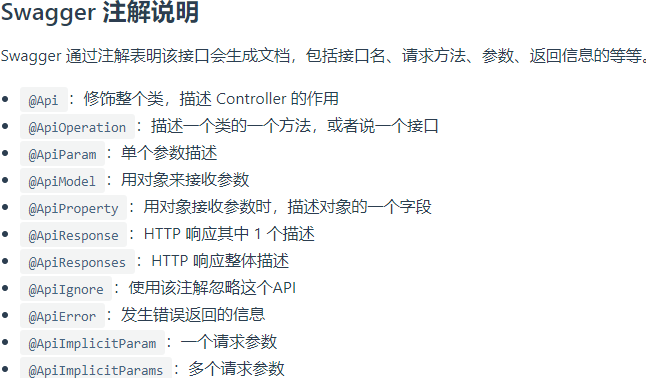
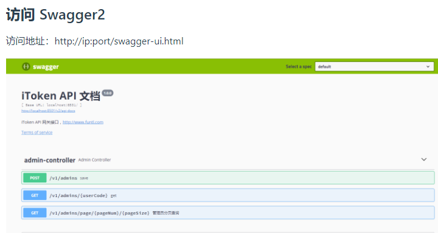

# 参考

- [https://www.funtl.com/zh/apache-http-client/你怎么理解-RESTful.html](https://www.funtl.com/zh/apache-http-client/你怎么理解-RESTful.html)