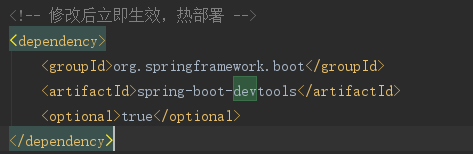
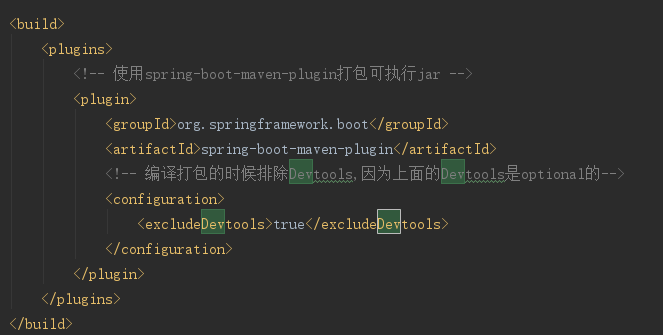
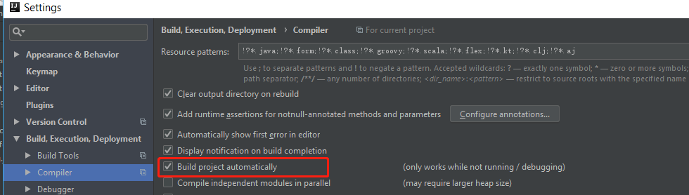
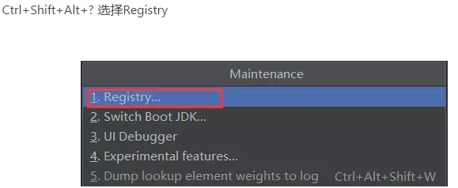
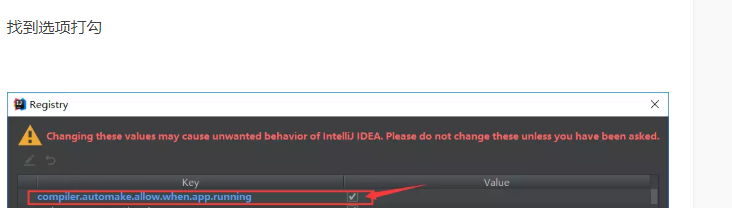

### 工程结构(最佳实践）

Spring Boot框架本身并没有对工程结构有特别的要求，但是按照最佳实践的工程结构可以帮助我们减少可能会遇见的坑，减少工作量,尤其是Spring包扫描机制的存在.

每一个类都应在一个包下面，而不应该直接放在classes目录下，因为这可能会导致一些注解，例如@ComponentScan, @EntityScan or @SpringBootApplication失效。对于@EnableAutoConfiguration注解，官方建议将其放在我们项目的root package下面.

### 典型示例

* root package结构：com.example.myproject
* 我们一般会在root package下面放置启动类Application.java(通常命名为Application.java)，通常我们会在启动类中做一些框架配置扫描等配置，我们放在root package下可以帮助程序减少手工配置来加载到我们希望被Spring加载的内容.
* 实体(Entity）与数据访问层(Repository）置于com.example.myproject.domain包下
* 逻辑层(Service）置于com.example.myproject.service包下
* Web层(web）置于com.example.myproject.web包下

.
└── com
    └── example
        └── myproject
            ├── Application.java
            ├── config
            ├── dao
            │   └── PersonDao.java
            ├── domain
            │   └── Person.java
            ├── service
            │   ├── impl
            │   │   └── PersonServiceImpl.java
            │   └── PersonService.java
            └── web
                ├── controller
                │   └── PersonController.java
                ├── filter
                ├── listener
                └── servlet

* 我们一般会在启动类上添加注解:

1. @EnableAutoConfiguration。之所以建议将启动类放在root package下面，是因为这个注解在某些情况下“隐含”的包含了一些“search package”，例如当如果的项目与JPA集成了，其就会自动扫描root package的所有子包，来寻找含有@Entity注解的类。(注意@Entity并不是Spring提供的注解，其不会自动实例化有这个注解的类，只有在与JPA整合的时候，才会自动去搜索含有此注解的类)

2. @ComponentScan注解。这个注解的作用类似于我们在spring的xml配置文件中的base-package的作用。在Applcation.java上添加这个注解后，会自动扫描所有的子包，寻找含有@Repository、@Service、@Controller、@Component、@RestController、@Configuration注解的类，实现实例化和依赖注入等功能。对于一些依赖的第三方jar，由于这些类上并没有添加以上的这些注解，因此通过@ComponentScan无法直接获取其实例。例如我们再进行Mybatis与Spring整合的使用，使用到SqlSessionFactory，通过@ComponentScan无法获取其实例。对于这种情况， SpringBoot官方倾向于在一个添加@Configuration注解的类上，来获取需要依赖注入的Bean。不过结合目前的Spring使用情况来说，大部分公司都是XML+注解联合使用的。因此Spring也提供了另外一个注解@ImportResource，来导入类路径下的xml格式的配置文件:`@ImportResource (value={"applicationContext.xml" })`。

3. @Configration,@Import(根据个人喜好)

>@SpringBootApplication，这个注解的作用相当于同时添加了:@EnableAutoConfiguration
,@ComponentScan,@Configuration

# 热部署

