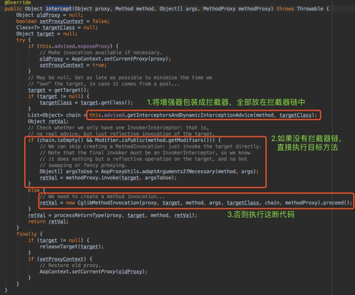

# Spring技术的演化

1. Spring Framework - XML配置为主-->注解为辅
2. Spring Boot - 自动化配置--->注解为主
3. Spring Cloud - 单体应用--->分布式微服务系统

# Spring Framework中最重要的两个核心特性

* 依赖注入(DI： DependencyInjection）:Spring使用“依赖注入”这种手段来管理`各类Java资源`，降低了各种资源的耦合
* 面向切面编程(AOP： Aspect-OrientedProgramming）:Spring通过动态代理技术实现了面向切面的编程(AOP），避免了编写大量重复的代码

# Spring IoC Container

我们使用的一些有用的ApplicationContext实现是:

1. AnnotationConfigApplicationContext：如果我们在独立的Java应用程序中使用Spring并using annotations for Configuration，那么我们可以使用它来初始化容器并获取bean对象。
2. ClassPathXmlApplicationContext：如果我们在独立应用程序中有spring bean配置xml文件，那么我们可以使用这个类加载文件并获取容器对象。
3. FileSystemXmlApplicationContext：这类似于ClassPathXmlApplicationContext，
除了可以从文件系统中的任何位置加载xml配置文件。
4. AnnotationConfigWebApplicationContext和XmlWebApplicationContext。

# Spring 5重要特性

- 使用新模块改进了日志记录 -  spring-jcl。
- 文件操作使用NIO 2流，从而提高了性能。
- 支持Reactor 3.1 Flux和Mono以及RxJava 1.3和2.1作为Spring MVC控制器方法的返回值。
- 支持Kotlin，Project Lombok，JSON Binding API作为Jackson和GSON的替代品。
- Spring WebFlux – Spring getting Reactive.

# JDK Version Range

- Spring Framework 5.1.x: JDK 8-12
- Spring Framework 5.0.x: JDK 8-10
- Spring Framework 4.3.x: JDK 6-8

# Spring Boot 2.0的特点

Spring Boot 2.x will no longer support Java 7 and below, being Java 8 the minimum requirement.Spring Boot 2.0 要求 Java 8 作为最低版本，许多现有的 API 已更新，以利用 Java 8 的特性

Spring Boot 2.0 基于 Spring Framework 5 构建,Spring的新特性均可以在Spring Boot 2.0中使用

>Spring Boot 2.0提供了两个技术栈: 同时支持传统的Servlet技术栈和新增的Reactive技术栈，现在两者都可以用于开发当前流行的“前后端分离”的Web应用，另外，后者更适合于开发微服务.

## Servlet Stack

Servlet技术栈用于开发经典的Java Web应用，使用MVC框架，能很方便地访问各种数据库，跑在Tomcat这种经典Web容器上。

Spring MVC is built on the Servlet API and uses a synchronous blocking I/O architecture with a one-request-per-thread-model.

1. Servlet Containers
2. Servlet API
3. Spring Security
4. Spring MVC
5. Spring Data Repositories JDBC, JPA, NoSQL

## Reactive Stack

Reactive技术栈是全新的，用于开发高性能的分布式软件系统系统，特别适合于开发微服务.

Spring Boot 2.0还提供了支持响应式编程特性的容器: 嵌入式 Netty 服务器(作为默认的响应式容器),由于 WebFlux 不依赖于 Servlet API，我们首次可以使用Netty 作为嵌入式服务器,该 spring-boot-starter-webflux 启动 POM 将拉取 Netty 4.1 和 Ractor Netty。注意：你只能将 Netty 用作响应式服务器，不提供 Servlet API 支持.

Spring WebFlux is a non-blocking web framework built from the ground up to take advantage of multi-core, next-generation processors and handle
massive numbers of concurrent connections.

1. Netty, Servlet3.1+ Containers
2. Reactive Streams Adapters
3. Spring Security Reactive
4. Spring WebFlux
5. Spring Data Reactive Repositories Mongo, Cassandra, Redis, Couchbase

## Servlet和Reactive技术栈的对比

1. Spring Boot 2.0所引入的两个技术栈，各有其适合的应用场景，使用Servlet技术栈的，适合于开发传统Web项目。开发微服务，推荐使用Reactive技术栈。
2. 当前主流的Web技术方案是“前后端分离”，如果使用Java开发后端服务，可以使用Spring MVC或WebFlux开发RESTful Service，诸如Thymeleaf之类传统的MVC视图技术也可以不用了， Vue/React/Angular用起来更方便和强大.

# spring framework高级特性

- Spring ApplicationEvent(Spring的应用程序事件)
- Spring Aware-用到Spring容器本身
- Spring异步调用-@EnableAsync开启对异步任务的支持,使用@Async注解来声明其是一个异步任务.
- Spring计划任务 -@EnableScheduling 来开启对计划任务的支持，然后在要执行计划任务的方法上注解@Scheduled，声明这是一个计划任务。

# Spring AOP的实现原理?

AOP的实现，最关键的有两步：

1. 得到代理对象
2. 利用递归责任链执行前置以及后置的advice(通知)及目标方法

IOC容器初始化时，对于涉及AOP操作的目标类，其实Spring返回的是代理对象，而不是目标类的实例。

代理对象proxy其实包含了很多东西，比如：

- 目标对象
- 增强器

代理对象最终都会间接调用目标对象的同名方法，比如proxy.add() --> target.add(),但代理对象允许在调用add()前后添加一些增强代码，作为功能扩展
即，调用代理对象的方法最终都会“转嫁”成调用目标方法，但是在调用前后会执行一些其他操作，我称这些其他操作为“增强代码”，本质上就是上面提到的增强器。

>代理对象方法 = 拦截器链 + 目标对象方法

假设代理对象proxy调用了某个方法，而这个方法会触发CglibAopProxy.intercept()。先不要理会为啥会触发这个方法，反正人家就是这样设定的。我们来看看intercept()方法：



intercept()如果没有拦截器链,直接执行目标方法,如果有拦截器链,就传入拦截器链和目标对象，最终new CglibMethodInvocation(...).proceed(),我们主要考虑有拦截器链的情况。

intercept()说穿了，就干了两件事：收集拦截器，做成链,然后把拦截器链和目标对象等传入，执行new CglibMethodInvocation(...).proceed()

>new CglibMethodInvocation(proxy, target, method, args, targetClass, chain, methodProxy).proceed();

这里new了一个CglibMethodInvocation对象，包括目标对象、拦截器链啥的。


简化后的示意图：


也就是说，只要拦截器链没执行完，就不会执行目标方法。即：

- 先执行全部的拦截器
- 最后执行目标方法

我知道你看到这里，会有什么疑问：既然拦截器都在目标方法前执行，怎么会出现AOP的后置调用呢?

```java
before... 
target.add() 
afterReturning... ...
```

别急，我们看看拦截器的invoke()干了啥。

刚才说过了，拦截器是对增强的包装。我们增强方法有哪些来着？Before/AfterReturning...等等，所以拦截器肯定也有对应的Before/AfterReturning...

我们先看Before拦截器：


- 先调用了this.advice.before()。即，反射执行@Before方法。
- 再调用了mi.proceed()。这个mi，就是我上一个截图传入的this，也就是CglibMethodInvocation对象。

再看After拦截器：


- 先调用mi.proceed()
- 后反射调用@After方法

先别管具体上下文环境以及方法含义，我就问你，单纯看语句调用顺序，Before拦截器和After拦截器有何不同？

答案是：

- Before拦截器是先反射调用@Before，再调用mi.proceed()。
- 而After拦截器是先调用mi.proceed()，再反射调用@AfterRetruning方法。(因为finally是目标对象的方法返回之后才带调用,这里就是aop的精华)

>其实，只有Before是特殊的，其他拦截器都是先调用proceed()，再反射调用通知方法。

AOP递归责任链：


跟着调用栈，可以看到顺序是before---target.add()---after...,流程解读：

1. proxy.add()触发CglibAopProxy.intercept()
2. intercept()中获取所有的拦截器，排好序后做出拦截器链（顺序和AOP执行顺序相反，before反而放链的末尾！）
,传入拦截器链和目标对象，new CglibMethodInvocation()并调用proceed()
3. proceed()先执行全部拦截器，最后执行目标方法
4. 目标方法的return是整个递归责任链的精华所在

## Spring Boot中使用AOP

### 引入AOP依赖

在Spring Boot中引入AOP就跟引入其他模块一样，非常简单，只需要在pom.xml中加入如下依赖：

```xml
<dependency>
    <groupId>org.springframework.boot</groupId>
    <artifactId>spring-boot-starter-aop</artifactId>
</dependency>
```

在完成了引入AOP依赖包后，一般来说并不需要去做其他配置。也许在Spring中使用过注解配置方式的人会问是否需要在程序主类中增加@EnableAspectJAutoProxy来启用，实际并不需要。

可以看下面关于AOP的默认配置属性，其中spring.aop.auto属性默认是开启的，也就是说只要引入了AOP依赖后，默认已经增加了@EnableAspectJAutoProxy。

```
# AOP
spring.aop.auto=true # Add @EnableAspectJAutoProxy.
spring.aop.proxy-target-class=false # Whether subclass-based (CGLIB) proxies are to be created (true) as
 opposed to standard Java interface-based proxies (false).
```

>而当我们需要使用CGLIB来实现AOP的时候，需要配置spring.aop.proxy-target-class=true，不然默认使用的是标准Java的实现。

### 优化：AOP切面的优先级

由于通过AOP实现，程序得到了很好的解耦，但是也会带来一些问题，比如：我们可能会对Web层做多个切面，校验用户，校验头信息等等，这个时候经常会碰到切面的处理顺序问题。

所以，我们需要定义每个切面的优先级，我们需要@Order(i)注解来标识切面的优先级。i的值越小，优先级越高。假设我们还有一个切面是CheckNameAspect用来校验name必须为xxx，我们为其设置@Order(10)，而上文中WebLogAspect设置为@Order(5)，所以WebLogAspect有更高的优先级，这个时候执行顺序是这样的：

- 在@Before中优先执行@Order(5)的内容，再执行@Order(10)的内容
- 在@After和@AfterReturning中优先执行@Order(10)的内容，再执行@Order(5)的内容

>所以我们可以这样子总结：

* 在切入点前的操作，按order的值由小到大执行
* 在切入点后的操作，按order的值由大到小执行

# 参考:

- [https://www.zhihu.com/question/23641679/answer/704897152](https://www.zhihu.com/question/23641679/answer/704897152)