# Web开发技术演化

- 过去的SSH(Spring Framework + Struts/SpringMVC + Hibernate)
- 现在的SSM(Spring Boot + Spring Boot MVC + Mybatis)

# Spring Web MVC framework(简称Spring MVC)

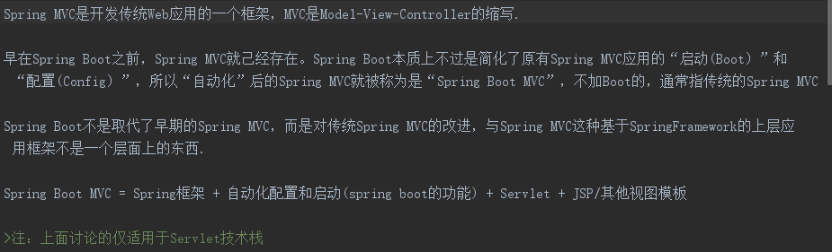


- 控制器(Controller)
- Spring Boot Web MVC 实现文件上传
- Spring Boot Web MVC数据校验
- 异常处理

## 控制器(Controller)


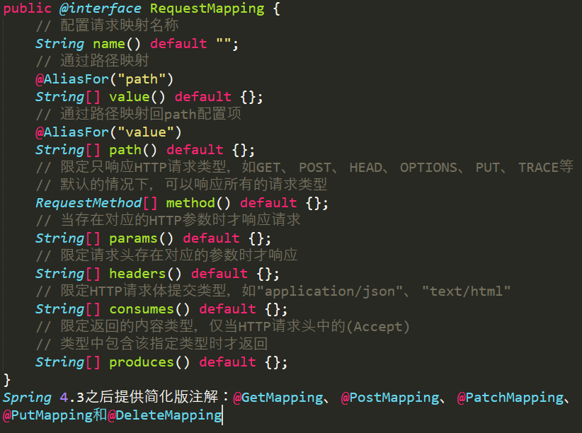

>转发(forward) vs 重定向(redirect)

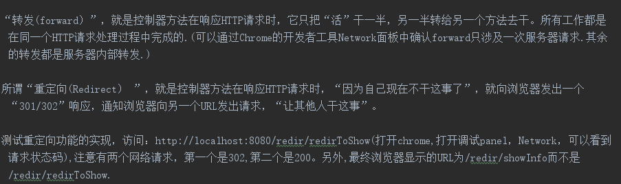

学习过程中需要特别注意一下数据的传送方式，主要有两种：一是数据如何从client传给Server端，二是如何在Server端保存多个HTTP请求之间的状态信息。

## Spring Boot Web MVC 实现文件上传

Spring MVC对文件上传提供了良好的支持，而在SpringBoot中可以更为简单地配置文件上传所需的内容。

通常我们会在网页上设置一个form元素，里面再放置一个文件上传控件(type='file'的input元素）， 用户选择要上传的文件之后，点击“提交”按钮， 采用MIME值为“multipart/form-data”的方式上传文件到服务端。服务端只需要取出文件数据，再将其保存到硬盘上即可。

>Spring Boot Web MVC项目中文件上传相关配置

```
# MULTIPART(MultipartProperties)
# 是否启用Spring MVC多部分上传功能
spring.servlet.multipart.enable=true
# 将文件写入磁盘的阈值，值可以使用后缀“MB”或“KB”来表示兆字节或字节大小
spring.servlet.multipart.file-size-threshold=0
# 指定默认上传的文件夹
spring.servlet.multipart.location=d:/upload
# 限制单个文件最大大小，这里设置为5MB
spring.servlet.multipart.max-file-size=5MB
# 限制所有文件最大大小，这里设置为20MB
spring.servlet.multipart.max-request-size=20MB
# 是否延迟多部件文件请求的参数和文件的解析
spring.servlet.multipart.resolve-lazily=false
```

## Spring Boot Web MVC数据校验

在实际开发中，为了保证数据的安全，必须对用户提交上来的数据进行有效性检测,数据有效性检测分为两类

1. 一类是在客户端进行的，常用的Web前端框架(比如Vue和React）都提供了相应的功能，在提交数据之前对数据的有效性进行检测;
2. 另一类则是服务端数据检测，就是在调用Spring Boot Web MVC控制器方法之前对客户端数据的有效性进行校验。

>这里介绍的是如何使用Spring Boot MVC框架在服务端完成数据有效性检测的工作。
    
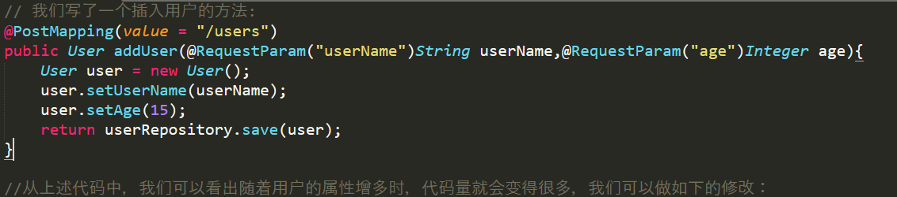
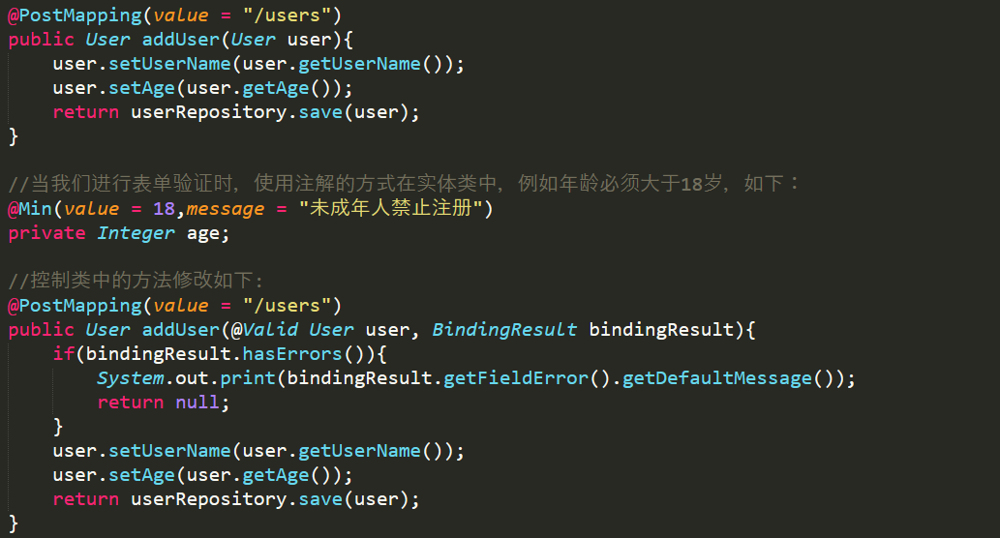
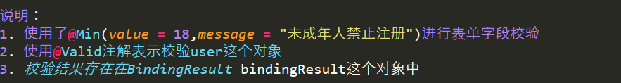

    常用的校验规则如下:

 

- [好的总结](https://www.funtl.com/zh/supplement1/#jsr-303-%E7%AE%80%E4%BB%8B)

## 异常处理

Spring Boot提供了一个默认的映射：/error，当处理中抛出异常之后，会转到/error中处理，并且该请求有一个全局的错误页面用来展示异常内容。

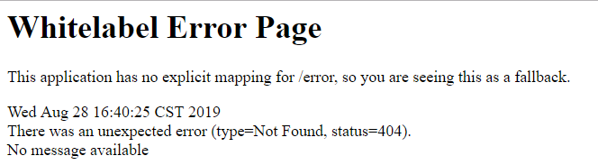

对于浏览器访问,返回默认错误页面的时候,状态吗为404,Spring Boot会使用这个默认页面将状态码显示在网页上.

对于非浏览器访问,例如使用Postman,Spring Boot会返回一个Json字符串，其中包容基础的出错信息。

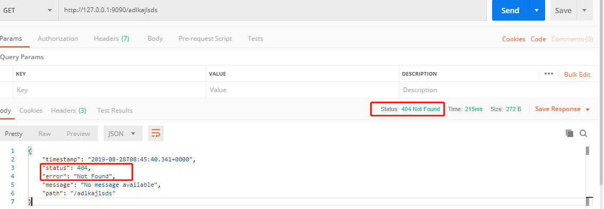

虽然，Spring Boot中实现了默认的error映射，但是在实际应用中，上面你的错误页面对用户来说并不够友好，我们通常需要自定义异常提示.

>Spring Boot项目的默认异常处理机制，是由一个内置的BasicErrorController实现的。

# 使用WebMvcConfigurer

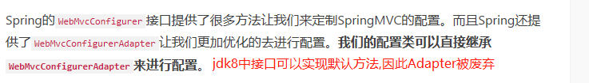
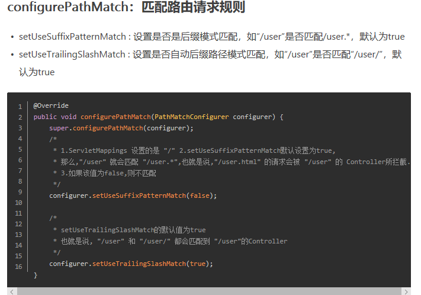


# Spring 整合 Spring MVC

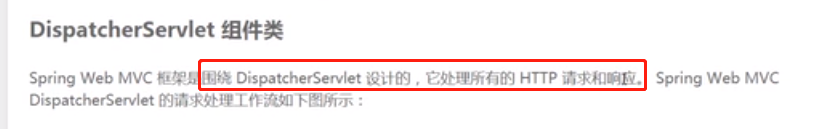
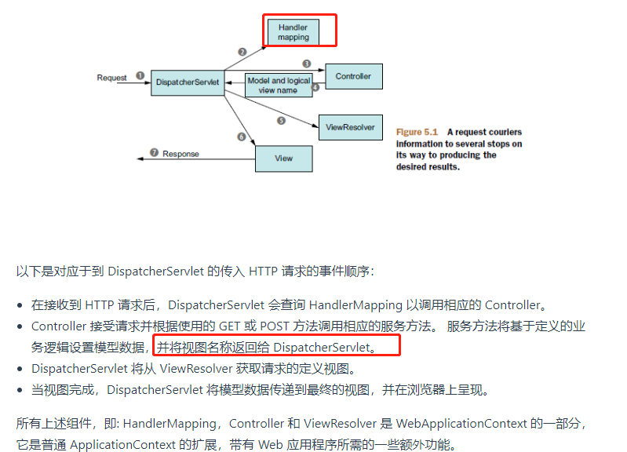

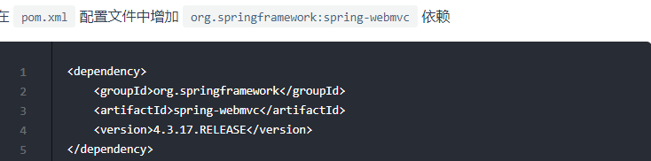


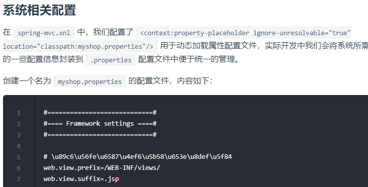


# spring mvc拦截器


简单概括:perHandle()方法是按照配置文件顺序执行 然后逆序执行每个拦截器的postHandle()方法 ，最后逆序执行afterCompletion()方法

- [来源](https://www.funtl.com/zh/spring-mvc/第一个-Controller-控制器.html#概述)