# 3.0 Java配置

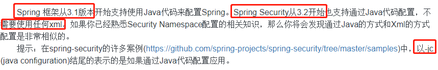

## 3.1 springSecurityFilterChain过滤器创建流程源码分析

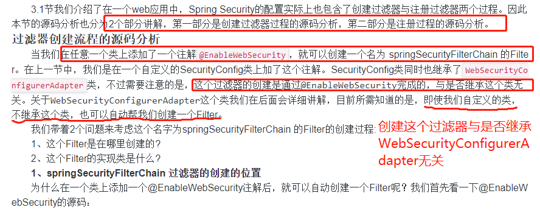
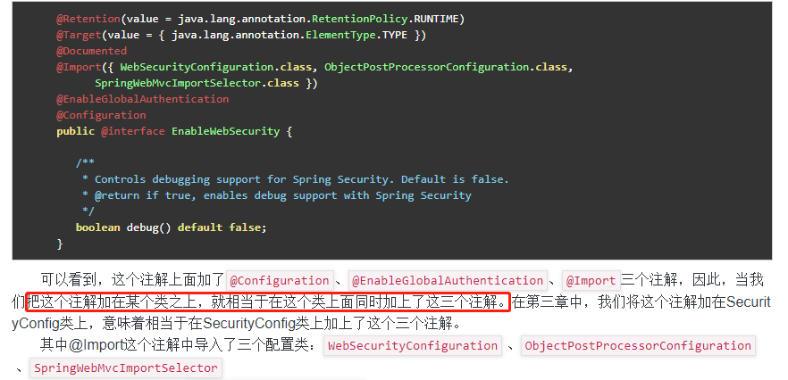
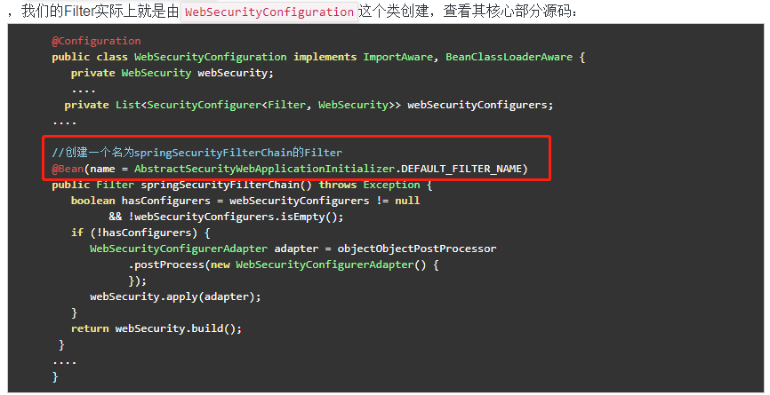
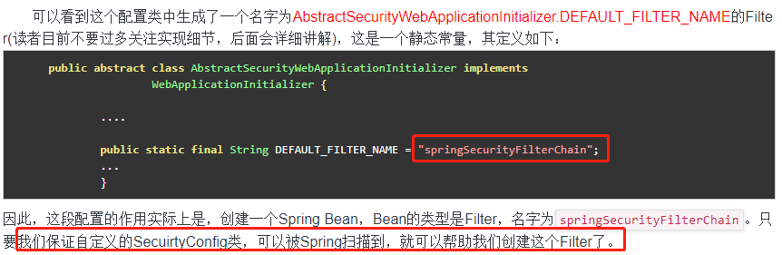
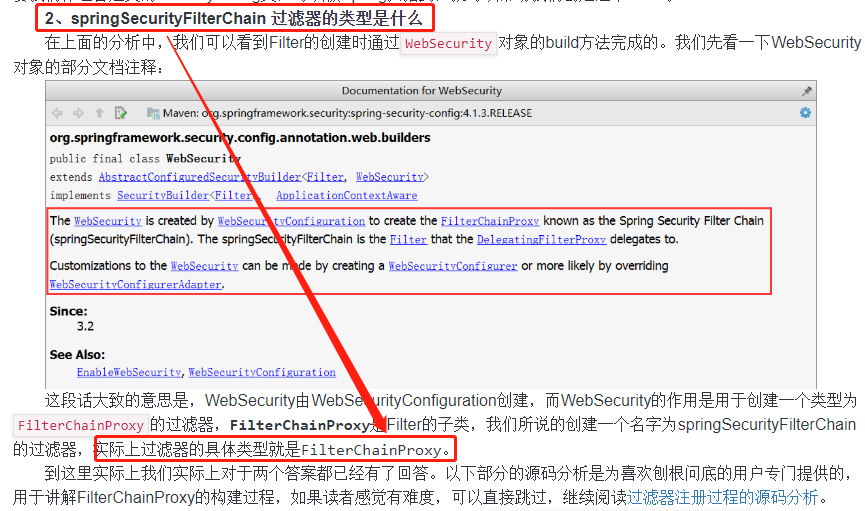

## 3.2 springSecurityFilterChain过滤器的注册源码分析

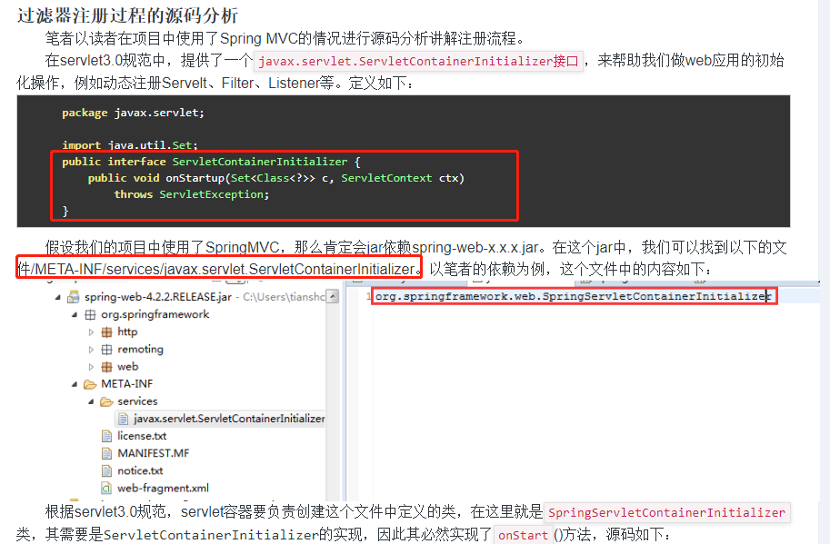
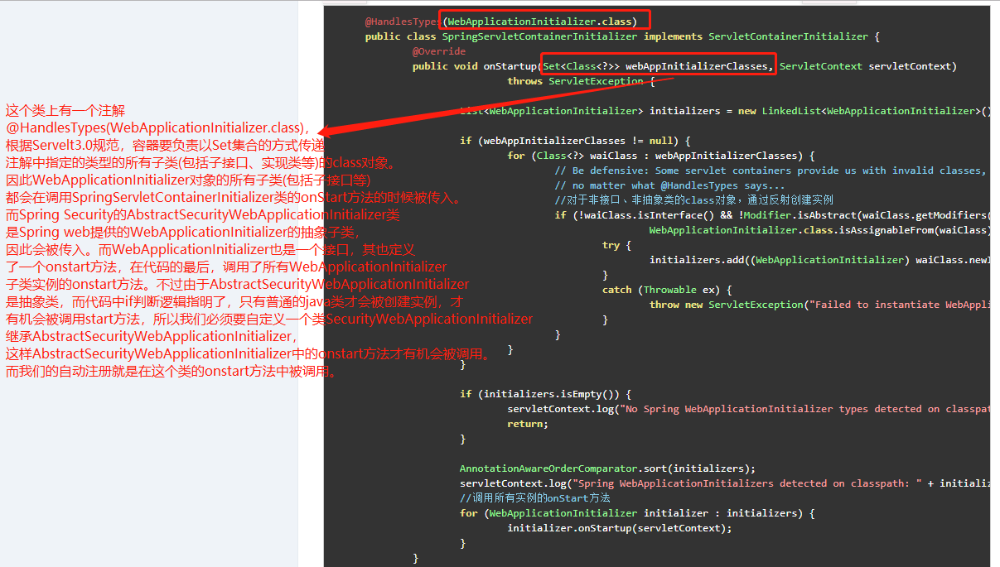
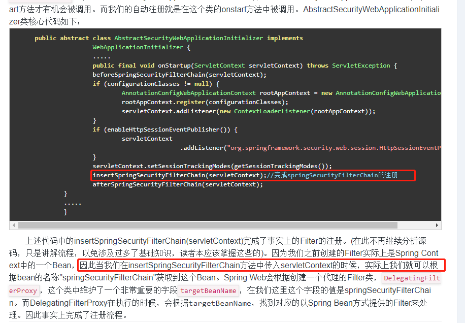

## 3.3 过滤器的创建

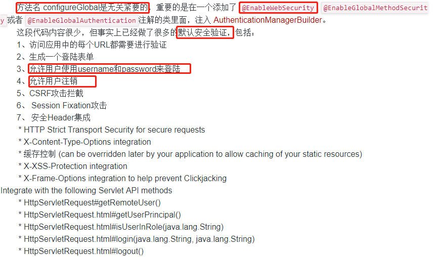

## 3.4 过滤器的注册

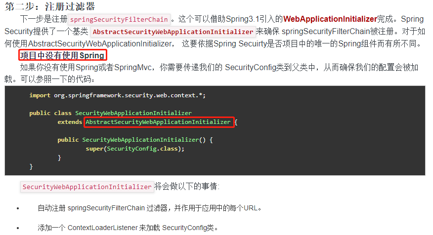
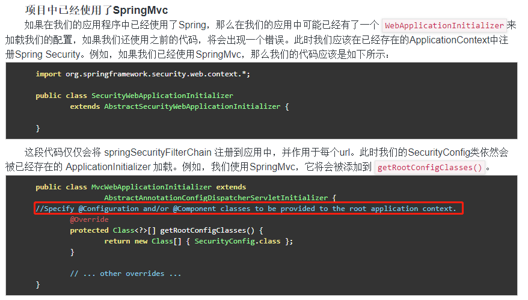

# 注销处理

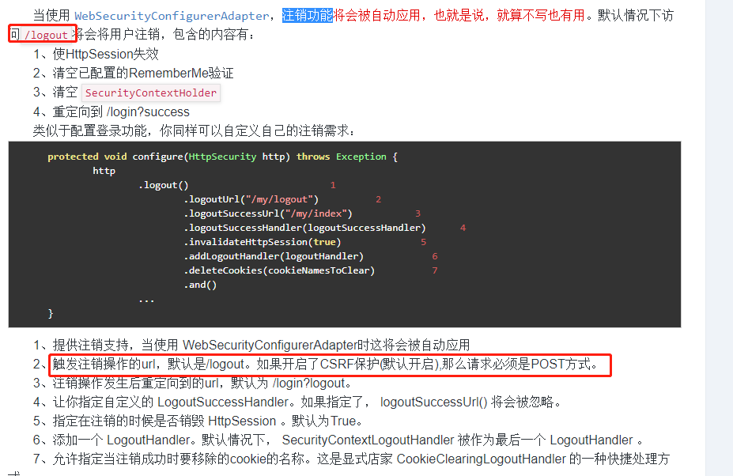
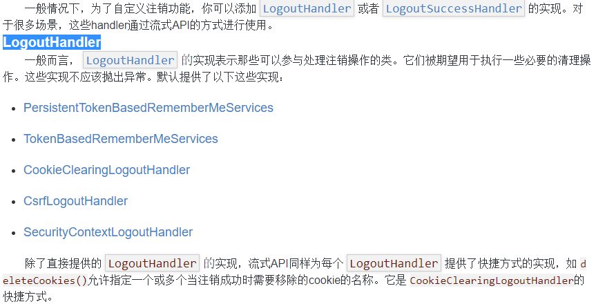
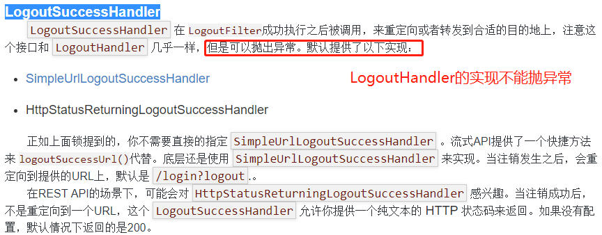

# 参考

- [注销处理](http://www.tianshouzhi.com/api/tutorials/spring_security_4/267)
- [官方文档](https://docs.spring.io/spring-security/site/docs/current/reference/html/jc.html)