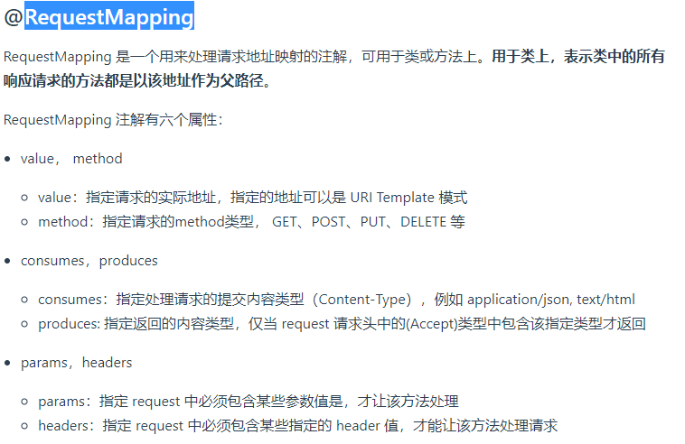
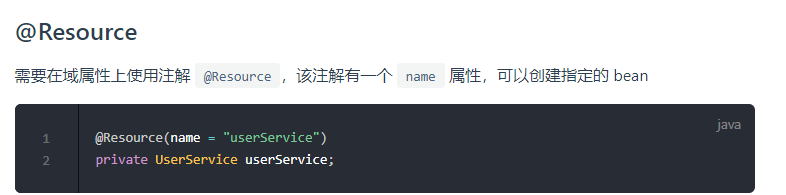
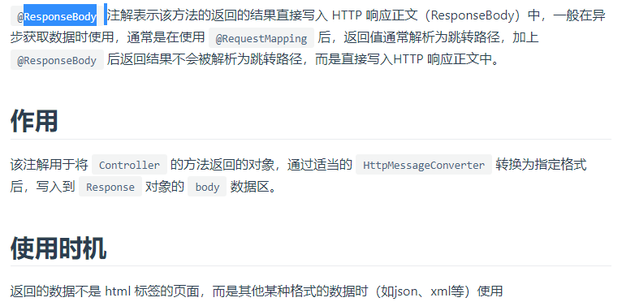
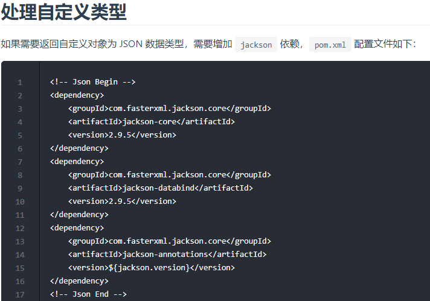
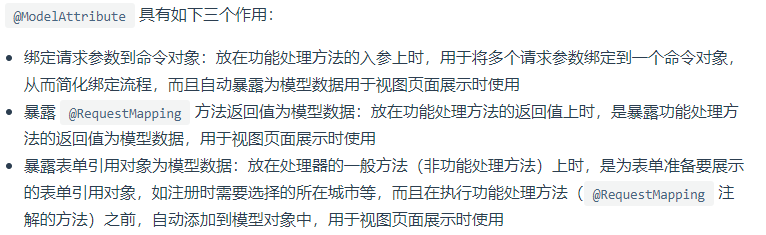
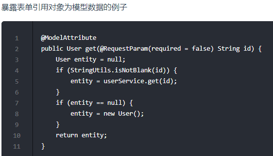
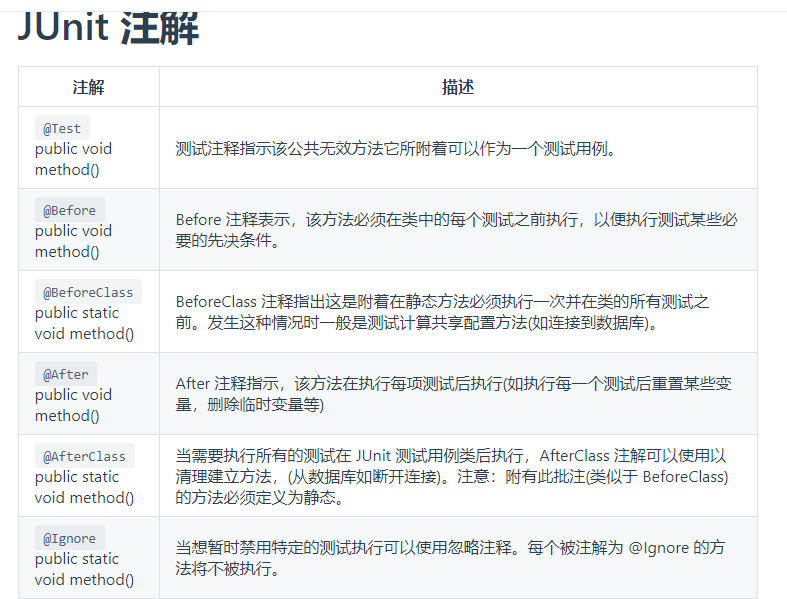
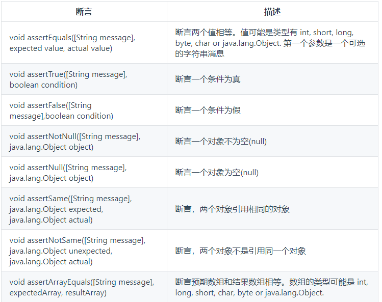
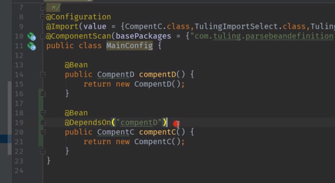

# 用于声明Bean的注解

- @Component组件，没有明确的角色，通常用于定义普通的没有特殊含义的Bean
- @Service在业务逻辑层(service层)使用,通常用于标识那些包容了“业务逻辑(business logic)”的Bean。
- @Repository:表示带注释的类是“存储库(Repository)”,此注释用作@Component的特化，并且建议与DAO类一起使用(advisable to use with DAO classes.),在数据访问层(dao层）使用， 通常用于标识那些包容了数据存取(Data Access）代码的Bean
- @Controller在展现层使用，它即Spring MVC中的控制器。
- @Configuration：用于标识“配置类”， Spring Boot项目在启动时会自动扫描并加载标记有此注解的类,在@Configuration注解修饰的类中把@Bean附加于特定的方法之上，方法返回的对象将成为一个Spring可以管理的Bean。

>@Service和@Repository都派生自@Component,但没有添加任何的特性,@Controller也派生自@Component。

# Component

@Component(value = "aa"): aa就是当前bean的name,或者说id

# RequestMapping注解



- ContentType: 用来告诉服务器当前发送的数据是什么格式 
- Accept: 用来告诉服务器，客户端能认识哪些格式,最好返回这些格式中的其中一种 

---
    有个用户发了一个请求, 请求头中:
    
    ContentType =application/json 
    Accept      =  */*  
    
    但是我的接口中定义了consumes={"application/xml"},我只接收application/xml 格式，也只返回xml格式.很明显，用户调不通这个接口.
---

# Resource注解-JSR-250提供的注解



# ResponseBody

    @ResponseBody可以修饰方法和类,修饰类的时候表示 这个类的所有方法返回的结果直接写到http的ResponseBody中
    
    @ResponseBody作用: 通知Spring依据HTTP请求信息(即accept值）选择合适的转换器(converter）转换
    成client能够接受的格式,返回给client.选择什么转换器是根据Http请求的Request Headers的Accept字段来确认.
    
    比如转成json: 一旦方法返回响应对象，MappingJackson2HttpMessageConverter就会将其转换为JSON,
    写入http的响应体ResponseBody中.





# @RequestBody

    @RequestBody只能作用于参数,作用是: 通知Spring将客户端发来的数据(从HTTP的请求的body中提取）转换为Java对象.

    比如: 用于将"请求主体JSON数据(request body JSON data)"映射到Employee对象，
    这也是由MappingJackson2HttpMessageConverter映射完成的。


# ModelAttribute




# RestController

    @RestController：Spring4之后加入的注解，原来在@Controller中返回json需要@ResponseBody来配合，
    如果直接用@RestController替代@Controller就不需要再配置@ResponseBody，默认返回json格式。

```java
// @RestController可以替代@Controller和@ResponseBody的原因
@Controller
@ResponseBody
public @interface RestController {}
```

# @Value

给Bean中的字段添加@Value注解，能为其设置默认值。

这个值除了直接指定，还可以从项目的application.properties文件中提取: @Value("${age}")获取配置文件中的属性值

# @ConfigurationProperties

通过@ConfigurationProperties加载properties文件内的配置，通过prefix属性指定
properties的配置的前缀，必要时，也可以通过locations指定properties文件的位置，例如：

```java
@ConfigurationProperties(prefix="xzj",locations={"classpath:config/author.properties"})
```

注意需要添加以下项目依赖：

```xml
<!--允许使用@ConfigurationProperties-->
<dependency>
    <groupId>org.springframework.boot</groupId>
    <artifactId>spring-boot-configuration-processor</artifactId>
    <optional>true</optional>
</dependency>
```

# @ComponentScan

在Spring Boot项目中，默认情况下，会扫描程序入口点类所在的包及下属子包中的Bean组件。如果Bean组件放在其他的包中，则可以给配置类添加@ComponentScan注解,指定额外的要扫描Bean组件的包.

通过@ComponentScan注解扫描特定的包只是这一注解最常见的用法罢了，这一注解其实包容有诸多的属性，比如它可以定义过滤器，将特定的Bean排除在外。

@ComponentScan注解。这个注解的作用类似于我们在spring的xml配置文件中的base-package的作用。在主配置类上添加这个注解后，会自动扫描所有的子包，寻找含有@Repository、@Service、@Controller、@Component、@RestController、@Configuration注解的类，实现实例化和依赖注入等功能。对于一些依赖的第三方jar，由于这些类上并没有添加以上的这些注解，因此通过@ComponentScan无法直接获取其实例。例如我们再进行Mybatis与Spring整合的使用，使用到SqlSessionFactory，通过@ComponentScan无法获取其实例。对于这种情况， SpringBoot官方倾向于在一个添加@Configuration注解的类上，来获取需要依赖注入的Bean。不过结合目前的Spring使用情况来说，大部分公司都是XML+注解联合使用的。因此Spring也提供了另外一个注解@ImportResource，来导入类路径下的xml格式的配置文件:`@ImportResource (value={"applicationContext.xml" })`。

# @JsonView的应用场景

1. 在实际开发中，有些数据实体类包容相当多的属性，但在特定的场景中，往往并不需要那么多的属性，只要几个就好了。
2. 通过在数据实体类和控制器中使用@JsonView注解，能够让我们针对特定的场景从数据实体类的属性集合中仅返回那些对于客户端应用来说“有用的”属性数据。
3. Spring将数据转换的结果统称为“View”，生成的Json数据也是“View”。

# @ImportResource

如果您已经有XML文件，您不希望转换为Java配置，您仍然可以使用@ImportResource导入它们,这样可以兼容xml和新的注解.

```java
@SpringBootApplication
@ImportResource({"classpath:some-context.xml", "classpath:another-context.xml"})
public class MainApplication {}    
```

# 条件注解-ConditionalOn

```java
//判断配置文件中是否存在某个配置spring.http.encoding
@ConditionalOnProperty(
    prefix = "spring.http.encoding",
    value = {"enabled"},
    matchIfMissing = true
)

@Bean
@ConditionalOnMissingBean(RequestContextListener.class)
public RequestContextListener requestContextListener() {
    return new RequestContextListener();
}

@ConditionalOnProperty(
    value = {"spring.mvc.favicon.enabled"},
    matchIfMissing = true // 如果缺失了,就是true
)
```

# Junit注解




# @PageableDefault

>分页功能的实现:

```java
@PostMapping("/orders/search")
public Page<SearchOrderOut> getOrders(@RequestBody @Valid Search search,
	@PageableDefault(
		sort = {"modifiedDate", "createdDate"},
		direction = Sort.Direction.DESC
		) Pageable pageable){
	return preOrderService.getOrders(search, pageable);
}
```

# @DependOn



# 其他

- @PostConstruct: Spring bean对象构造完后调用.
- @PreDestroy: Spring bean对象销毁前调用
- @Transactional标注在某个方法上表示这个方法是要进行事务管理,事务就是多条操作同时成功或者失败.
- 启动指定类的ConfigurationProperties功能:@EnableConfigurationProperties({HttpEncodingProperties.class})
- @Primary:声明默认的，首要的bean(在没有具体指明名字的时候使用).
- Springboot中显示的导入配置类的方法; @Import(value = { LoginSecurityConfig.class })
- @ComponentScan(basePackages="pkg")-这个是为了导入和MainApplication不是同一个包,也不是其子包的package中的配置.
- @RequestHeader and @ResponseHeader
- @PreDestroy
- @PropertySource: 加载指定的属性配置文件；(person.properties),配合@ConfigurationProperties(prefix = "person")使用

# spring boot测试

@SpringBootTest: 这是一个SpringBoot的单元测试
@RunWith(SpringRunner.class) : 单元测试使用springboot的驱动器跑,而不是junit的驱动器
