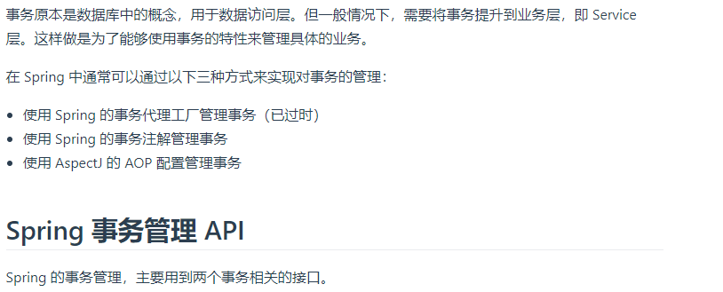
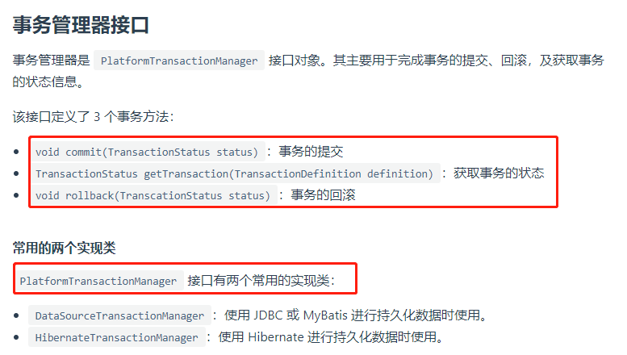
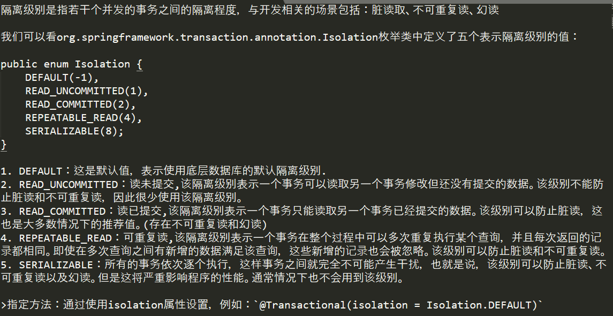
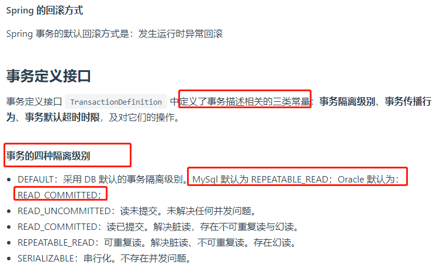
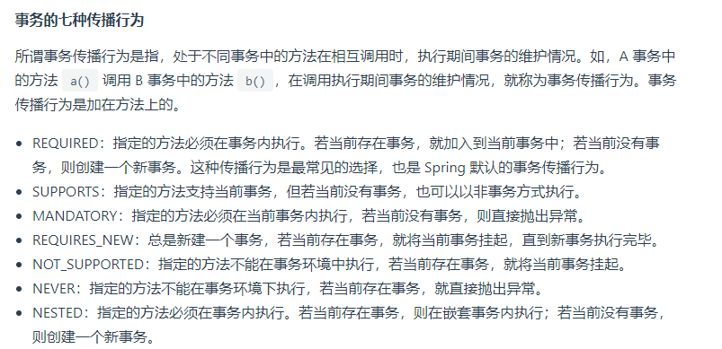
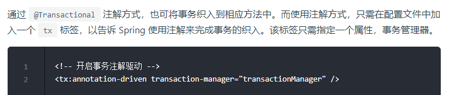
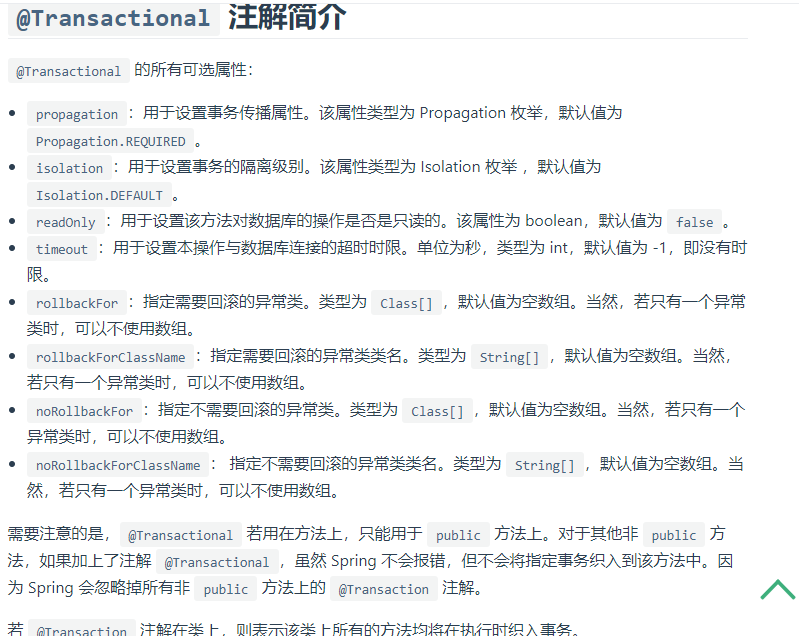
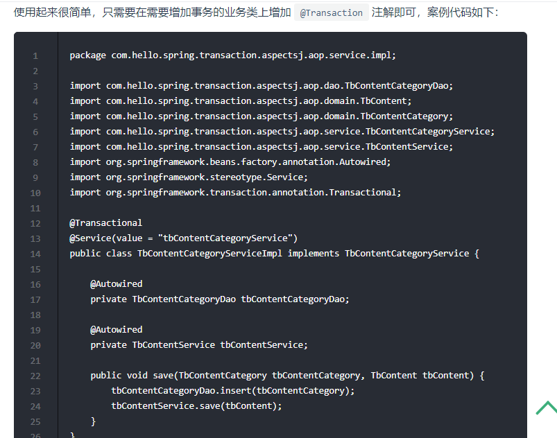

# 事务

一个业务里面,数据库操作几次(数据库的操作次数)?

- 一个业务里面操作1次数据库: 这个业务就是简单业务
- 一个业务里面操作3次数据库: 这个业务就是普通业务
- 一个业务里面操作7次数据库: 这个业务属于复制业务

举个例子,要删除一个分类,具体包含的操作是删除这个类别中的所有子类别,以及每个子类别的内容,所以删除分类这个业务操作中包含了操作好多次数据库.

因为我们使用了spring框架,所以肯定使用spring的事务管理, 之前学习的是jdbc的事务管理,但是这里肯定不会直接使用jdbc的事务管理.

# spring的事务管理

>我们要把事务放到业务层(Service层).

---
mybatis事务管理器内部其实还是使用了jdbc事务管理.

spring事务回滚的触发机制是: 抛出运行时异常.

>我们自己不能使用try-catch机制来捕获这些异常,因为自己一旦做了try-catch,spring事务机制就失效了.所以要全部交给spring管理.即:假如一个方法是事务方法,一旦这个方法被try-catch包裹了,你在这个方法上添加的事务也就失效了.
---

## spring事务管理器接口

## 事务定义接口.

事务定义接口定义事务的行为.主要包括事务隔离级别,事务传播行为,事务默认超时时间.

### 事务默认超时时间

比如插入10万条数据,不知道多长时间插完,这就要求事务来定义超时时间.这个超时时间是spring事务默认配置的,我们不用管.

### 事务隔离级别

事务的隔离级别主要是解决并发问题.并发主要导致3种问题:脏读,不可重复读,幻读

>幻读: 读取的数据的条数不同,也就是2个线程并发读取的结果集的数量不同.

### 事务的传播行为

事务方法中嵌套了事务方法.

>面试: 事务的隔离级别都要记住, 传播行为记住required即可.(其他的一般不怎么配置.)

# 使用Spring的注解管理事务

>真正在开发业务时，通常在service层接口中使用@Transactional来对各个业务逻辑进行事务管理

>当项目有多个数据源,这时候需要在声明事务时，指定不同的事务管理器。只需要通过value属性指定配置的事务管理器名即可:
`@Transactional(value="transactionManagerPrimary")`,除了指定不同的事务管理器之后，还能对事务进行隔离级别和传播行为的控制.

小知识: 在我们测试事务的时候,不想真正的往数据库插入内容,那么就可以在测试类上同时添加@Transactional和@Rollback注解.

# 分布式事务

例如在下单场景下，库存和订单如果不在同一个节点上，就涉及分布式事务。
