# 日志框架对比

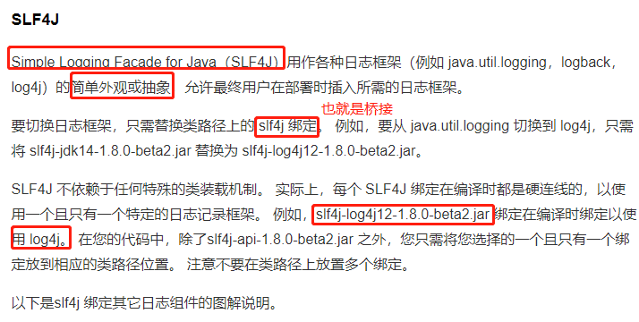
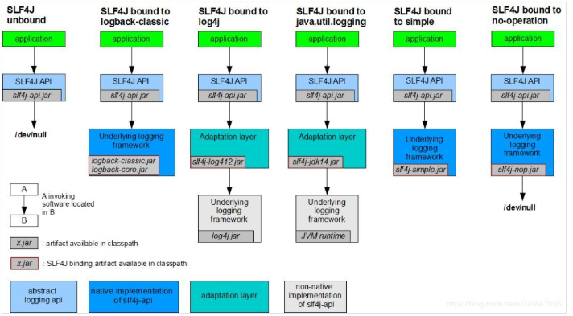
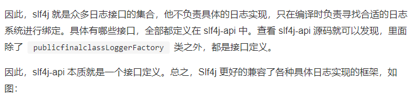
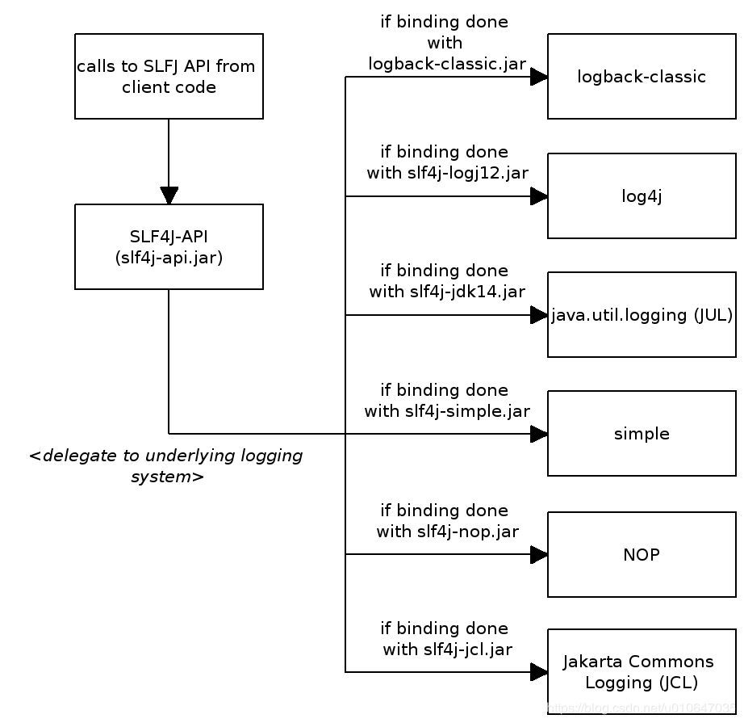

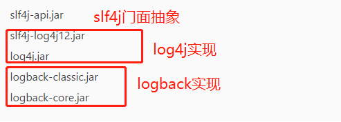
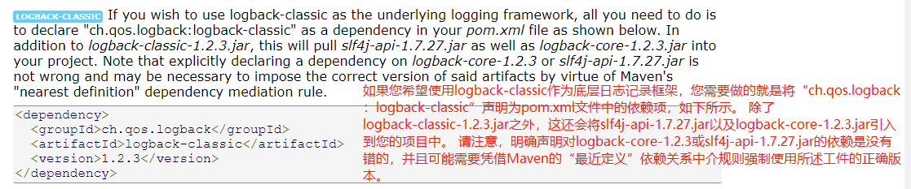
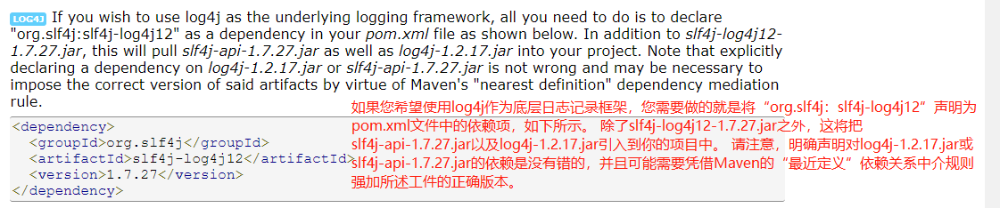
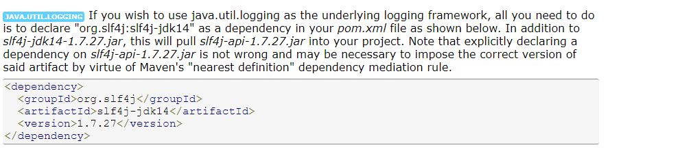

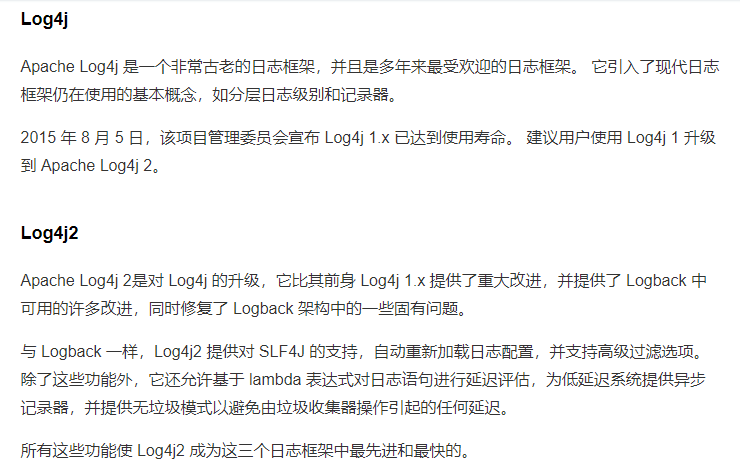
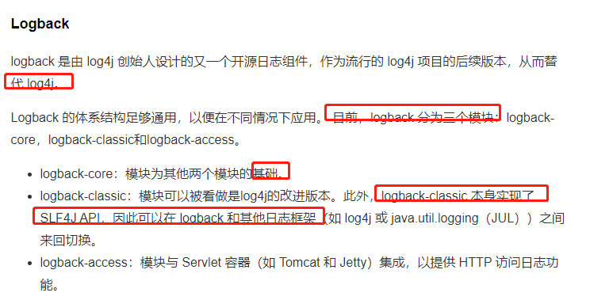
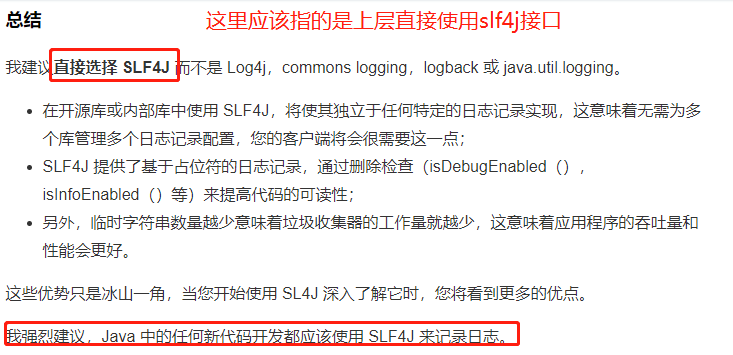

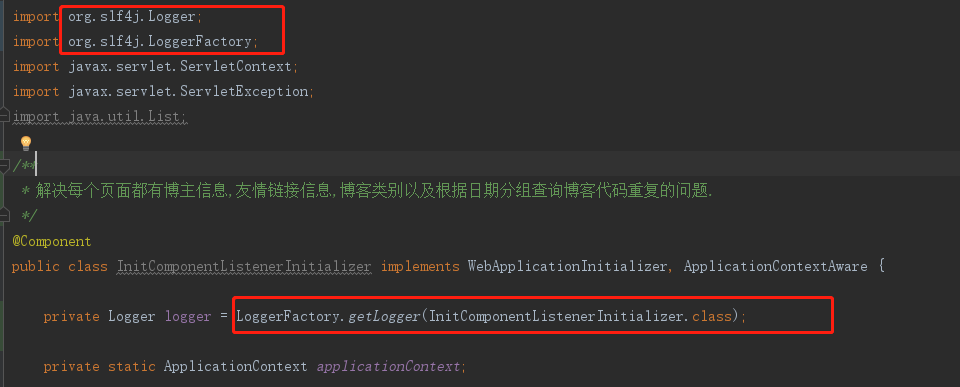
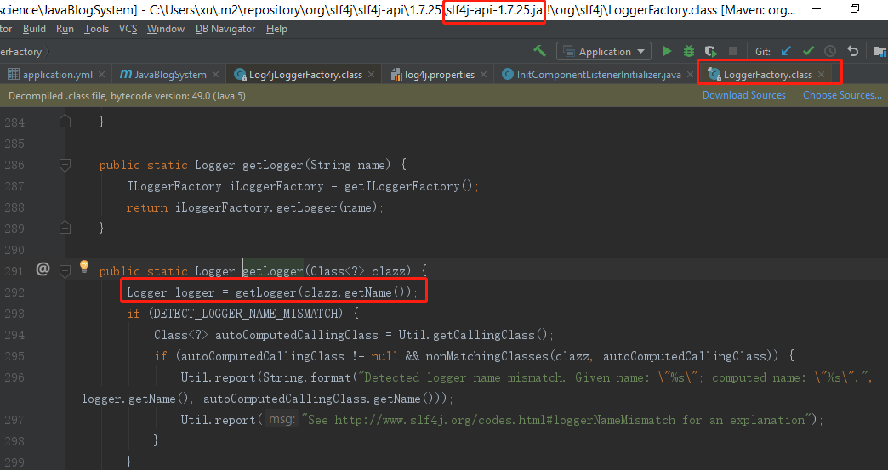
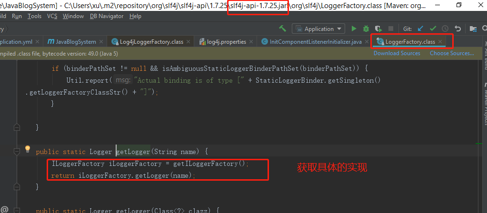
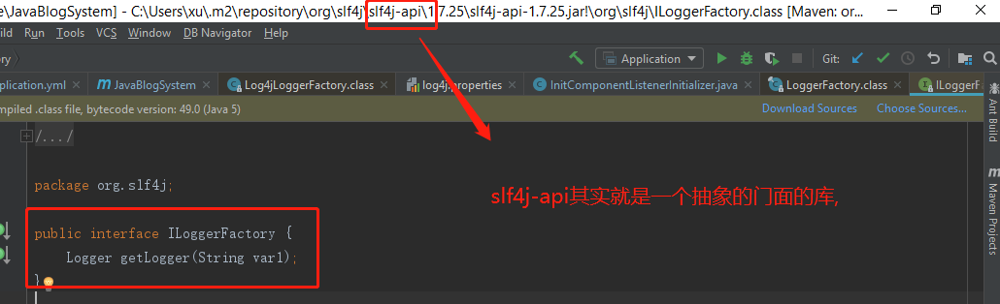
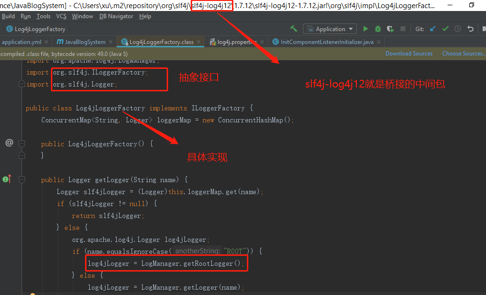
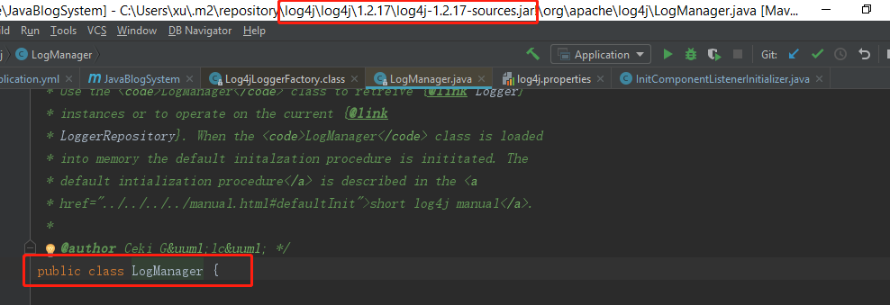

- [slf4j理解](https://www.slf4j.org/manual.html)

# SpringBoot使用Logback(我们自己开发使用的框架)

- [logback好的理解](https://javadeveloperzone.com/spring-boot/spring-boot-slf4j-and-logback-example/)

spring boot的start自动引入了logback.

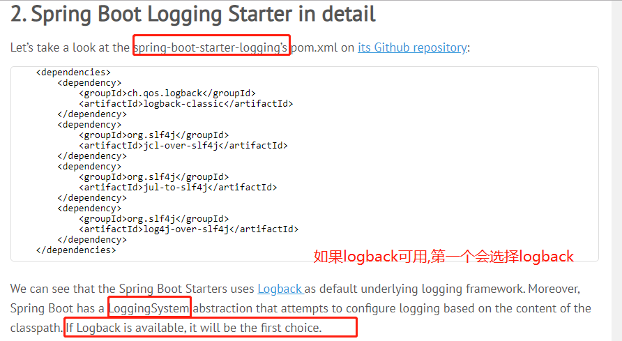
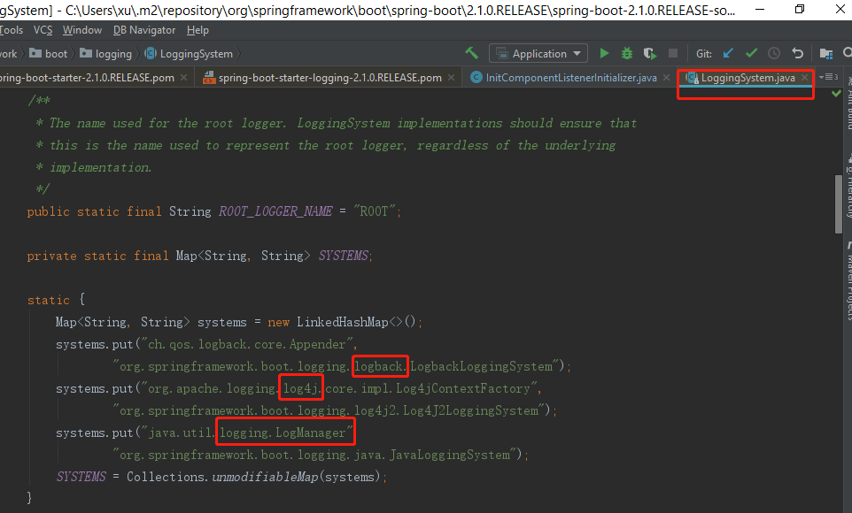
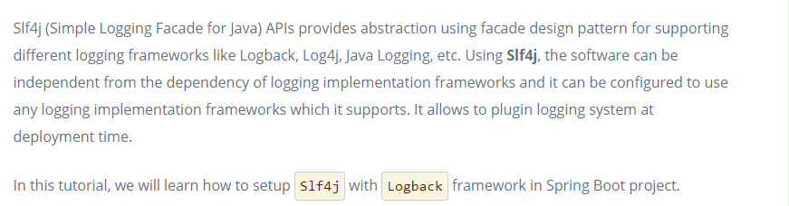
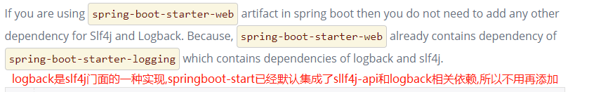

其中日志框架门面是SLF4J(对应slf4j-api这个jar包)。slf4j门面的具体实现是Logback(对应logback-classic这个jar包)。调用日志记录的方法，不应该直接调用实现类，而是调用日志抽象层里面的方法。

>每一个日志的实现框架都有自己的配置文件，即使使用slf4j，配置文件还是写日志实现框架的配置文件:

1. Logback：logback-spring.xml, logback-spring.groovy, logback.xml, logback.groovy
2. Log4j：log4j-spring.properties, log4j-spring.xml, log4j.properties, log4j.xml
3. Log4j2：log4j2-spring.xml, log4j2.xml
4. JDK (Java Util Logging)：logging.properties

Spring Boot官方推荐优先使用带有-spring的文件名作为你的日志配置(如使用logback-spring.xml，而不是logback.xml）

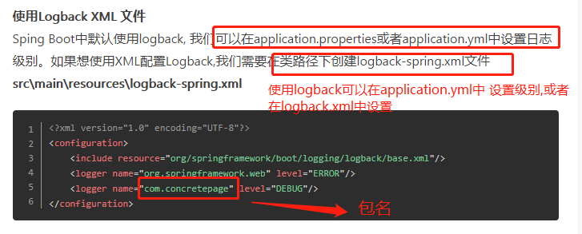

## logback配置文件详解-logback.xml

吧logback.xml放在项目resources目录下即可，

~~~xml
<?xml version="1.0" encoding="UTF-8"?>
<!--
scan：当此属性设置为true时，配置文件如果发生改变，将会被重新加载，默认值为true。
scanPeriod：设置监测配置文件是否有修改的时间间隔，如果没有给出时间单位，默认单位是毫秒当scan为true时，此属性生效。默认的时间间隔为1分钟。
debug：当此属性设置为true时，将打印出logback内部日志信息，实时查看logback运行状态。默认值为false。
-->
<configuration scan="false" scanPeriod="60 seconds" debug="false">
    <!-- 定义日志的根目录 -->
    <property name="LOG_HOME" value="/app/log" />
    <!-- 定义日志文件名称 -->
    <property name="appName" value="atguigu-springboot"></property>
    <!-- ch.qos.logback.core.ConsoleAppender 表示控制台输出 -->
    <appender name="stdout" class="ch.qos.logback.core.ConsoleAppender">
        <!--
        日志输出格式：
            %d表示日期时间，
            %thread表示线程名，
            %-5level：级别从左显示5个字符宽度
            %logger{50} 表示logger名字最长50个字符，否则按照句点分割。 
            %msg：日志消息，
            %n是换行符
        -->
        <layout class="ch.qos.logback.classic.PatternLayout">
            <pattern>%d{yyyy-MM-dd HH:mm:ss.SSS} [%thread] %-5level %logger{50} - %msg%n</pattern>
        </layout>
    </appender>

    <!-- 滚动记录文件，先将日志记录到指定文件，当符合某个条件时，将日志记录到其他文件 -->  
    <appender name="appLogAppender" class="ch.qos.logback.core.rolling.RollingFileAppender">
        <!-- 指定日志文件的名称 -->
        <file>${LOG_HOME}/${appName}.log</file>
        <!--
        当发生滚动时，决定 RollingFileAppender 的行为，涉及文件移动和重命名
        TimeBasedRollingPolicy： 最常用的滚动策略，它根据时间来制定滚动策略，既负责滚动也负责出发滚动。
        -->
        <rollingPolicy class="ch.qos.logback.core.rolling.TimeBasedRollingPolicy">
            <!--
            滚动时产生的文件的存放位置及文件名称 %d{yyyy-MM-dd}：按天进行日志滚动 
            %i：当文件大小超过maxFileSize时，按照i进行文件滚动
            -->
            <fileNamePattern>${LOG_HOME}/${appName}-%d{yyyy-MM-dd}-%i.log</fileNamePattern>
            <!-- 
            可选节点，控制保留的归档文件的最大数量，超出数量就删除旧文件。假设设置每天滚动，
            且maxHistory是365，则只保存最近365天的文件，删除之前的旧文件。注意，删除旧文件是，
            那些为了归档而创建的目录也会被删除。
            -->
            <MaxHistory>365</MaxHistory>
            <!-- 
            当日志文件超过maxFileSize指定的大小是，根据上面提到的%i进行日志文件滚动 注意此处配置SizeBasedTriggeringPolicy是无法实现按文件大小进行滚动的，必须配置timeBasedFileNamingAndTriggeringPolicy
            -->
            <timeBasedFileNamingAndTriggeringPolicy class="ch.qos.logback.core.rolling.SizeAndTimeBasedFNATP">
                <maxFileSize>100MB</maxFileSize>
            </timeBasedFileNamingAndTriggeringPolicy>
        </rollingPolicy>
        <!-- 日志输出格式： -->     
        <layout class="ch.qos.logback.classic.PatternLayout">
            <pattern>%d{yyyy-MM-dd HH:mm:ss.SSS} [ %thread ] - [ %-5level ] [ %logger{50} : %line ] - %msg%n</pattern>
        </layout>
    </appender>

    <!-- 
        logger主要用于存放日志对象，也可以定义日志类型、级别
        name：表示匹配的logger类型前缀，也就是包的前半部分
        level：要记录的日志级别，包括 TRACE < DEBUG < INFO < WARN < ERROR
        additivity：作用在于children-logger是否使用 rootLogger配置的appender进行输出，
        false：表示只用当前logger的appender-ref，true：
        表示当前logger的appender-ref和rootLogger的appender-ref都有效
    -->
    <!-- hibernate logger -->
    <logger name="com.atguigu" level="debug" />
    <!-- Spring framework logger -->
    <logger name="org.springframework" level="debug" additivity="false"></logger>

    <!-- 
    root与logger是父子关系，没有特别定义则默认为root，任何一个类只会和一个logger对应，
    要么是定义的logger，要么是root，判断的关键在于找到这个logger，然后判断这个logger的appender和level。 
    -->
    <root level="info">
        <appender-ref ref="stdout" />
        <appender-ref ref="appLogAppender" />
    </root>
</configuration> 
~~~

如果将logback.xml更改为logback-spring.xml就是由SpringBoot解析这个配置文件，就可以使用SpringBoot的Profile功能，指定在某种开发环境下才生效。

~~~xml
<layout class="ch.qos.logback.classic.PatternLayout">
            <springProfile name="dev">
                <pattern>%d{yyyy-MM-dd HH:mm:ss.SSS} ----> [%thread] ---> %-5level %logger{50} - %msg%n</pattern>
            </springProfile>
            <springProfile name="!dev">
                <pattern>%d{yyyy-MM-dd HH:mm:ss.SSS} ==== [%thread] ==== %-5level %logger{50} - %msg%n</pattern>
            </springProfile>
        </layout>
~~~

# Spring boot中使用log4j

在spring boot中引入log4j桥接jar以及实现jar.

## log4j控制台输出

```
# 设定root日志的输出级别为INFO
# LOG4J配置
log4j.rootCategory=INFO, stdout

# 控制台输出(appender为控制台输出stdout)
log4j.appender.stdout=org.apache.log4j.ConsoleAppender
log4j.appender.stdout.layout=org.apache.log4j.PatternLayout
log4j.appender.stdout.layout.ConversionPattern=%d{yyyy-MM-dd HH:mm:ss,SSS} %5p %c{1}:%L - %m%n
```

## log4j输出到文件

```
# LOG4J配置
log4j.rootCategory=INFO, stdout, file

# root日志输出
log4j.appender.file=org.apache.log4j.DailyRollingFileAppender
log4j.appender.file.file=logs/all.log
log4j.appender.file.DatePattern='.'yyyy-MM-dd
log4j.appender.file.layout=org.apache.log4j.PatternLayout
log4j.appender.file.layout.ConversionPattern=%d{yyyy-MM-dd HH:mm:ss,SSS} %5p %c{1}:%L - %m%n
```

## log4j分类输出

```xml
# com.didispace包下的日志配置
log4j.category.com.didispace=DEBUG, didifile

# com.didispace下的日志输出
log4j.appender.didifile=org.apache.log4j.DailyRollingFileAppender
log4j.appender.didifile.file=logs/my.log
log4j.appender.didifile.DatePattern='.'yyyy-MM-dd
log4j.appender.didifile.layout=org.apache.log4j.PatternLayout
log4j.appender.didifile.layout.ConversionPattern=%d{yyyy-MM-dd HH:mm:ss,SSS} %5p %c{1}:%L ---- %m%n

```

>可以对不同级别进行分类，比如对ERROR级别输出到特定的日志文件中，具体配置可以如下。

```xml
log4j.logger.error=errorfile

# error日志输出
log4j.appender.errorfile=org.apache.log4j.DailyRollingFileAppender
log4j.appender.errorfile.file=logs/error.log
log4j.appender.errorfile.DatePattern='.'yyyy-MM-dd
log4j.appender.errorfile.Threshold = ERROR
log4j.appender.errorfile.layout=org.apache.log4j.PatternLayout
log4j.appender.errorfile.layout.ConversionPattern=%d{yyyy-MM-dd HH:mm:ss,SSS} %5p %c{1}:%L - %m%n
```

## log4j示例

log4j.properties中对com.didispace包下的日志定义是这样的，固定定义了DEBUG级别，并输出到名为didifile定义的appender中：

```xml

# LOG4J配置
log4j.category.com.didispace=DEBUG, didifile

# com.didispace下的日志输出
log4j.appender.didifile=org.apache.log4j.DailyRollingFileAppender
log4j.appender.didifile.file=logs/my.log
log4j.appender.didifile.DatePattern='.'yyyy-MM-dd
log4j.appender.didifile.layout=org.apache.log4j.PatternLayout
log4j.appender.didifile.layout.ConversionPattern=%d{yyyy-MM-dd HH:mm:ss,SSS} %5p %c{1}:%L ---- %m%n
```

# SpringBoot使用log4j2

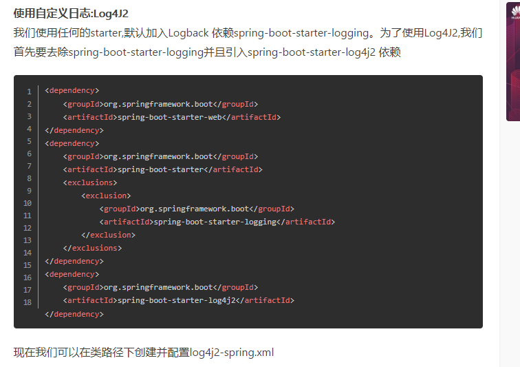

# Spring Boot源码内部使用的日志框架-Commons Logging

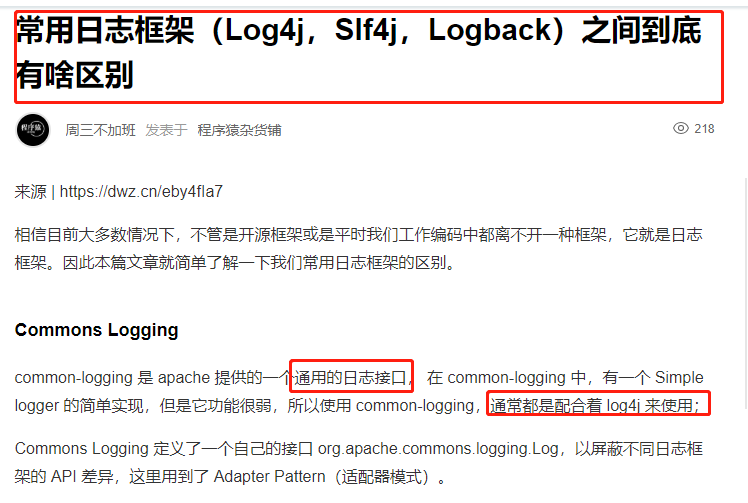
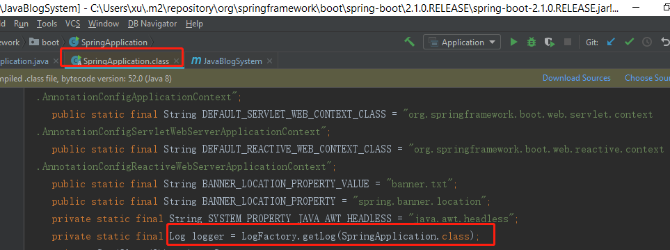
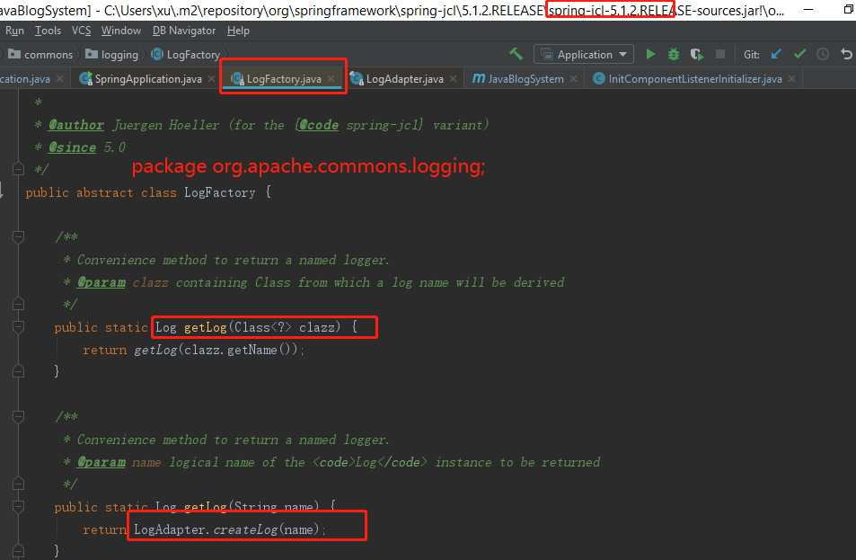
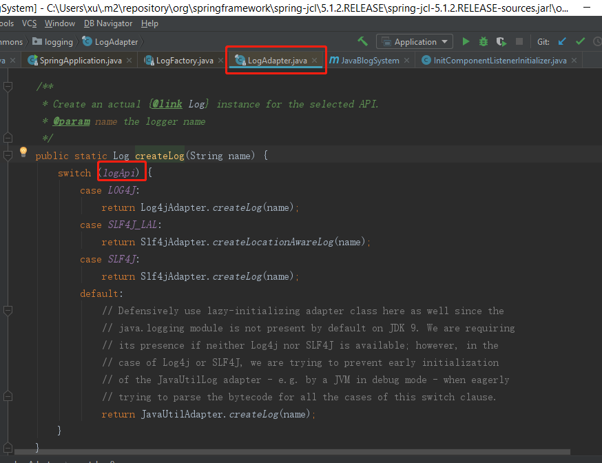
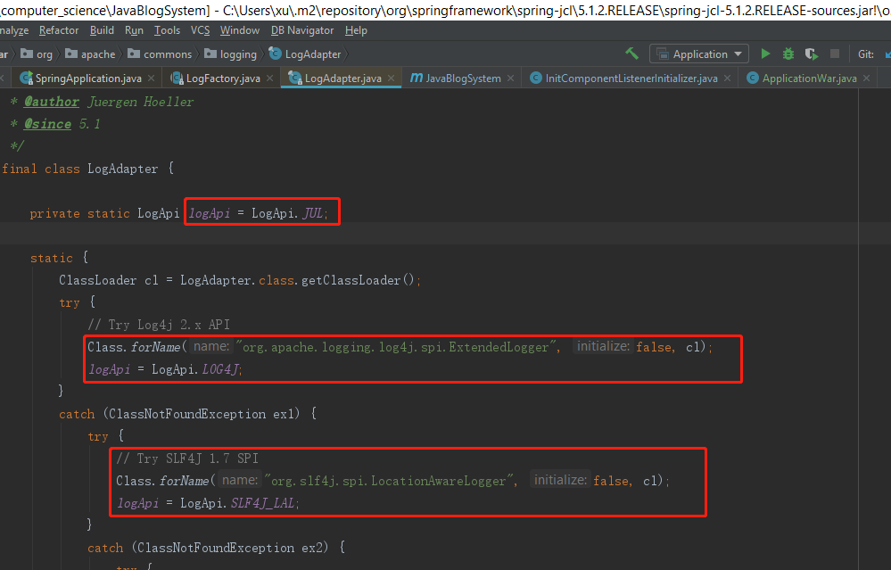


Spring Boot源码内部使用Commons Logging(区别与一般用户开发代码使用的框架).根据上面的代码截图,可以知道,Commons Logging是内部也要根据加载不同的实现类来确定具体使用什么实现类来打印日志.这主要得益于Commons Logging是提供的Log接口,然后就可以通过动态加载实现类来达到目的.

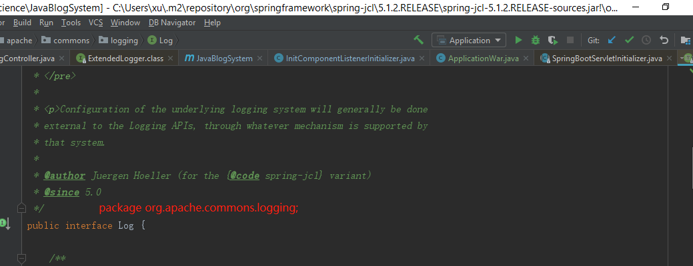
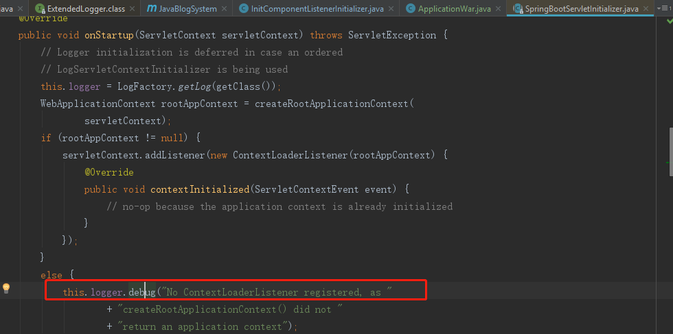
