# Spring和springmvc父子容器概念

在spring和springmvc进行整合的时候，一般情况下我们会使用不同的配置文件来配置spring(使用root-context.xml)和springmvc(使用servlet-context.xml),因此我们的应用中会存在至少2个ApplicationContext实例(分别加载这两个xml得到的)，

>由于是在web应用中，因此最终实例化的是ApplicationContext的子接口WebApplicationContext.


图显示了2个WebApplicationContext实例，为了进行区分，分别称之为：

- Servlet WebApplicationContext
- Root WebApplicationContext

## Servlet WebApplicationContext

Servlet WebApplicationContext：这是对J2EE三层架构中的web层进行配置，
如控制器(controller)、视图解析器(view resolvers)等相关的bean。
通过spring mvc中提供的DispatchServlet来加载配置，通常情况下，配置文件的名称为servlet-context.xml。

## Root WebApplicationContext

Root WebApplicationContext：这是对J2EE三层架构中的service层、dao层进行配置，如业务bean，数据源(DataSource)等。通常
配置文件名称为root-context.xml。在web应用中，其一般通过`ContextLoaderListener`来加载。

## Root WebApplicationContext初始化过程详解

>Root WebApplicationContext创建过程源码分析:>spring-boot-learn-code中的`com.spring.CommonSource.ContextLoaderListener`

1. ContextLoaderListener(上下文加载器的监听器)会被优先初始化，被初始化时，其会根据`<context-param>`元素中`contextConfigLocation`参数指定的配置文件路径，在这里就是`"/WEB-INF/spring/root-context.xml”`，来创建WebApplicationContext实例。
并调用ServletContext的setAttribute方法，将其设置到ServletContext中，
属性的key为`”org.springframework.web.context.WebApplicationContext.ROOT”`，最后的”ROOT"字样表明这是一个Root WebApplicationContext。

## Servlet WebApplicationContext创建过程源码分析

DispatcherServlet负责创建Servlet WebApplicationContext，并尝试将ContextLoaderListener创建的ROOTWebApplicationContext设置为自己的parent。

其类图继承关系如下所示：

```java
public class DispatcherServlet extends FrameworkServlet {}

public abstract class FrameworkServlet extends HttpServletBean{}

public abstract class HttpServletBean extends HttpServlet{}
```

因此在应用初始化时，其`HttpServlet的init方法`会被调用,也就是HttpServletBean.init()会被调用,HttpServletBean的init方法中，调用了initServletBean()方法，在HttpServletBean中，这个方法是空实现。FrameworkServlet实现了HttpServletBean中的initServletBean方法。

>见: spring-boot-learn-code中的`com.spring.CommonSource.FrameworkServlet`

DispatcherServlet在初始化时，会根据`<init-param>`元素中`contextConfigLocation`参数指定的配置文件路径，
即`"/WEB-INF/spring/servlet-context.xml”`，来创建Servlet WebApplicationContext。同时，其会调用ServletContext的getAttribute方法来判断是否存在Root WebApplicationContext。如果存在，则将其设置为自己的parent。这就是父子上下文(父子容器)的概念。

## 父子容器的作用

当我们尝试从child context(即：Servlet WebApplicationContext)中获取一个bean时，如果找不到，则会委派给parent context (即Root WebApplicationContext)来查找。

如果我们没有通过ContextLoaderListener来创建Root WebApplicationContext，那么Servlet WebApplicationContext的parent就是null，也就是没有parent context。

## 为什么要有父子容器?

笔者理解，父子容器的作用主要是划分框架边界:

在J2EE三层架构中，在service层我们一般使用spring框架，而在web层则有多种选择，如springmvc、struts等。因此，通常对于web层我们会使用单独的配置文件

例如在下面的案例中，一开始我们使用servlet-context.xml来配置web层，
使用root-context.xml来配置service、dao层。如果现在我们想把web层从spring mvc替换成struts，那么只需要将servlet-context.xml替换成Struts的配置文件struts.xml即可，而root-context.xml不需要改变。

## 单独只使用`servlet-context.xml`

事实上，如果你的项目确定了只使用spring和spring mvc的话，你甚至可以将service 、dao、web层的bean都放
到servlet-context.xml中进行配置，并不是一定要将service、dao层的配置单独放到
root-context.xml中，然后使用ContextLoaderListener来加载。
在这种情况下，就没有了Root WebApplicationContext，只有Servlet WebApplicationContext。

# ContextLoaderListener解析

ContextLoaderListener是一个监听器,由Spring编写并提供.我们搭建SSM框架时，需要做的仅仅是在web.xml中配置它，一般是这样：


先不看ContextLoader，我们发现ContextLoaderListener实现了ServletContextListener,用于监听ServletContext的初始化和销毁.

很明显Spring的ContextLoaderListener实现了ServletContextListener接口，写了一个监听器来监听项目启动。一旦项目启动，会触发ContextLoaderListener中的特定方法。


也就是说Tomcat创建ServletContext时，会调用ContextLoaderListener的contextInitialized()，这个方法内部的initWebApplicationContext()就是用来初始化Spring的IOC容器的。再强调一遍：

- ServletContext接口servlet规范中定义的接口,具体的实现类是由Tomcat的实现的.
- ServletContextListener接口也是servlet规范中定义的接口,tomcat在创建和销毁ServletContext的时候会回调.
- ContextLoaderListener是Spring写的，实现了ServletContextListener
- Spring自己写的监听器，用来创建Spring IOC容器天经地义

至于Spring怎么创建IOC容器的，还记得web.xml中的那两处配置吗：


web.xml中配置了Spring配置文件的位置，那里边不是写了很多<bean/>啥的吗。读取xml配置文件反射创建对象加入IOC即可。

Tomcat会解析web.xml，反射创建ContextLoaderListener。不要以为只有Spring有对象容器，Tomcat也有自己的对象容器好吧。

Event对象其实就是被监听对象的包装，那么创建IOC时，要ServletContext对象作甚？那是因为，最终IOC容器其实是存放在ServletContext对象中(通过设置属性)。所以我上面就说了，别以为只有Spring会搞对象容器，我Tomcat虽然是一只小猫，但是吞你Spring。

---

>下面简单过一遍源码。看的时候，告诉自己，你看到的所有代码都在ContextLoader中，以免自乱阵脚：

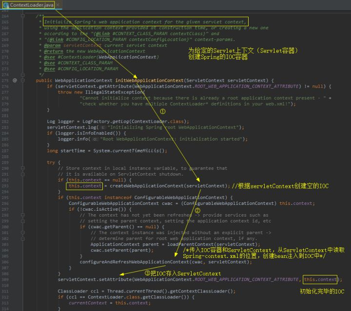

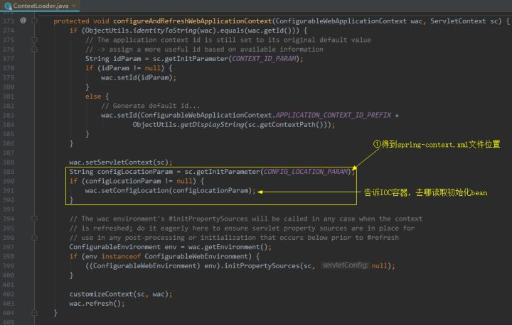


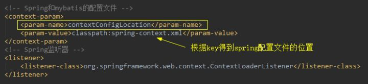

当然了，Spring也提供了工具类，方便从ServletContext中取出IOC容器：


# ContextLoaderListener vs DispatcherServlet


# web.xml vs Initializer with Spring

演示从web.xml配置到 `web.xml+java配置`的混合配置 再到完全都是java配置.

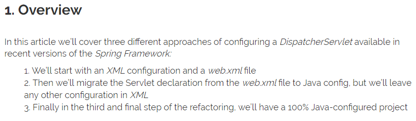
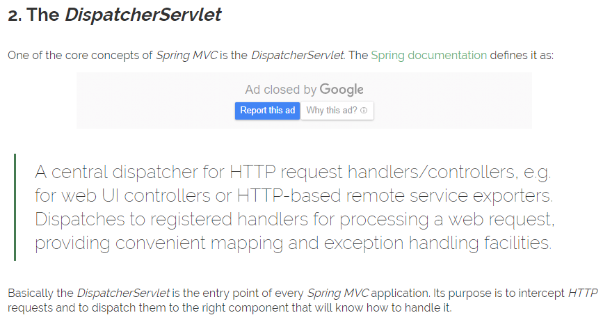
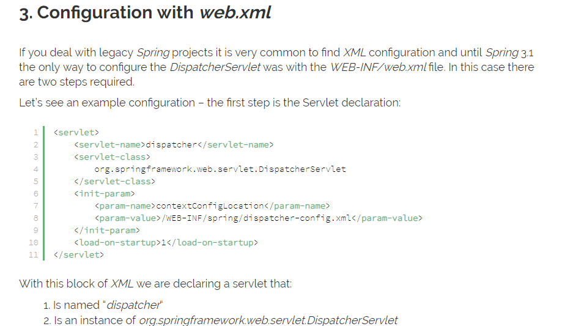
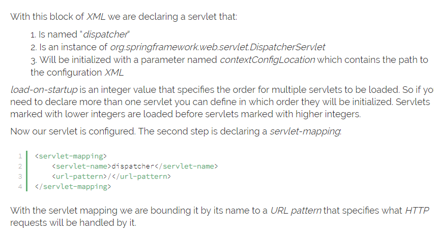
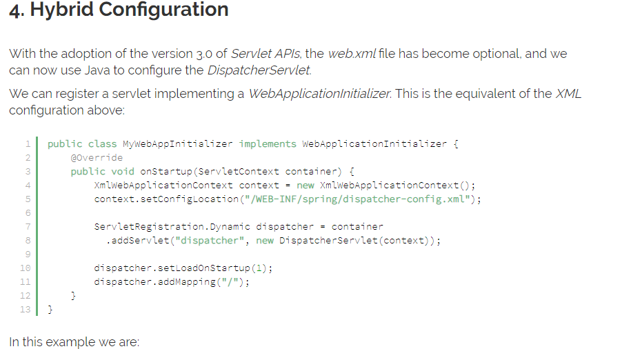
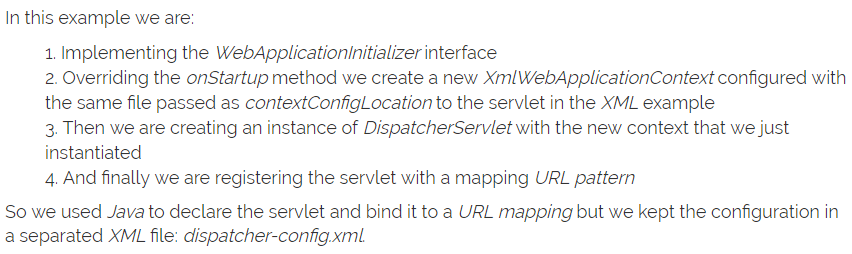
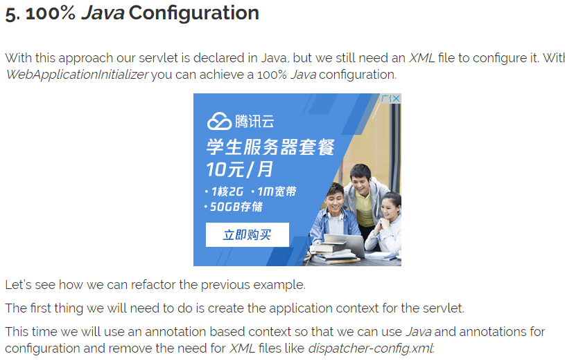
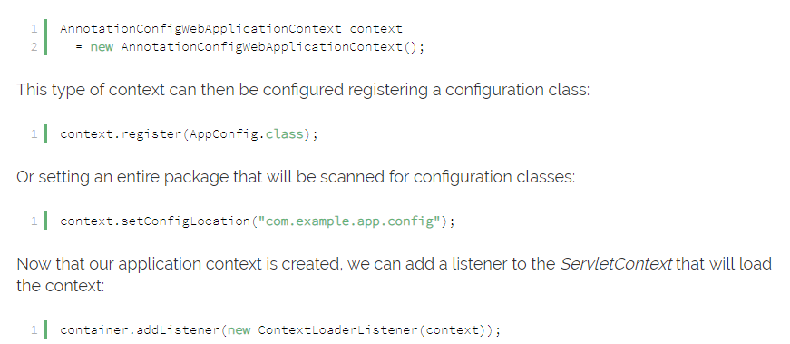
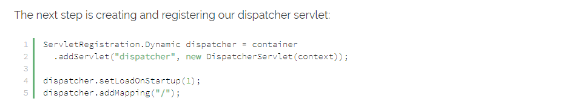
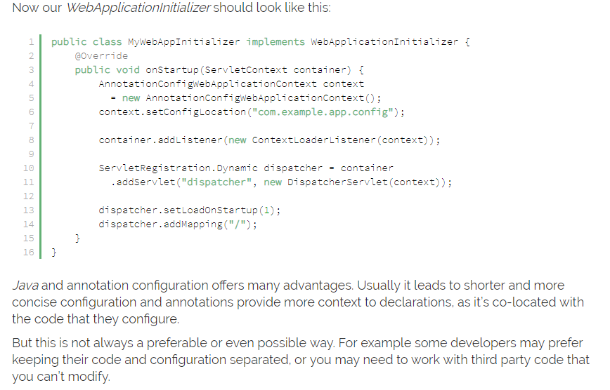


# springboot是如何帮我们省去web.xml配置的

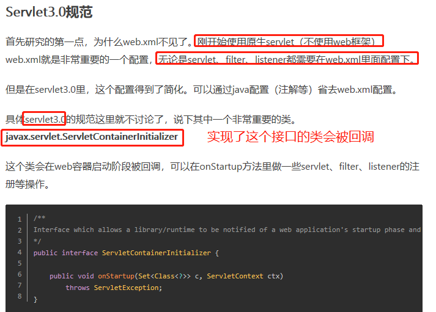


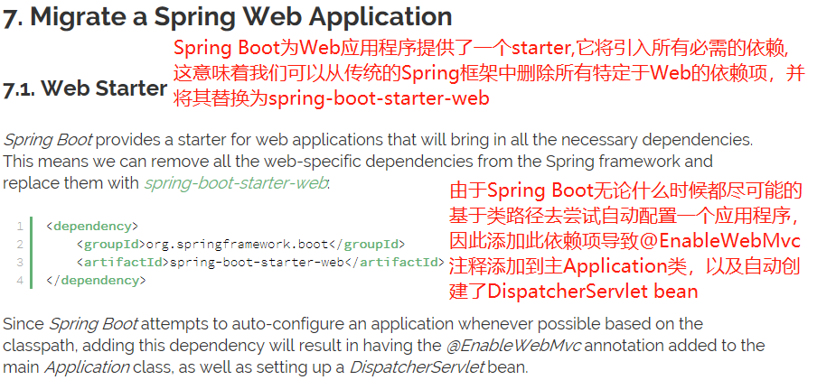

# 传统的web-xml中通过反射创建DispatcherServlet


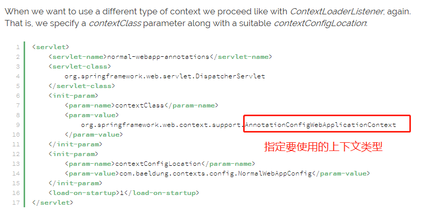

# 使用WebApplicationInitializer的方式创建DispatcherServlet

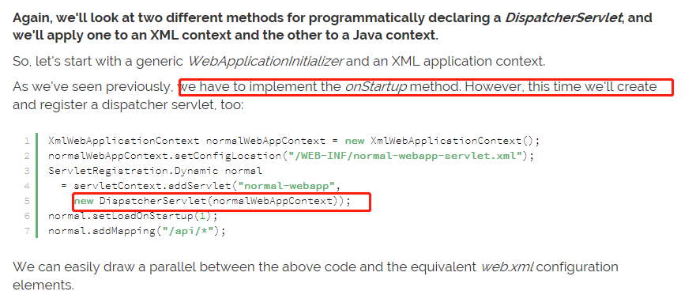
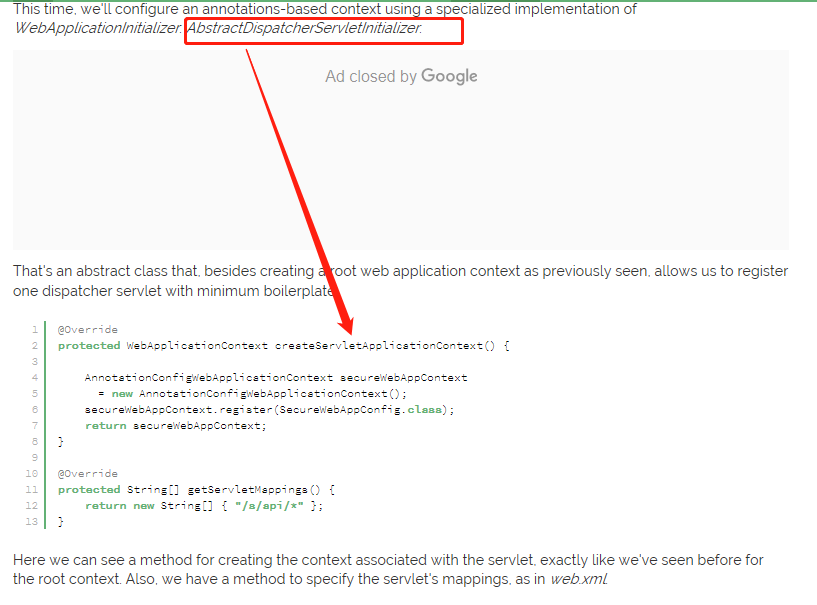

# 究竟Springboot如何配置DispatcherServlet

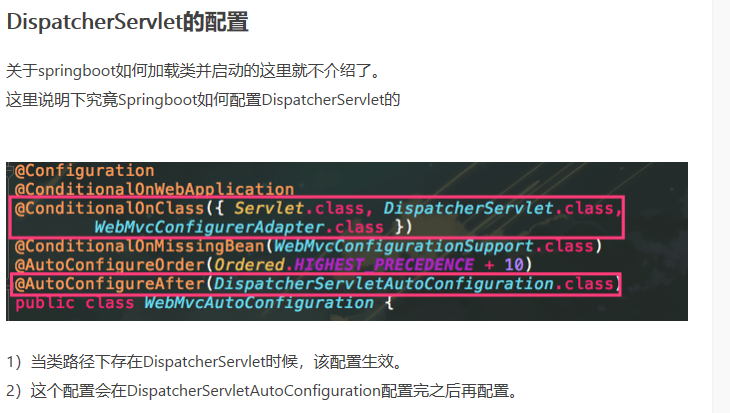


# SpringBoot中如何创建ContextLoaderListener

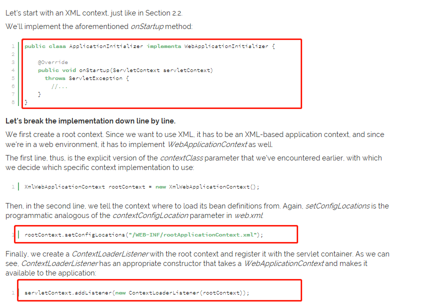
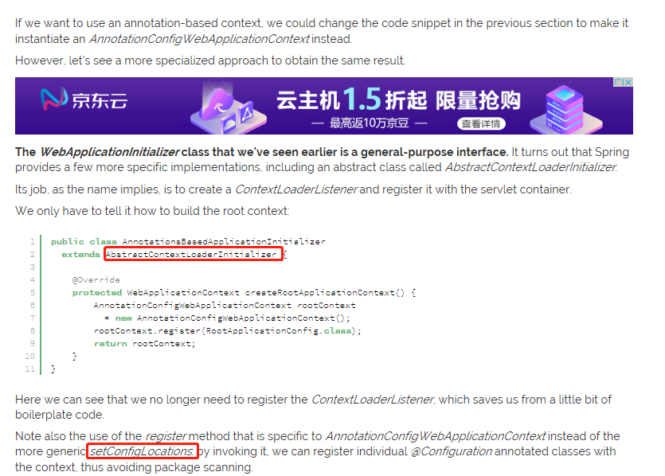

# 参考

- [https://www.baeldung.com/spring-xml-vs-java-config](https://www.baeldung.com/spring-xml-vs-java-config)