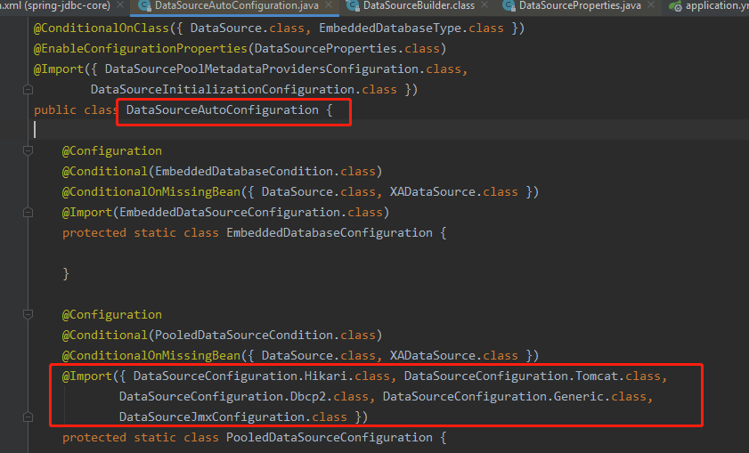
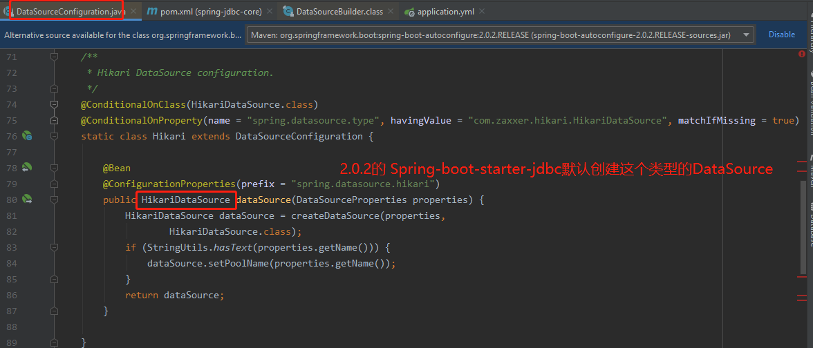
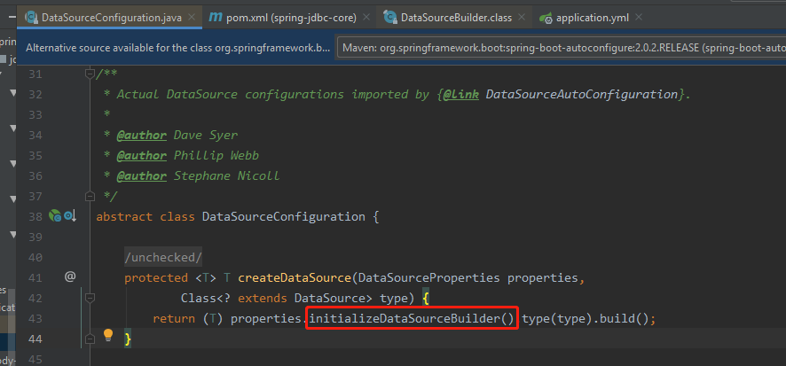
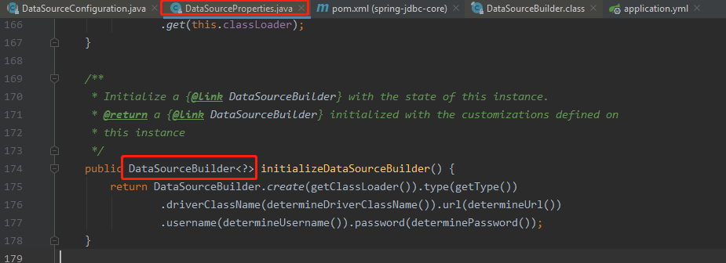
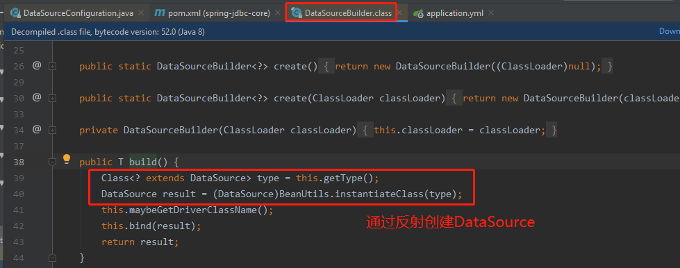

# Java数据存取技术的历史变迁

1. JDBC: 冗余代码比较多,包括最原始的JDBC,以及Spring框架对JDBC的简单封装(提供了一个JDBCTemplate对象简化JDBC的开发)
2. JPA与Hibernate: 高度封装，一度成为标配，但不太适应互联网时代的要求
3. MyBatis使用十分简单，而且能非常容易定制SQL，移动互联时代受到欢迎

# DataSource的自动配置原理(以spring-jdbc为例)

```xml
<project>
    <!-- spring-boot-starter-jdbc默认导入了com.zaxxer:HikariCP -->
    <!-- 所以默认是有这个类的: HikariDataSource, 这个也是默认的(DataSource Type)数据源类型 -->
    <dependency>
        <groupId>org.springframework.boot</groupId>
        <artifactId>spring-boot-starter-jdbc</artifactId>
    </dependency>
    <dependency>
        <groupId>mysql</groupId>
        <artifactId>mysql-connector-java</artifactId>
        <scope>runtime</scope>
    </dependency>
</project>
```

```yaml
spring:
  datasource:
    username: root
    password: 123456
    url: jdbc:mysql://192.168.15.22:3306/jdbc
    driver-class-name: com.mysql.jdbc.Driver
# 没有指定(DataSource Type)数据源类型 就是用默认的 HikariDataSource
```

    自动配置相关的类: 
        DataSourceAutoConfiguration.java
        DataSourceConfiguration.java
        DataSourceProperties.java
        DataSourceBuilder

---







# 自定义数据源类型(DataSource Type)

    指定type,比如: spring.datasource.type=com.alibaba.druid.pool.DruidDataSource

```java
abstract class DataSourceConfiguration {
    @ConditionalOnMissingBean(DataSource.class)
    @ConditionalOnProperty(name = "spring.datasource.type")
    static class Generic {
       @Bean
       public DataSource dataSource(DataSourceProperties properties) {
           //使用DataSourceBuilder创建数据源，利用反射创建相应类型(type)的数据源DataSource，并且绑定相关属性
          return properties.initializeDataSourceBuilder().build();
       }
    }
}
```

# DataSourceInitializer作用

    1）、runSchemaScripts();运行建表语句；(app每次重启,都会重新创建,只适合开发环境)
    2）、runDataScripts();运行插入数据的sql语句；

    默认只需要将文件命名为：

```properties
# 建表sql的命名规则
schema-*.sql # 默认规则：schema.sql，schema-all.sql；
# 插入数据sql的命名规则
data-*.sql

# 可以使用在配置文件中配置具体的名字来指定位置: spring.datasource.schema=classpath:department.sql
```