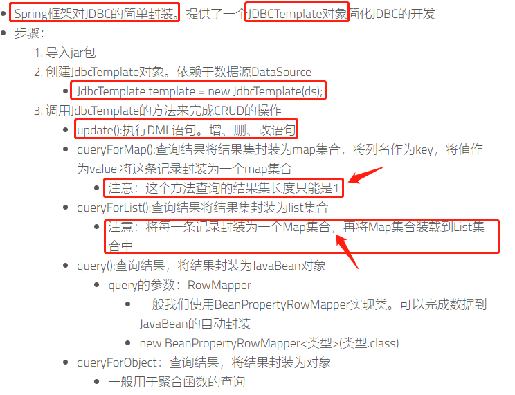
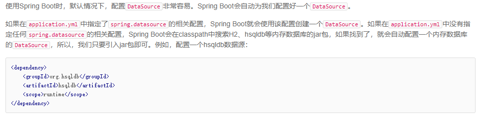
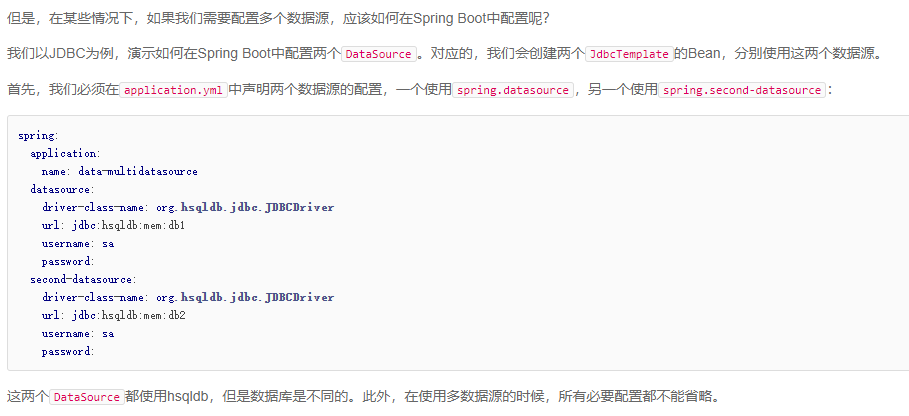
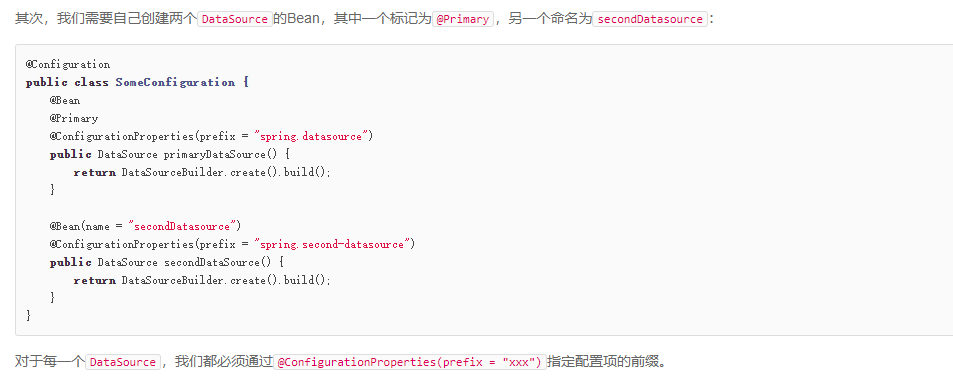
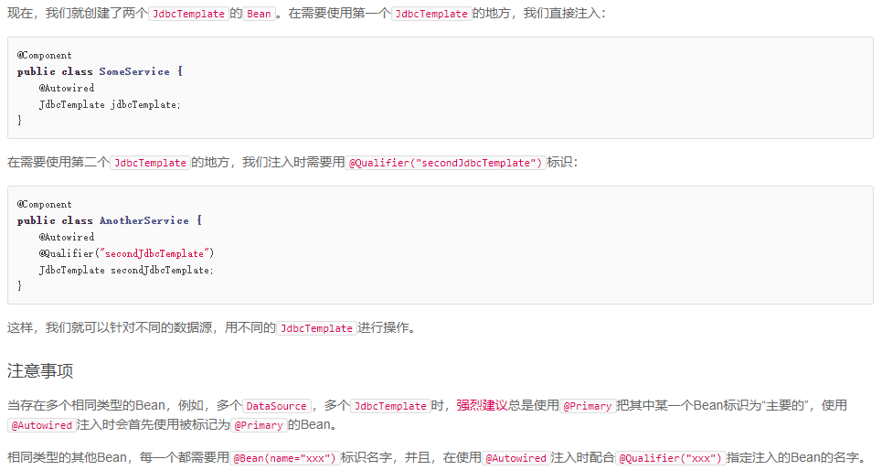

# Spring JDBC

1. JDBC产生了大量的冗余代码，例如打开/关闭一个数据库连接，处理sql异常等
2. 在Spring JdbcTemplate中，只需要配置到数据库的连接,然后写SQL查询语句即可，我们的其余工作由Spring执行。
3. JdbcTemplate类执行SQL查询，遍历ResultSet
4. JdbcTemplate类的实例是线程安全的。这意味着通过配置JdbcTemplate类的单个实例，我们可以将它用于几个DAO对象。
5. 使用JdbcTemplate来避免资源泄漏等常见错误并删除JDBC样板代码.

## SpringBoot配置多个DataSource

