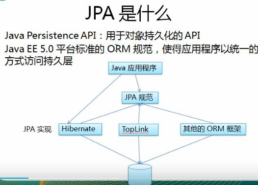
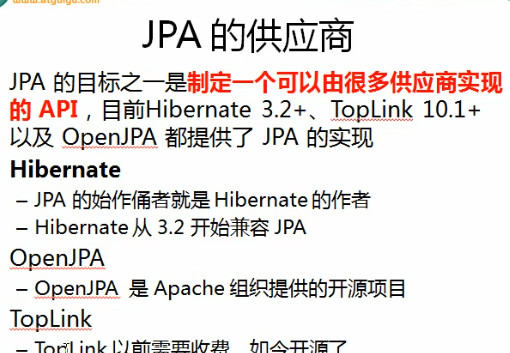
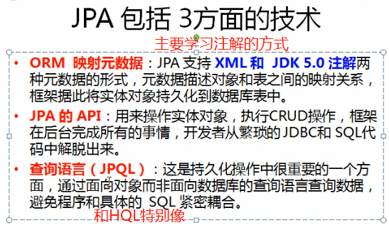
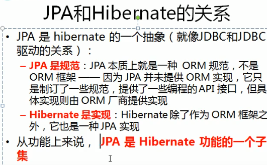
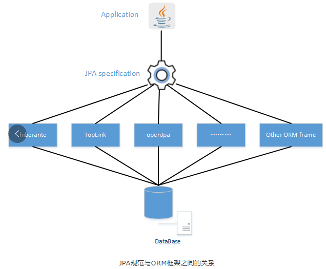
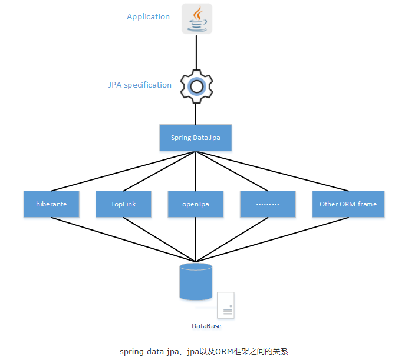

# JPA(Java Persistence API-Java持久化API)

    jpa统一了java应用程序使用各个orm框架的方式.

    JPA是Java持久化标准接口，JPA是一套ORM规范,注意JPA不是ORM实现，它只是制订了规范，
    提供了编程的API接口,但具体实现则由服务厂商来提供实现.

    既然JPA作为一种规范——也就说JPA规范中提供的只是一些接口，显然接口不能直接拿来使用。
    虽然应用程序可以面向接口编程，但JPA底层一定需要某种JPA实现，否则JPA依然无法使用。

## 为什么出现了JPA

>Sun之所以提出JPA规范，其目的是以官方的身份来统一各种ORM框架的规范,开发者面向JPA接口编程，但底层的JPA实现可以任意切换：觉得Hibernate好的，可以选择Hibernate JPA实现；觉得TopLink好的，可以选择TopLink JPA实现.

## jpa和Hibernate的关系

    JPA是一套ORM规范，Hibernate实现了JPA规范

    以前使用hibernate使用的是xml配置的方式
    jpa支持xml和注解2种方式,不过现在都是使用注解
    学jpa就是使用注解的方式去用hibernate
    这些注解是java ee 5.0带的,所以使用jpa,除了hibernate和jpa,不需要引入其他jar.

## Spring Data JPA

spirng data jpa是spring提供的一套简化JPA开发的框架,Spring Data JPA 可以理解为 JPA 规范的再次封装抽象，底层还是使用了 Hibernate 的 JPA 技术实现.

Spring Data JPA是Spring Data的一部分。Spring Data JPA提供了一组Repository接口，通过动态代理实现数据存取功能.

使用Spring Data JPA,DAO层几乎不用写代码了,即使要写,也只需要声明一个接口,声明一个方法就可以了.向以前的翻页,排序,CURD都可以很快实现.

>使用: 添加项目依赖spring-boot-starter-data-jpa后,Spring Boot就会默认为你配置数据源，这些默认的数据源主要是内存数据库，如h2、hqldb和Derby等内存数据，具体是哪个，依赖于你在项目的Maven配置文件pom.xml中加入了对哪个数据库的依赖.

    问题: 
    Spring Data JPA的问题是封装得过多，可控性没那么强，就像是一个“黑盒子”，学习曲线比较陡峭，
    并且主要用于关系型数据库，因此，在实际开发中的应用受到限制。

    提醒一下，其实这个技术领域包容非常多的技术特性，许多特性初学者不易理解，学习曲线比较陡峭