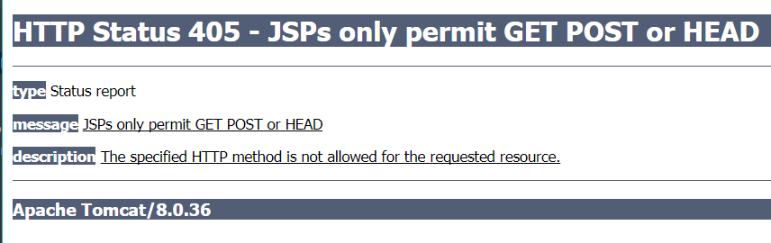
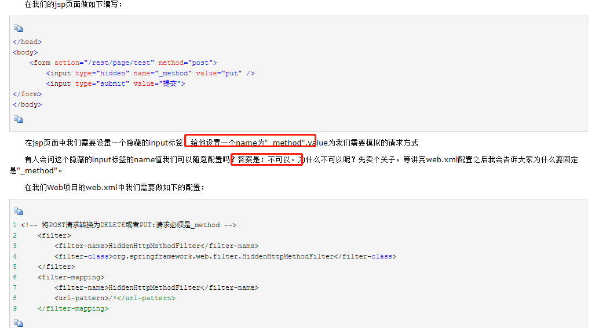
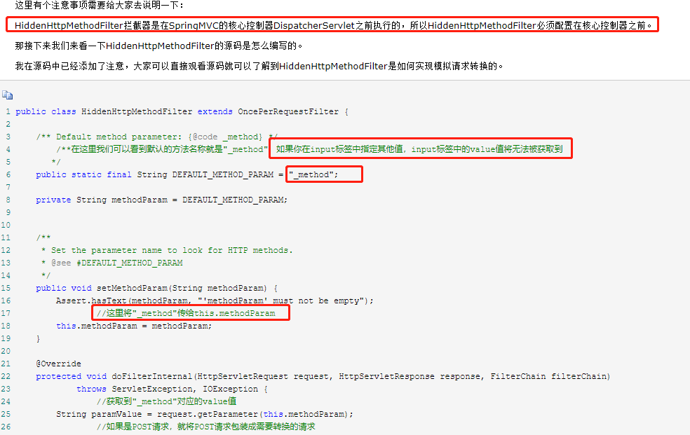
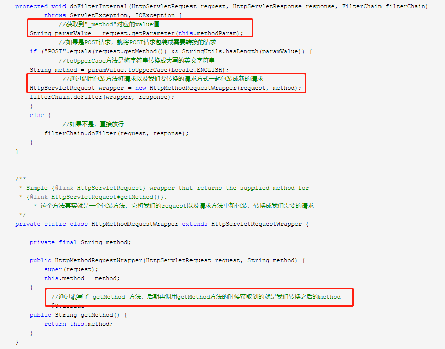

# 通过form表单如何进行PUT和DELETE提交?

    浏览器在发送form表单请求的时候, method只有2中方式：POST跟GET,
    可是在HTTP协议中不仅仅有POST跟GET两种请求，还包括PUT、DELETE

    实际开发中,url很多都是restful的,restful风格的url中有的是put请求,有的是delete请求,
    那么form表单如何支持put和delete请求呢?

# tomcat7解决方案

    使用HiddenHttpMethodFilter: 这个拦截器的主要作用就是将我们的Post请求转换成我们想要转换请求方式

# tomcat8解决方案

    在tomcat8上面,即使添加了HiddenHttpMethodFilter,依然会有问题,
    tomcat8运行时可以进入到相应的Controller，但是视图渲染返回的时候,由于不支持delete和put方法,
    会报出异常页面

    解决办法1: 在Controller中delete和put对应的方法上添加@ResponseBody注解,这样直接返回字符串给前端,
    就不会返回jsp渲染后的页面给前端了,这样可以规避.但不是最好解决方案.    

# HiddenHttpMethodFilter原理

    

    

    