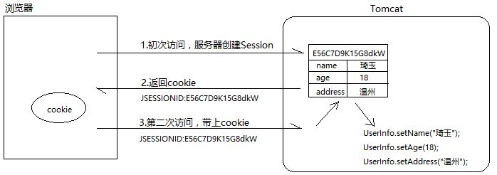

# JWT

JSON Web Token（缩写 JWT）是目前最流行的跨域认证解决方案，本文介绍它的原理和用法。

# 来源

- [http://www.ruanyifeng.com/blog/2018/07/json_web_token-tutorial.html](http://www.ruanyifeng.com/blog/2018/07/json_web_token-tutorial.html)