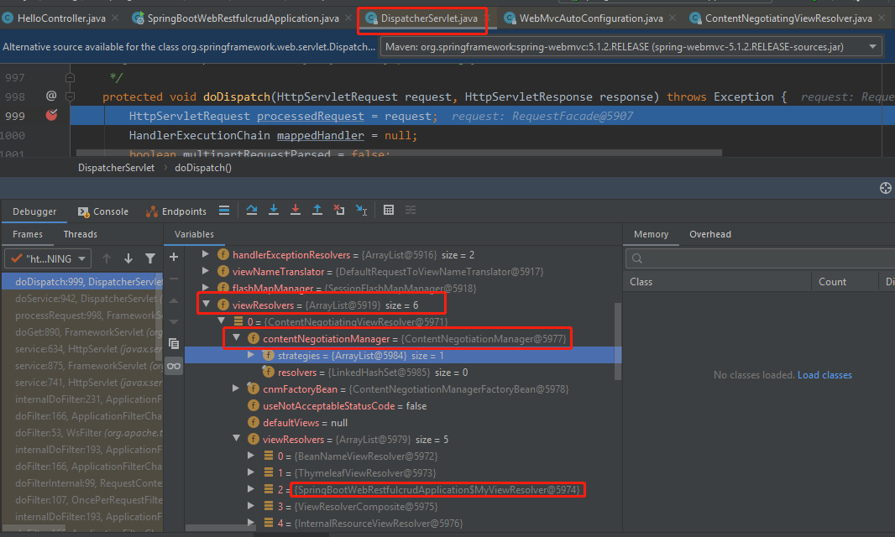
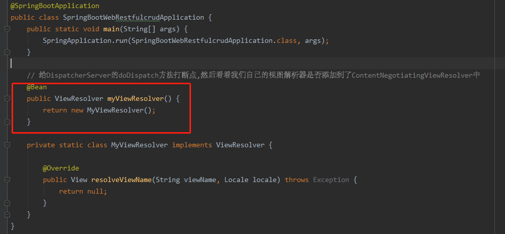
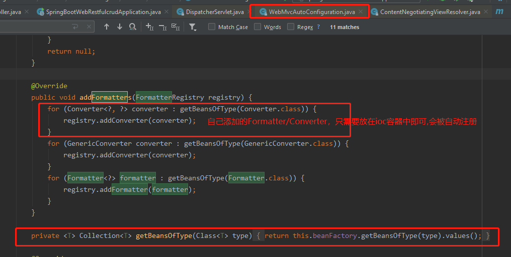

# springboot中Spring MVC的自动配置类概述

    在springboot中,Spring MVC的相关配置都在WebMvcAutoConfiguration.java这个自动配置类中.

    xxxxAutoConfiguration：帮我们给容器中自动配置组件；(本例就是WebMvcAutoConfiguration)
    xxxxProperties:配置类来封装配置文件的内容；(本例就是WebMvcProperties和ResourceProperties)

[springboot官网详细说明](https://docs.spring.io/spring-boot/docs/1.5.10.RELEASE/reference/htmlsingle/#boot-features-developing-web-applications)

[MVC configuration](https://docs.spring.io/spring/docs/4.3.14.RELEASE/spring-framework-reference/htmlsingle#mvc) 

# Spring MVC auto-configuration(Spring MVC在SpringBoot中的自动配置)

    Spring Boot 自动配置好了SpringMVC，以下是SpringBoot对SpringMVC的默认配置:

## 视图解析器的默认配置

---

   

    WebMvcAutoConfiguration自动帮我们 类型为ContentNegotiatingViewResolver和 BeanNameViewResolver的beans.
    
        ContentNegotiatingViewResolver的功能：组合所有的视图解析器的；然后选择一个合适的视图解析器来解析视图。它是怎么拿到所有的视图解析器呢？
        
        通过BeanFactoryUtils工具类，从ioc容器中拿到： BeanFactoryUtils.beansOfTypeIncludingAncestors(obtainApplicationContext(), ViewResolver.class)
        拿到所有的ViewResolver.class的实现类的实例。
        
        我们如何定制自己的视图解析器呢？ 我们可以自己给ioc容器中添加一个视图解析器；然后ContentNegotiatingViewResolver就会自动的将我们的视图解析器组合进来。

 


 
    视图解析器在spring mvc中的功能就是： 根据方法的返回值得到视图对象（也就是View对象），然后视图对象View决定如何渲染（是转发？还是重定向？还是怎么到一个页面）

---

## 静态自由文件夹路径/webjars/首页访问(index.html)/favicon.ico

## 自动帮我们注册了Converter/GenericConverter/Formatter的beans.

---
    Converter：转换器； public String hello(User user)：类型转换使用Converter，
    页面提交的都是字符串,通过转换器转成User中的具体类型，比如integer/boolean等
    
    Formatter： 格式化器； 页面上传上来的是2017.12.17(不同国家日期格式不一样，可以通过spring.mvc.data-format配置)，我们就要把它转换成Date类型

```java
@Bean
@ConditionalOnProperty(prefix = "spring.mvc", name = "date-format")//在配置文件中配置日期要用哪种格式 格式化成Date
public Formatter<Date> dateFormatter() {
    return new DateFormatter(this.mvcProperties.getDateFormat());//配置日期格式化组件到ioc中
}
```

    自己添加的Formatter/Converter，只需要放在ioc容器中即可



---

## HttpMessageConverters

---
    SpringMVC用来转换Http请求和响应的；User--->Json；

    HttpMessageConverters也是是从容器中获取的；能通过ioc获取所有的HttpMessageConverter；

    自己给容器中添加HttpMessageConverter，只需要将自己的组件注册到ioc容器中即可
---

## ConfigurableWebBindingInitializer

    我们可以配置一个ConfigurableWebBindingInitializer来替换默认的；（只需要添加到容器即可）

    这个组件的作用： 初始化WebDataBinder；将页面发来的请求数据封装成JavaBean

## 总结如何修改SpringBoot的默认配置

---
    
    模式：
    1. SpringBoot在自动配置很多组件的时候，先看容器中有没有用户自己配置的（@Bean、@Component）如果有就用用户配置的，如果没有，才自动配置；
    如果有些组件可以有多个（ViewResolver）将用户配置的和自己默认的组合起来；
    2. 在SpringBoot中会有非常多的xxxConfigurer帮助我们进行扩展配置
    3. 在SpringBoot中会有很多的xxxCustomizer帮助我们进行定制配置

---
