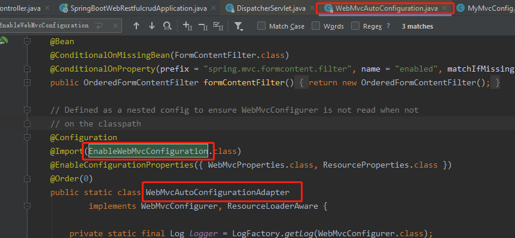

# 在springboot自动配置的基础只上扩展SpringMVC的功能

    编写一个配置类（@Configuration），是WebMvcConfigurerAdapter类型；而且不能标注@EnableWebMvc。
    这样既保留了springboot所有的自动配置，也能用我们扩展的配置

```java
// 使用WebMvcConfigurerAdapter可以来扩展SpringMVC的功能
@Configuration
public class MyMvcConfig extends WebMvcConfigurerAdapter {
    @Override
    public void addViewControllers(ViewControllerRegistry registry) {
        // super.addViewControllers(registry);
        //浏览器发送 /hello 请求来到 success 这个视图
        registry.addViewController("/hello").setViewName("success");
    }
}
```

# 在springboot自动配置的基础只上扩展SpringMVC的功能的原理

    1. WebMvcAutoConfiguration是SpringMVC的自动配置类
    2. WebMvcAutoConfiguration在做自动配置时会导入；@Import(**EnableWebMvcConfiguration**.class)



```java
    // 这个类是WebMvcAutoConfiguration自动配置类的静态内部类
    @Configuration
	public static class EnableWebMvcConfiguration extends DelegatingWebMvcConfiguration {
      private final WebMvcConfigurerComposite configurers = new WebMvcConfigurerComposite();
     
      // 这个方法是在EnableWebMvcConfiguration的父类DelegatingWebMvcConfiguration中
	 // 这个方法的作用是: 从ioc容器中获取WebMvcConfigurer类型的实例, 然后添加到List<WebMvcConfigurer>中
	 // 这个方法是自动注入的.
      @Autowired(required = false)
      public void setConfigurers(List<WebMvcConfigurer> configurers) {
          if (!CollectionUtils.isEmpty(configurers)) {
              // 这里configurers就是WebMvcConfigurer的实现类的实例
              // 内部实际上是添加到了: List<WebMvcConfigurer> delegates中.
              this.configurers.addWebMvcConfigurers(configurers);
            	
                //一个参考实现；将所有的WebMvcConfigurer相关配置都来一起调用；  
            	// @Override
                // public void addViewControllers(ViewControllerRegistry registry) {
                // delegates是 List<WebMvcConfigurer> delegates,这里就是回调所有的WebMvcConfigurer
                //    for (WebMvcConfigurer delegate : this.delegates) {
               //       delegate.addViewControllers(registry);
               //   }
              }
          }
	}
}
```

    3. 容器中所有的WebMvcConfigurer都会一起起作用；
    4. 我们的自己配置的也会被调用；
    5. 效果：SpringMVC的自动配置和我们的扩展配置都会起作用；
