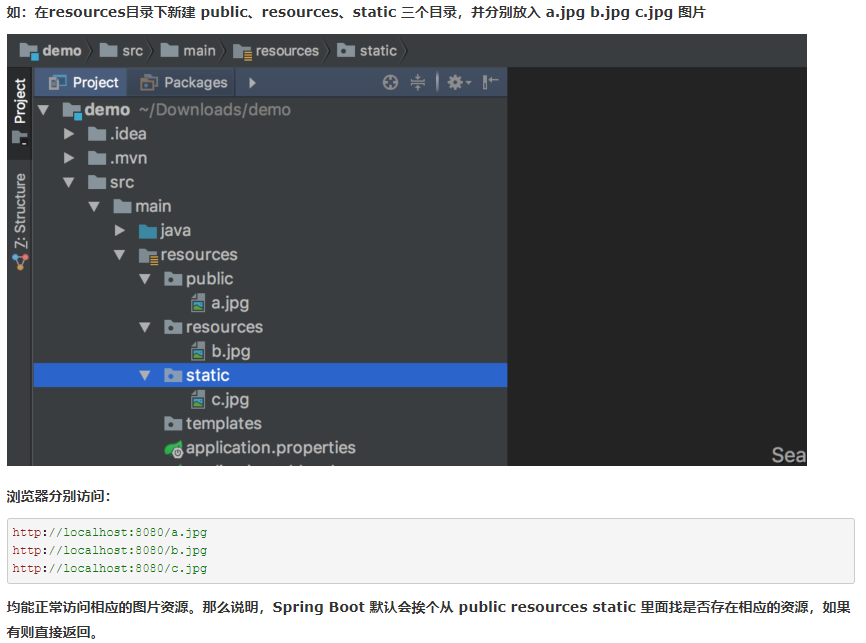
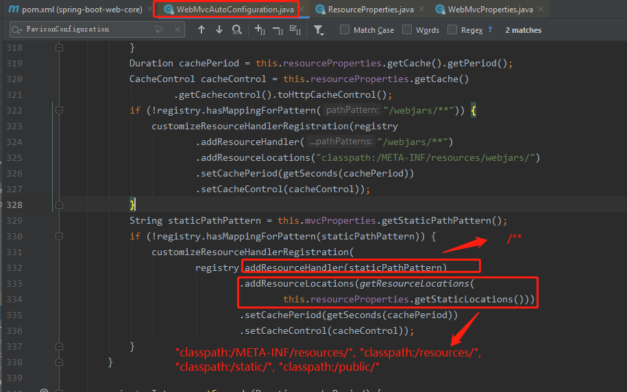
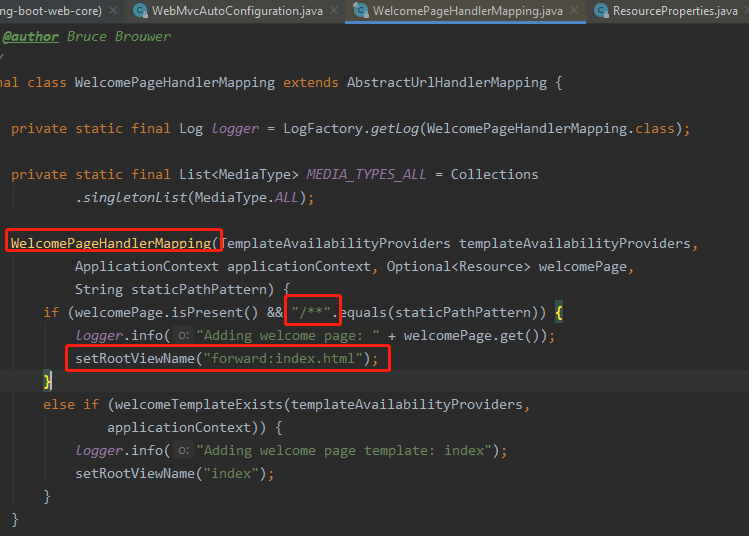

# SpringBoot对静态资源的映射规则

    "/**" 访问当前项目的任何资源，都去（静态资源的文件夹）找映射
    一般选择放在static下

```
"classpath:/META-INF/resources/", 
"classpath:/resources/",
"classpath:/static/", 
"classpath:/public/" 
"/"：当前项目的根路径
```

    http://localhost:9090/css/web.css ===>  去静态资源文件夹里面找css/web.css





    欢迎页； 静态资源文件夹下的所有index.html页面；被"/**"映射

    http://localhost:9090/   在静态资源文件夹下去找 index.html 页面



    所有的 **/favicon.ico  都是在静态资源文件下找 favicon.ico.

    随便访问一个页面: http://localhost:9090/

# 修改springboot默认的静态资源文件夹

    spring.resources.static-locations=classpath:/hello/,classpath:/dir_static/
    
    注意: 自己定义静态资源文件夹后,默认的静态资源文件夹就不能用了

# 修改springboot静态资源路径匹配模式

    spring.mvc.static-path-pattern=/static/**
    
    配置之后,访问静态资源的时候必须要加载/static/前缀,然后才可以到静态资源文件夹下去找对应的文件.
    
    比如我在classpath:/public/下有一个css/web.css, 在没有修改这个配置之前是这样访问:
    localhost:9090/css/web.css, 改完之后要这样访问:
    localhost:9090/static/css/web.css