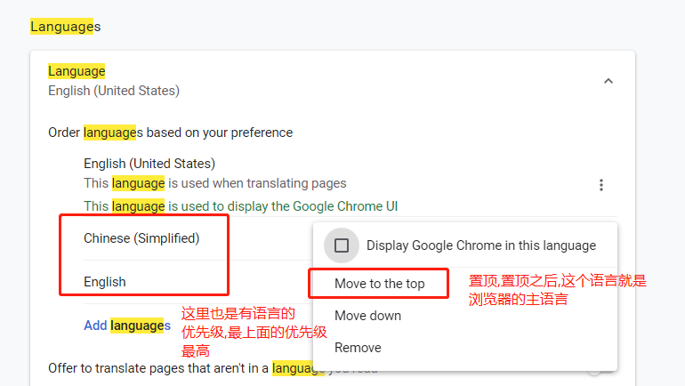
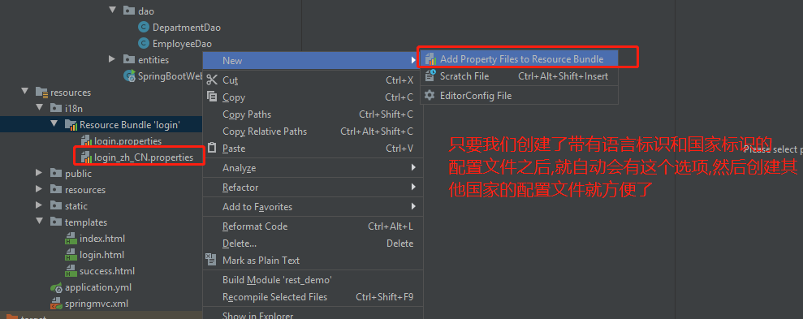
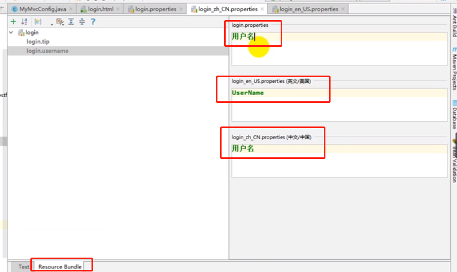
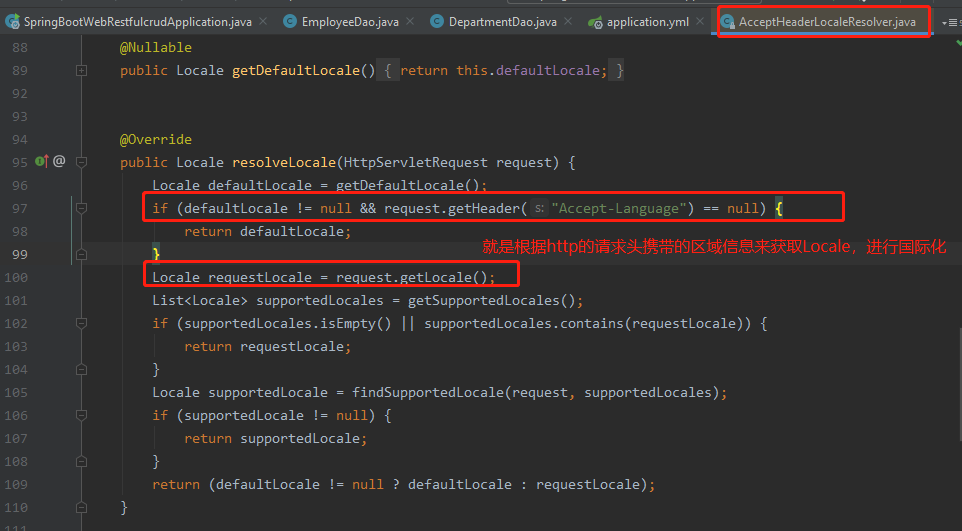
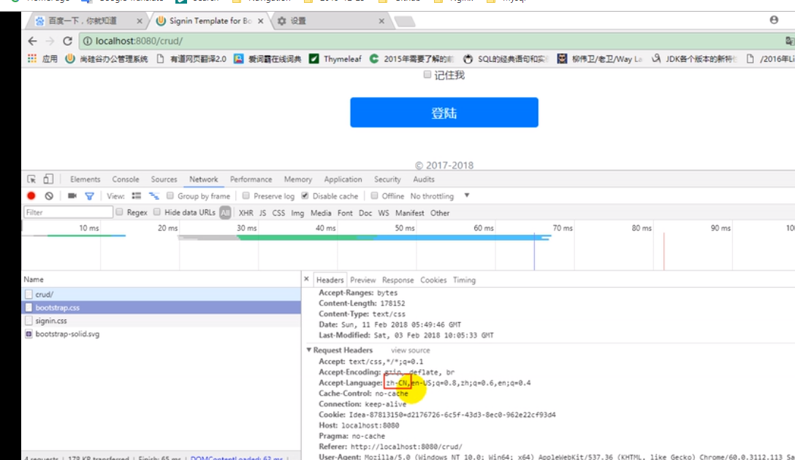

# 国际化

    通过浏览器的语言信息,来动态显示页面展示所用的语言,达到国际化效果.



# springboot中配置国际化的步骤

    1）、编写国际化配置文件，抽取页面需要显示的国际化消息
    2）、使用ResourceBundleMessageSource管理国际化资源文件
    3）、在页面使用fmt:message取出国际化内容

# 第一步: 编写国际化配置文件，抽取页面需要显示的国际化消息

    我们以login.html为例:
    格式： login_语言代码_国家代码.
    login_zh_CN.properties (浏览器语言是中文的环境下会用到这个属性文件)
    login_en_US.properties(英文环境下)
    login.properties (有些语言信息没有在我们国际化中配置(比如西班牙),那么就用这个默认的不带国家代码的配置属性文件.)





    中文情况下的国际化配置文件.


# 第二步： SpringBoot自动配置好了管理国际化资源文件的组件

```java
// springboot中的国际化自动配置类
@ConfigurationProperties(prefix = "spring.messages")
public class MessageSourceAutoConfiguration {
    
    // 这个的意思是，如果你没有把国际化配置文件指定在其他目录下，默认情况会使用
    // 类路径下的messages.properties/messages_zh_CN.properties/messages_en_US.properties
    // 也就是默认spring.messages.basename这个属性值就是messages。
    //我们的国际化配置文件可以直接放在类路径下叫messages.properties；
	private String basename = "messages";  
    // 比如我配置了spring.messages.basename=i18n.login，那么默认的就没有效果了，要到
    // 类路径下的i18n目录下下找login_zh_CN.properties/login_en_US.properties/login.properties

    @Bean
	public MessageSource messageSource() {
		ResourceBundleMessageSource messageSource = new ResourceBundleMessageSource();
		if (StringUtils.hasText(this.basename)) {
            //设置国际化资源文件的基础名（这个基础名是 去掉语言代码(en)和国家代码的(US)）
            // 设置完成后，spring mvc会自动到对应的目录下找对应的文件。
			messageSource.setBasenames(StringUtils.commaDelimitedListToStringArray(
					StringUtils.trimAllWhitespace(this.basename)));
		}
		if (this.encoding != null) {
			messageSource.setDefaultEncoding(this.encoding.name());
		}
		messageSource.setFallbackToSystemLocale(this.fallbackToSystemLocale);
		messageSource.setCacheSeconds(this.cacheSeconds);
		messageSource.setAlwaysUseMessageFormat(this.alwaysUseMessageFormat);
		return messageSource;
	}
}
```

# 第三步： 去页面获取国际化的值


    在thymeleaf模板中，使用#{login.username}来获取国际化属性文件中的值

    效果：根据浏览器语言设置的信息 页面会使用对应的语言。

# springboot默认的LocaleResolver是怎么配置的

    Locale（区域信息对象）；LocaleResolver（区域信息 解析器）；

```java
// 这个是springboot默认配置的，默认配置了一个叫AcceptHeaderLocaleResolver的区域信息 解析器
@Bean
// 这个就是springboot牛逼的地方，意思是如果用户没有配置自己的LocaleResolver，这个默认的才会生效，
// 如果用户配置了，就使用用户自己的
@ConditionalOnMissingBean
@ConditionalOnProperty(prefix = "spring.mvc", name = "locale")
public LocaleResolver localeResolver() {
    if (this.mvcProperties
            .getLocaleResolver() == WebMvcProperties.LocaleResolver.FIXED) {
        return new FixedLocaleResolver(this.mvcProperties.getLocale());
    }
    AcceptHeaderLocaleResolver localeResolver = new AcceptHeaderLocaleResolver();
    localeResolver.setDefaultLocale(this.mvcProperties.getLocale());
    return localeResolver;
}
默认的就是根据http的请求头携带的区域信息来获取Locale，进行国际化
```

# AcceptHeaderLocaleResolver作用又是什么？



    可以看到：浏览器也是有语言优先级的.



# 点击页面按钮，切换国际化

    自定义我们自己的LocaleResolver，只要我们自己配置了我们自己的LocaleResolver，默认的配置就会失效。
