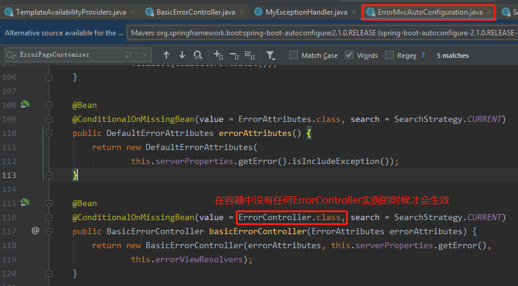
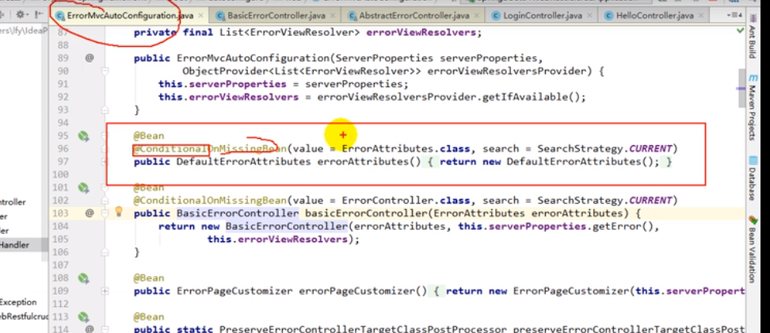

# 错误处理机制

# 1）、SpringBoot默认的错误处理机制

    在我们没有配置异常处理器的情况下,springboot的默认异常页面：

​		1）、浏览器访问，返回一个默认的错误页面


    依据浏览器浏览器发送请求的请求头：


​		2）、如果是除了浏览器以外的其他客户端(比如postman)，默认响应一个json数据


    所依据也是请求头中的accept


# 2）、SpringBoot默认的错误处理机制原理

    参照ErrorMvcAutoConfiguration；springboot 错误处理的自动配置类；
  	
  	这个自动配置类会给 容器 中添加了以下组件

    第一个组件: BasicErrorController：这个Controller默认处理的映射路径为/error.



```java
@Controller
// 映射路径: 如果配置了属性server.error.path,就用这个属性,如果没有配置就用error.path这个属性,如果这个属性也没有配置,就用/error
@RequestMapping("${server.error.path:${error.path:/error}}")
public class BasicErrorController extends AbstractErrorController {
    
    //浏览器发送的请求来到这个方法处理,产生html类型的数据；(依据是request头中的accept是否包含text/html)
    @RequestMapping(produces = "text/html")
	public ModelAndView errorHtml(HttpServletRequest request,HttpServletResponse response) {
		HttpStatus status = getStatus(request);
        // 从ErrorAttributes的实现类的getErrorAttributes()方法中获取要返回的数据.(我们自定义的数据就包含在这里)
        // 如果我们要自定义返回的错误信息,就要写一个类,继承DefaultErrorAttributes,然后重写getErrorAttributes方法,在这个方法中添加自定义的错误信息.
		Map<String, Object> model = Collections.unmodifiableMap(getErrorAttributes(request, isIncludeStackTrace(request, MediaType.TEXT_HTML)));
        // 设置响应的状态吗
		response.setStatus(status.value());
        // 从ErrorViewResolver的实现类中解析ModelAndView,也就是获得: 去哪个页面作为错误页面；包含页面地址和页面内容
        // 默认ErrorViewResolver的实现类为DefaultErrorViewResolver
		ModelAndView modelAndView = resolveErrorView(request, response, status, model);
		return (modelAndView == null ? new ModelAndView("error", model) : modelAndView);
	}
    
    // postman发送的请求来到这个方法处理,产生json数据
	@RequestMapping
	@ResponseBody
	public ResponseEntity<Map<String, Object>> error(HttpServletRequest request) {
        // 从ErrorAttributes的实现类的getErrorAttributes()方法中获取要返回的数据.(我们自定义的数据就包含在这里)
		Map<String, Object> body = getErrorAttributes(request,isIncludeStackTrace(request, MediaType.ALL));
		HttpStatus status = getStatus(request);
		return new ResponseEntity<Map<String, Object>>(body, status);
	}

    // 获取请求的状态吗
	protected HttpStatus getStatus(HttpServletRequest request) {
        // 从request的属性中获取
		Integer statusCode = (Integer) request.getAttribute("javax.servlet.error.status_code");
		if (statusCode == null) {
			return HttpStatus.INTERNAL_SERVER_ERROR;
		}
		try {
			return HttpStatus.valueOf(statusCode);
		} catch (Exception ex) {
			return HttpStatus.INTERNAL_SERVER_ERROR;
		}
	}

	protected ModelAndView resolveErrorView(HttpServletRequest request,HttpServletResponse response, HttpStatus status, Map<String, Object> model) {
		for (ErrorViewResolver resolver : this.errorViewResolvers) {
            // 调用DefaultErrorViewResolver的resolveErrorView,会根据传入的响应码status,来获得ModelAndView
            // 比如响应码为400,默认会去找/error/400.html这个视图,如果400.html没有找到,就去找/error/4xx.html
            // 也就是会先进行精确匹配,如果没有匹配到,就进行模糊匹配.
            // 在找的过程中,会现在类路径下的/templates/error中去找,没有找到就去静态资源文件夹的/error中去找,如果没有找到,说明没有模板.
            // 没有模板可用的话,就显示springboot默认的错误提示页面.
			ModelAndView modelAndView = resolver.resolveErrorView(request, status, model);
			if (modelAndView != null) {
				return modelAndView;
			}
		}
		return null;
	}
}
```

    第二个组件: DefaultErrorViewResolver：

```java
public class DefaultErrorViewResolver {
    // 去哪个页面是由DefaultErrorViewResolver解析得到的；
    @Override
    public ModelAndView resolveErrorView(HttpServletRequest request, HttpStatus status,
            Map<String, Object> model) {
        ModelAndView modelAndView = resolve(String.valueOf(status), model);
        if (modelAndView == null && SERIES_VIEWS.containsKey(status.series())) {
            modelAndView = resolve(SERIES_VIEWS.get(status.series()), model);
        }
        return modelAndView;
    }

    private ModelAndView resolve(String viewName, Map<String, Object> model) {
        // 默认SpringBoot可以去找到一个页面:  error/错误码
        String errorViewName = "error/" + viewName;
        // 模板引擎可以解析这个页面地址就用模板引擎解析
        TemplateAvailabilityProvider provider = this.templateAvailabilityProviders.getProvider(errorViewName, this.applicationContext);
        if (provider != null) {
            // 模板引擎可用的情况下返回到errorViewName指定的视图地址
            return new ModelAndView(errorViewName, model);
        }
        //模板引擎不可用，就在静态资源文件夹下找errorViewName对应的页面error/错误码.html
        return resolveResource(errorViewName, model);
	}
}
```

    第3个组件ErrorPageCustomizer：一但系统出现错误；默认会来到/error请求；
    会被BasicErrorController处理；这个是springboot默认帮我们配置好的
    
```java
// 系统出现错误以后默认会来到error请求进行处理；（类似于web.xml中注册的错误页面规则）
// 路径解析: 会先用error.path这个属性,如果没有这个属性,就用/error.系统出现错误以后来到error请求进行处理
// 当然我们可以通过配置这个属性 修改成我们自定义的错误处理url路径
@Value("${error.path:/error}") 
private String path = "/error";
// springboot会在启动的时候就注册这个url映射.  
```

    第4个组件: DefaultErrorAttributes：我们可以定义一个自己的ErrorAttributes组件,然后重写getErrorAttributes
    来添加我们自定义的错误信息.



```java
public class DefaultErrorAttributes{
    @Override
    public Map<String, Object> getErrorAttributes(RequestAttributes requestAttributes,
            boolean includeStackTrace) {
        Map<String, Object> errorAttributes = new LinkedHashMap<String, Object>();
        errorAttributes.put("timestamp", new Date());
        addStatus(errorAttributes, requestAttributes);
        addErrorDetails(errorAttributes, requestAttributes, includeStackTrace);
        addPath(errorAttributes, requestAttributes);
        return errorAttributes;
    }
}
```