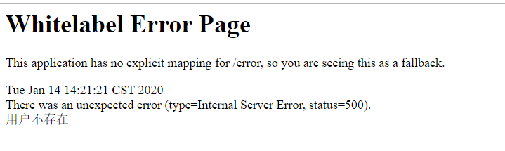
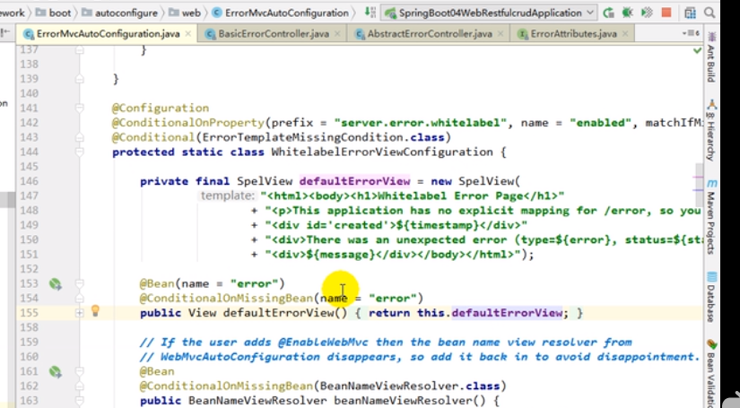
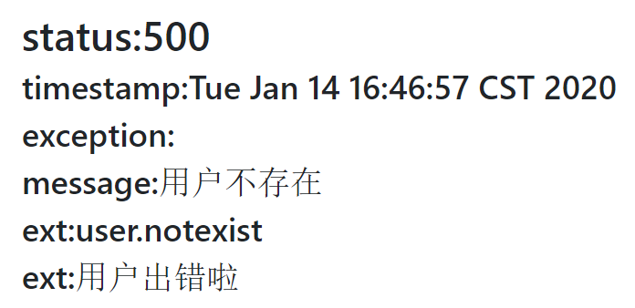

# 如何定制浏览器访问的错误页面

    1）、有模板引擎的情况下；error/状态码;** 【将错误页面命名为  错误状态码.html 
    然后放在模板引擎文件夹里面的 error文件夹下】，发生此状态码的错误就会来到  对应的页面；

    我们可以使用4xx和5xx作为错误页面的文件名来匹配这种类型的所有错误，寻找错误页面的的时候,
    优先精确匹配（优先寻找精确的状态码.html,比如错误码是400,优先找/error/400.html,再去找/error/4xx.html)

    页面能获取的信息；
    timestamp：时间戳
    status：状态码
    error：错误提示
    exception：异常对象
    message：异常消息
    errors：JSR303数据校验的错误都在这里

    2）、没有模板引擎（模板引擎找不到这个错误页面），静态资源文件夹下找；
    
    3）、以上都没有错误页面，就是默认来到SpringBoot默认的错误提示页面；





# 如何定制postman请求的错误响应(json数据)

    1）、自定义异常处理: 没有自适应效果,浏览器和postman都得到json数据

```java
@ControllerAdvice
public class MyExceptionHandler {
    @ResponseBody
    @ExceptionHandler(UserNotExistException.class)
    public Map<String,Object> handleException(Exception e){
        Map<String,Object> map = new HashMap<>();
        map.put("code","user.notexist");
        map.put("message",e.getMessage());
        return map;
    }
}
```

    2）、自定义异常处理: 转发到/error进行自适应响应效果处理

```java
@ExceptionHandler(UserNotExistException.class)
public String handleException(Exception e, HttpServletRequest request){
    Map<String,Object> map = new HashMap<>();
    //传入我们自己的错误状态码  4xx 5xx，否则就不会进入定制错误页面的解析流程
    /**
     * Integer statusCode = (Integer) request
     .getAttribute("javax.servlet.error.status_code");
     */
    request.setAttribute("javax.servlet.error.status_code",500);
    map.put("code","user.notexist");
    map.put("message",e.getMessage());
    //转发到/error
    return "forward:/error";
}
```


# 将我们的定制数据携带出去

    出现错误以后，会来到/error请求，会被BasicErrorController处理.

    页面上能用的数据，或者是json返回能用的数据都是通过ErrorAttributes.getErrorAttributes得到；
    ErrorAttributes的默认实现类为DefaultErrorAttributes

    我们可以自定义ErrorAttributes的实现类,添加我们自定义的数据

```java
// 给容器中加入我们自己定义的ErrorAttributes
@Component
public class MyErrorAttributes extends DefaultErrorAttributes {
    @Override
    public Map<String, Object> getErrorAttributes(RequestAttributes requestAttributes, boolean includeStackTrace) {
        Map<String, Object> map = super.getErrorAttributes(requestAttributes, includeStackTrace);
        map.put("company","xxx");
        return map;
    }
}
```

    最终的效果：响应是自适应的，可以通过定制ErrorAttributes改变需要返回的内容，




# 如何定制错误响应步骤汇总

    步骤:
    第一步: 因为要处理异常,比如这里处理的异常是UserNotExistException,所以第一步肯定是定义一个异常的处理器,
    比如异常处理器的名字叫MyExceptionHandler,然后用@ControllerAdvice标注MyExceptionHandler(在springmvc中要成为异常处理器,必须要添加这个注解.)
    
    第二步: 在MyExceptionHandler中定义一个方法,比如method1,使用@ExceptionHandler(UserNotExistException.class)标注这个方法,
    意思就是告诉springmvc,用这个方法处理UserNotExistException异常.
    
    第三步: 自定义ErrorAttributes的实现类,然后重写getErrorAttributes方法,在这个方法中添加自定义数据.