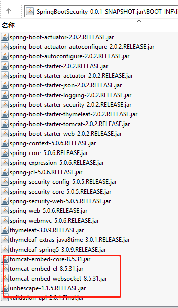
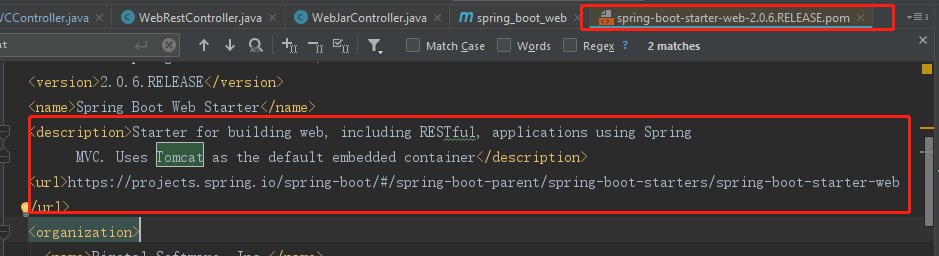
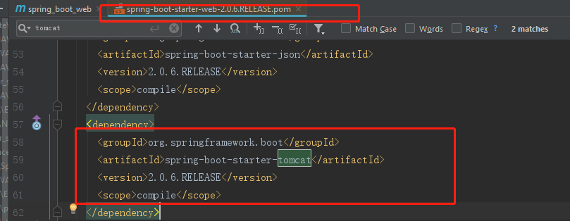

# 将应用打包成一个可执行的jar

```xml
 <!-- 这个插件，可以将应用打包成一个可执行的jar包(称为Fat JAR)；-->
 <!-- 因为这样的 jar包内部包含了自己运行时的所有依赖，体积比较大 -->
    <build>
        <plugins>
            <plugin>
                <groupId>org.springframework.boot</groupId>
                <artifactId>spring-boot-maven-plugin</artifactId>
            </plugin>
        </plugins>
    </build>
```

    将这个应用打成jar包，直接使用java -jar的命令进行执行；
    就是电脑没有装tomcat也没关系,因为springboot打成的这个jar中自带了tomcat相关的jar.

    springbootstudy-0.0.1-SNAPSHOT.jar内部包含了其他依赖的，可以直接运行的jar
    而springbootstudy-0.0.1-SNAPSHOT.jar.original 则是原始的打包后的jar,没有包含依赖



# Spring Boot的嵌入式容器-tomcat

    spring-boot-starter-web中默认集成了tomcat,所以spring boot启动默认使用的是tomcat,
    如果你需要使用具体的tomcat版本,需要配置 "<tomcat.version>8.0.3</tomcat.version>)" 属性
    当然,如果你想要jetty,而不是tomcat,就需要把spring-boot-starter-web中的tomcat给exclude掉,
    然后再添加jetty的starter: spring-boot-starter-jetty,
    
    内嵌web容器的两个默认配置项：默认的监听端口:8080 和 应用的contextPath为"/"

```yaml
#Tomcat configuration
server.port=80
server.contextPath=/springboot
```





# 将项目打包为war，然后部署到外部Tomcat容器(外部的任何javaee容器)

    步骤一、修改POM中的打包方式，将打包方式由jar改为war
    
    步骤二、默认情况下,spring-boot-starter-web会启动一个嵌入式的tomcat，因为现在我们是要生成一个war包，
    跑在外部的tomcat上，所以，给项目添加一个tomcat依赖(spring-boot-starter-tomcat)，
    并将其scope设置为“provided(表明这些组件由外部容器提供）”,从而覆盖掉默认设置

# 不允许直接上传war到tomcat的原因

    1.0.0.war会在webapps 下自动解压为1.0.0这个文件夹,然后又发布了1.0.1.war,
    又在webapps下自动解压为1.0.1这个文件夹,问题来了,你要走的其实是1.0.1这个版本,但是文件在1.0.0下,

    改成myshop.war也不行,会自动删除myshop,然后再自动解压,原来的文件就没了.