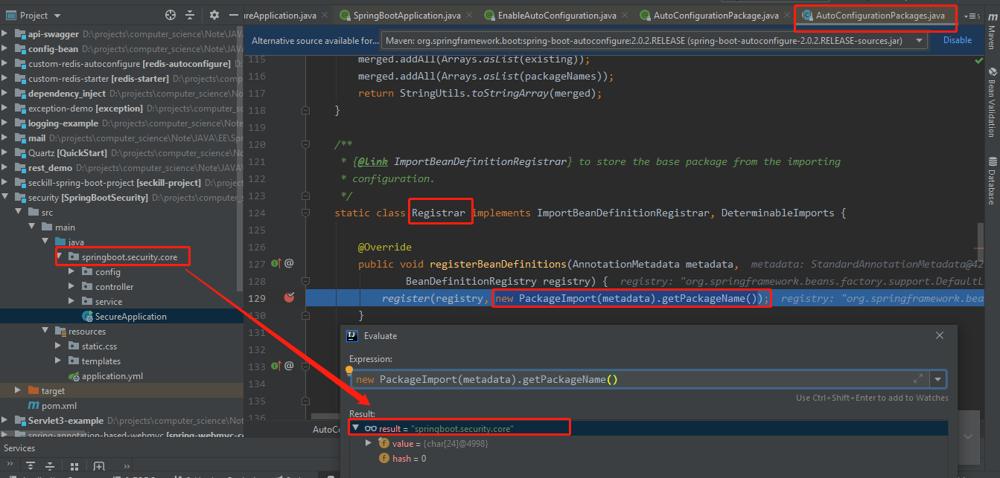

# @SpringBootApplication

    @SpringBootApplication = @SpringBootConfiguration + @EnableAutoConfiguration + @ComponentScan

# @SpringBootConfiguration

    标注在某个类上，表示这是一个Spring Boot的配置类；

    @SpringBootApplication标注在某个类上说明这个类是SpringBoot的主配置类.
    
    @SpringBootApplication这个类上也标注了@Configuration,说明继承了@Configuration的功能.

# @EnableAutoConfiguration

    @EnableAutoConfiguration告诉SpringBoot开启自动配置功能；这样自动配置才能生效；
    
    以前我们需要配置的东西，Spring Boot帮我们自动配置；

```java
@AutoConfigurationPackage
@Import(EnableAutoConfigurationImportSelector.class)
public @interface EnableAutoConfiguration {}
```

---

```java
@Import(AutoConfigurationPackages.Registrar.class)
public @interface AutoConfigurationPackage {}
```

    @Import(AutoConfigurationPackages.Registrar.class)： 注册SpringBoot主配置类（@SpringBootApplication标注的类） 所在的包以及子包中的所有Bean定义到容器中.



---

    EnableAutoConfigurationImportSelector：导入哪些组件的选择器；
    
    @Import(EnableAutoConfigurationImportSelector.class): 会给容器中导入非常多的自动配置类（xxxAutoConfiguration）
    有了自动配置类，免去了我们手动编写配置注入功能组件等的工作；


    Spring Boot在启动的时候从类路径下的META-INF/spring.factories中获取EnableAutoConfiguration指定的值，
    将这些值作为自动配置类导入到容器中，自动配置类就生效，帮我们进行自动配置工作；
    以前我们需要自己配置的东西，自动配置类都帮我们；

    J2EE的整体整合解决方案和自动配置都在spring-boot-autoconfigure-1.5.9.RELEASE.jar；
    也就是spring-boot这些自动配置类(xxxAutoConfiguration)都在spring-boot-autoconfigure这个包下.
