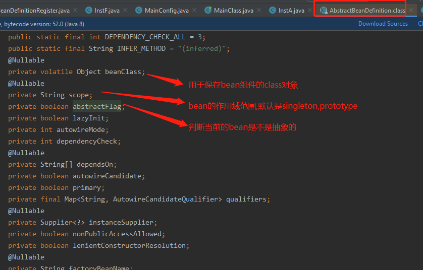
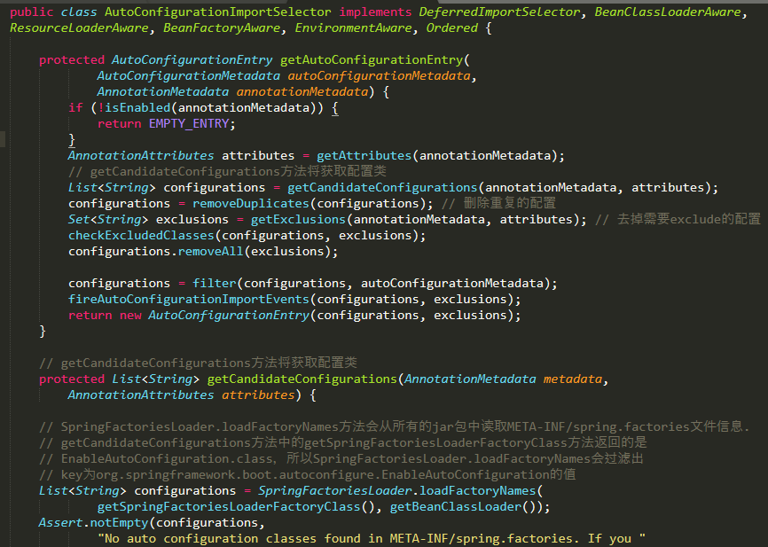

# SpringBoot自动装配了什么东西?怎么个自动装配的?(核心)

比如我们定义了一个类,叫Player,如下:

```java
@Lazy
@Scope
public class Player{
    Integer age;
    String lastName;
    Float height;
}
```

    那么Spring是怎么去描述这个Player呢?

    Spring它也有一个对象用来描述Player这个Bean,这个对象就是BeanDefinition.

    比如,上面的Player,是否是懒加载的(@Lazy),这个Player的class属性是什么(类对象是什么),
    是不是抽象的,是不是primary的(当发生自动装配的时候,假如某个bean会发现多个,那么标注primary为true的BeanDefinition首先被注入),
    构造方法有哪些,@Scope是单例的还是原型的,等等一系列的关于这个bean的属性,都是由BeanDefinition来描述的.


上图中的UserController.class这些类加载到内存后,通过@Controller注解,可以被Spring识别出来,然后就形成一个个的BeanDefinition.

每个被Spring识别出来的Bean都会构成一个BeanDefinition.这些BeanDefinition的存储结构叫BeanDefinitionMap<beanName, BeanDefinition>

BeanDefinition包含的属性字段如上图.比如说要描述当前这个bean属于哪个class,这个bean的scope属性,autowireMode你的注入模型是什么,等


    BeanDefinition相当于是Bean的图纸,IoC会拿着这些图纸去依葫芦画瓢把对象给new出来



    演示项目: spring-source-learn-code中的com.beans.BeanDefinition.setInject.MainClass
    以及com.autoconfiguration.TestBaseJavaConfig.

# 接下来看一下SpringBoot自动装配的过程

    @SpringBootApplication = @SpringBootConfiguration + @EnableAutoConfiguration + @ComponentScan


    @SpringBootConfiguration: 意味着可以在主启动类中使用@Bean配置bean,一般不这么配置,不美观.


    @ComponentScan: 执行组件扫描(@Component，@Service，@Repository，@Controller等Bean)
    扫描主启动类所在包以及子包中符合条件的bean.
    
    这也是SpringApplication.run方法第一个参数是主启动类的原因.因为要根据这个主启动类所在的包来扫描.

---

    @EnableAutoConfiguration
    

    
    看源码的方法: 
    1. 一行行的看就完蛋了,你会崩溃的,一行代码的调用栈非常深,你看一行要看好几天.
    2. 看源码一定要debug


    





    spring-boot-starter-autoconfigure中的spring.factories文件
    不是所有的AutoConfiguration都会加载，会根据AutoConfiguration上的@ConditionalOnClass等条件判断是否加载。
    这里加载的仅仅是key为org.springframework.boot.autoconfigure.EnableAutoConfiguration的值


    @EnableAutoConfiguration注解的作用: 把AutoConfigurationImportSelector类加载器所对应的类路径
    下的META-INF/spring.factories中的配置类加载到SpringIoc容器中

    removeDuplicates: 防止你自己写的配置类跟自动装配的名称相冲突,也就是去重.
    
    getExclusions: 因为@SpringBootApplication(exclude = {})可以排除加载配置类,所以getExclusions就是
    排除@SpringBootApplication中要排除的类
    
    filter(configurations, autoConfigurationMetadata): 作用是: 
    比如org.springframework.boot.autoconfigure.data.redis.RedisAutoConfiguration,这个类上面有条件注解
    @ConditionalOnClass(RedisOperations.class),filter意思就是根据条件注解来进行过滤,把不满足条件的配置类过滤掉.
    


---    
    SpringBoot自动装配了什么东西?
    
    通过@Import注解,读取spring.factories这个配置文件,把里面的配置类解析成一个一个的BeanDefinition
    ,然后把BeanDefinition导入到BeanDefinitionMap中,然后SpringIoC就可以使用BeanDefinitionMap来创建bean实例了.
    
    所以SpringBoot装配的是BeanDefinition,自动就是通过@Import注解,读取spring.factories.
---

# 导入BeanDefinition到SpringIOC容器中的方式有几种

    第一种: @ComponentScan + @Component
    第二种: @ComponentScan + @Configuration + @Bean
    第三种: @Import
    第四种: 实现BeanDefinitionRegistryPostProcessor接口的postProcessBeanDefinitionRegistry方法
    
    项目示例: spring-source-learn-code中的com.beans.BeanDefinition.setInject.MyBeanDefinitionRegister

# @Import的三种玩法

    项目示例:  spring-source-learn-code中的com.beans.BeanDefinition.setInject.MainConfig    

# SpringBoot自动配置总结

application.yml文件中到底都能配置什么?

1. SpringBoot启动的时候加载主配置类，在主配置类中使用了@SpringBootApplication注解，点进去发现会开启@EnableAutoConfiguration注解自动配置。
2. @EnableAutoConfiguration的作用：利用@Import({AutoConfigurationImportSelector.class})给容器中导入一些组件，点进去找到selectImports方法中List<String> configurations = this.getCandidateConfigurations(annotationMetadata, attributes);
3. SpringFactoriesLoader.loaFactoryNames()扫描所有jar包类路径下META_INF/Spring.factories,把扫描到的这些文件的内容包装成一个properties对象，从properties中获取EnableAutoConfiguration.class类（类名）对应的值，然后将他们添加到容器中

**总结将类路径下META-INF/Spring.factories里面配置的所有EnableAutoConfiguration的值加入到容器中**

以HttpEncodingAutoConfiguration为例解释自动配置原理

@Conditional根据满足某一个特定条件创建一个特定的Bean。比方说，当某一个jar包在一个类路径下的时候，自动配置一个或多个Bean；或者只有某个Bean被创建才会创建另外一个Bean。总的来说，就是根据特定条件来控制Bean的创建行为，这样我们可以利用这个特性进行一些自动的配置。

~~~java
@Configuration //表示这是一个配置类
@EnableConfigurationProperties({HttpEncodingProperties.class})
//启动指定类的ConfigurationProperties功能
@ConditionalOnWebApplication(//Spring底层有@conditiona注解，根据不同的条件，如果满足指定的条件才会让配置类中的配置就会生效，判断当前应用是否为web应用。
    type = Type.SERVLET
)
@ConditionalOnClass({CharacterEncodingFilter.class})
//判断当前项目中有没有CharacterEncodingFilter这个类
@ConditionalOnProperty(//判断配置文件中是否存在某个配置spring.http.encoding
    prefix = "spring.http.encoding",
    value = {"enabled"},
    matchIfMissing = true
)
~~~

根据当前不同的条件判断，决定这个配置类是否生效。

所有可以在配置文件中能配置的属性都是在xxxProperties类中封装着，配置文件能配置什么就可以参照某个功能对应的这个属性类

~~~java
@ConfigurationProperties(
    prefix = "spring.http.encoding"
)//从配置文件中获取指定的值和bean的属性进行绑定，也就是说在yaml文件中可以配置spring.http.encoding
public class HttpEncodingProperties {
~~~

    SpringBoot自动配置的精髓

SpringBoot在启动的时候就会加载大量的自动配置类

我们看我们需要的功能有没有在SpringBoot默认写好的自动配置文件类中，如果自动配置文件类中有我们需要的组件，就不在需要我们配置。

1、快捷键Alt+Shift+N打开自动搜索，输入*AutoConfiguration，选择自己需要的配置文件类

2、在配置文件类中选择注解xxxProperties.class

3、在ConfigurationProperties注解后面就是可以配置的属性名，字段名就是属性值

自动配置文件类只有满足条件才能生效，如何知道那些自动配置类生效，使用方法如下：

~~~yaml
debug: true
~~~

在yaml文件中配置应用以debug模式来启动，在控制台就会打印那些自动配置类已经生效了。其中Negative matches就是没有生效的配置类。Positive matches就是生效的自动配置。
