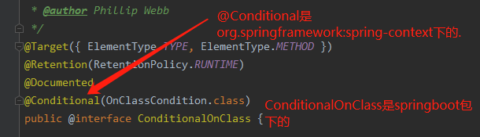
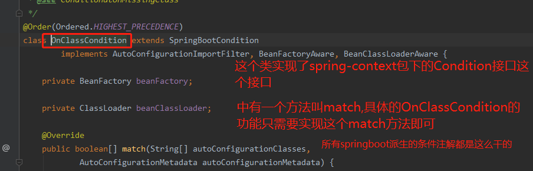

# @Conditional条件注解的原理

    @Conditional是org.springframework:spring-context下的.属于spring的原生注解
        

    Condition是一个接口,也是spring-context下的,所有的派生条件注解都会有一个这个接口的实现类.

# @Conditional派生注解

    作用：必须是@Conditional指定的条件成立，才给容器中添加组件，配置配里面的所有内容才生效；

| @Conditional扩展注解                | 作用（判断是否满足当前指定条件）               |
| ------------------------------- | ------------------------------ |
| @ConditionalOnJava              | 判断系统的jdk版本是否符合要求                |
| @ConditionalOnBean              | 判断容器中存在指定Bean；                   |
| @ConditionalOnMissingBean       | 判断容器中不存在指定Bean；                  |
| @ConditionalOnExpression        | 判断是否满足SpEL表达式指定                    |
| @ConditionalOnClass             | 判断系统中是否有指定的类                       |
| @ConditionalOnMissingClass      | 判断系统中没有指定的类                      |
| @ConditionalOnSingleCandidate   | 判断容器中只有一个指定的Bean，或者这个Bean是首选Bean |
| @ConditionalOnProperty          | 判断系统中指定的属性是否有指定的值                |
| @ConditionalOnResource          | 判断类路径下是否存在指定资源文件                 |
| @ConditionalOnWebApplication    | 判断当前是web环境                       |
| @ConditionalOnNotWebApplication | 判断当前不是web环境                      |
| @ConditionalOnJndi              | 判断JNDI存在指定项                      |

    自动配置类必须在一定的条件下才能生效

    我们怎么知道哪些自动配置类生效；
    可以通过启用  debug=true属性；来让控制台打印自动配置报告，这样我们就可以很方便的知道哪些自动配置类生效；

    搜索关键字: AUTO-CONFIGURATION REPORT
    Positive matches:（表示自动配置类启用的）
    Negative matches:（表示没有启动，没有匹配成功的自动配置类）

# 条件注解示例

---

<table>
    <thead>
        <tr>
            <th>例子</th>
            <th>例子意义</th>
        </tr>
    </thead>
    <tbody>
        <tr>
            <td>@ConditionalOnBean(javax.sql.DataSource.class)</td>
            <td>Spring容器或者所有父容器中需要存在至少一个javax.sql.DataSource类的实例</td>
        </tr>
        <tr>
            <td>@ConditionalOnClass
                 ({ Configuration.class,
                 FreeMarkerConfigurationFactory.class })</td>
            <td>类加载器中必须存在Configuration和FreeMarkerConfigurationFactory这两个类</td>
        </tr>
        <tr>
            <td>@ConditionalOnExpression
                 (“‘${server.host}’==’localhost’”)</td>
            <td>server.host配置项的值需要是localhost</td>
        </tr>
        <tr>
            <td>ConditionalOnJava(JavaVersion.EIGHT)</td>
            <td>Java版本至少是8</td>
        </tr>
        <tr>
            <td>@ConditionalOnMissingBean(value = ErrorController.class, search = SearchStrategy.CURRENT)</td>
            <td>Spring当前容器中不存在ErrorController类型的bean</td>
        </tr>
        <tr>
            <td>@ConditionalOnMissingClass
                 (“GenericObjectPool”)</td>
            <td>类加载器中不能存在GenericObjectPool这个类</td>
        </tr>
        <tr>
            <td>@ConditionalOnNotWebApplication</td>
            <td>必须在非Web应用下才会生效</td>
        </tr>
        <tr>
            <td>@ConditionalOnProperty(prefix = “spring.aop”, name = “auto”, havingValue = “true”, matchIfMissing = true)</td>
            <td>应用程序的环境中必须有spring.aop.auto这项配置，且它的值是true或者环境中不存在spring.aop.auto配置(matchIfMissing为true)</td>
        </tr>
        <tr>
            <td>@ConditionalOnResource
                 (resources=”mybatis.xml”)</td>
            <td>类加载路径中必须存在mybatis.xml文件</td>
        </tr>
        <tr>
            <td>@ConditionalOnSingleCandidate
                 (PlatformTransactionManager.class)</td>
            <td>Spring当前或父容器中必须存在PlatformTransactionManager这个类型的实例，且只有一个实例</td>
        </tr>
        <tr>
            <td>@ConditionalOnWebApplication</td>
            <td>必须在Web应用下才会生效</td>
        </tr>
    </tbody>
</table>    

---