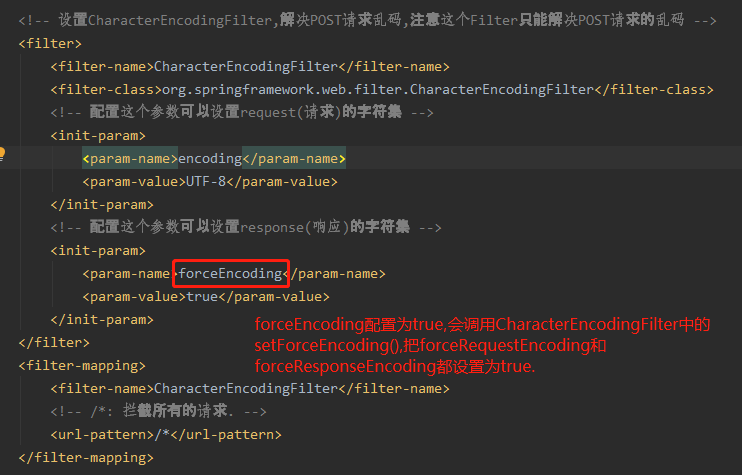
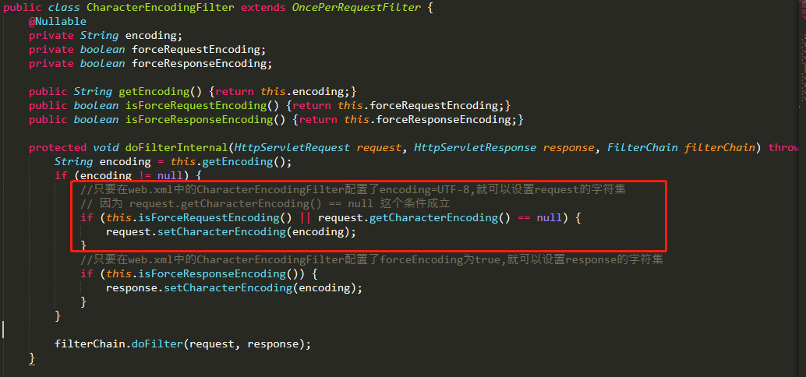

# SpringMVC中如何解决POST和GET请求中文乱码问题呢?

    注意：从Tomcat8开始，tomcat默认编码已经改为UTF-8，所以已经不会出现Get请求中文乱码问题了。
    只需处理Post请求中文乱码即可

# 对于POST请求如何解决?
    
    在web.xml中配置一个过滤器: org.springframework.web.filter.CharacterEncodingFilter

# 对于get请求

    注意：从Tomcat8开始，tomcat默认编码已经改为UTF-8，所以已经不会出现Get请求中文乱码问题了。
    
    对于tomcat8以前的版本,需要修改tomcat的配置文件server.xml
    在第一个Connector标签中添加URIEncoding="UTF-8"
