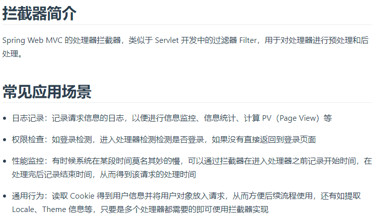
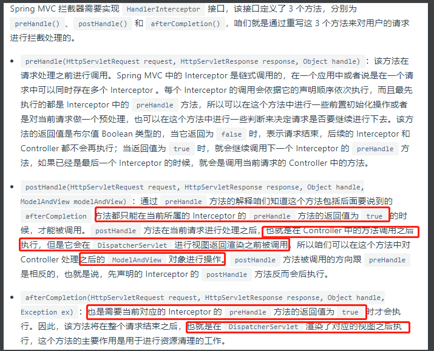
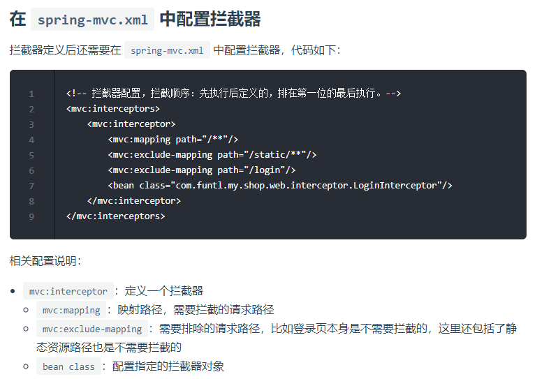

# spring mvc拦截器

    通过实现HandlerInterceptor接口, 或实现抽象类HandlerInterceptorAdapter来创建Spring拦截器

    preHandle:
        此方法在将请求转发给"对应的处理方法-handler method"之前拦截请求。
         a. 这个方法应该返回'true'让Spring知道要让下一个Spring拦截器处理请求，
         或者如果没有其他Interceptor则将它发送到处理程序方法。
         b. 如果此方法返回'false'，则Spring框架假定请求已由spring拦截器本身处理，
         并且不需要进一步处理。在这种情况下，我们应该使用"response"来给客户端的请求发送响应
         此方法也可以抛出异常，在这种情况下，Spring MVC异常处理应该很有用,它会将错误页面作为响应发送。

    postHandle:
        当已经调用处理程序,但DispatcherServlet尚未渲染视图时(is yet to render the view)，
        此时将调用HandlerInterceptor拦截器方法。此方法可用于向要在"视图页面"中使用的ModelAndView对象添加其他属性

简单概括:perHandle()方法是按照配置文件顺序执行 然后逆序执行每个拦截器的postHandle()方法 ，最后逆序执行afterCompletion()方法