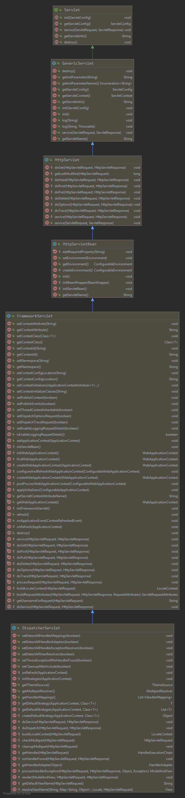
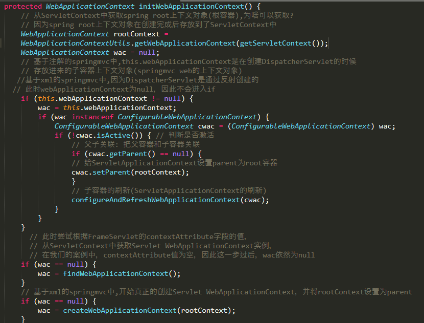
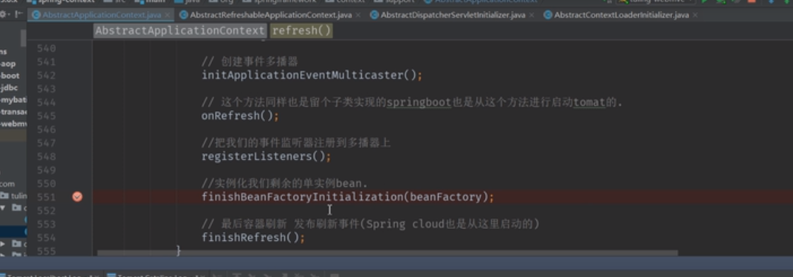

# DispatcherServlet是如何调用到initWebApplicationContext()的?

1. Servlet的init(ServletConfig)会调用到GenericServlet的init()
2. HttpServletBean继承了GenericServlet,HttpServletBean的init()调用到了initServletBean()
3. FrameworkServlet重写了initServletBean(),initServletBean()中会调用到initWebApplicationContext()

# DispatcherServlet的initWebApplicationContext()剖析

    见当前目录下的: FrameworkServlet.java

    