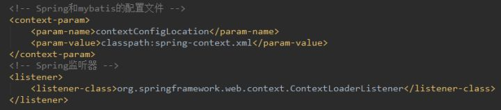
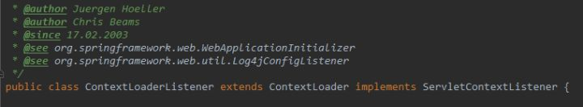
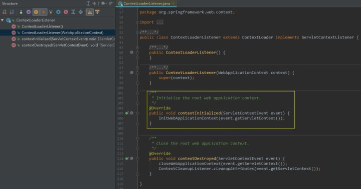
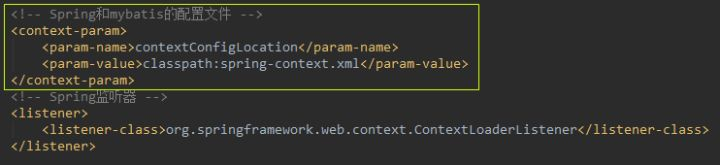
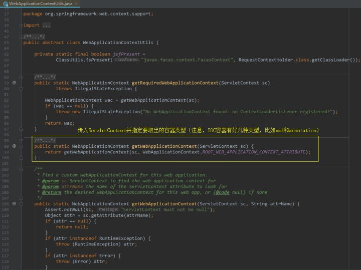

# 根容器中的service和repository组件的创建

    org.springframework.web.context.ContextLoaderListener是一个监听器,由org.springframework:spring-web提供.
    我们搭建SSM框架时，需要做的仅仅是在web.xml中配置它，一般是这样：

    Tomcat会解析web.xml，反射创建ContextLoaderListener,
    然后把这个Listener注册到ServletContext中-->SrvletContext.addListener(listener)

    很明显Spring的ContextLoaderListener实现了ServletContextListener，来监听项目启动。
    一旦项目启动，会触发ContextLoaderListener中的回调方法
    

    也就是说Tomcat创建ServletContext时，会回调ContextLoaderListener的contextInitialized()，
    这个方法中的initWebApplicationContext()就是用来初始化Spring的IOC容器的
    
    注意,initWebApplicationContext()是初始化根容器(父容器),并不是创建根容器,因为根容器此时已经创建完成了,
    只是没有初始化而已,初始化的意思就是把service和repository这些bean组件添加到容器中
    
    再强调一遍：ServletContext接口是servlet规范定义的接口,具体的实现类是由Tomcat的实现的.
    tomcat在创建和销毁ServletContext的时候会回调ServletContextListener接口中的方法

    ContextLoaderListener是Spring的，实现了ServletContextListener,
    Spring自己写的监听器，用来创建"根容器(root container)"中的services和repositories等bean组件

    web.xml中context-param提供的xml，里面有很多bean,
    根容器就是通过读取这个xml来拿到services和repositories这些bean,然后把这些bean舔加到根容器中.

# ContextLoaderListener中initWebApplicationContext()方法详解

>看的时候，告诉自己，initWebApplicationContext()的具体实现是在ContextLoaderListener的父类ContextLoader中，以免自乱阵脚：

    参见: 当前目录下的ContextLoader.class
    
    当然了，Spring也提供了工具类，方便从ServletContext中取出IOC容器：

