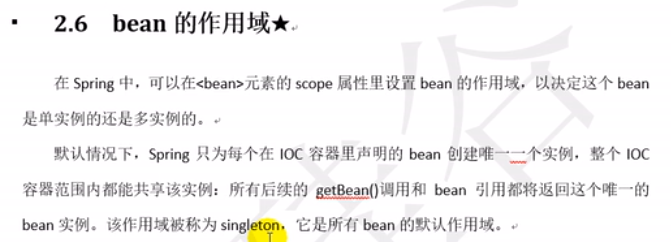
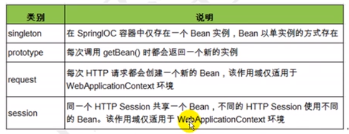
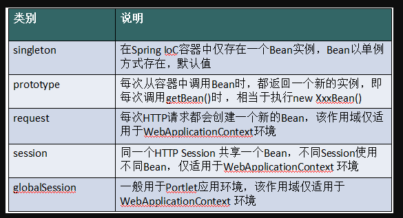
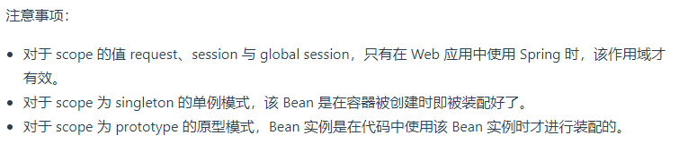
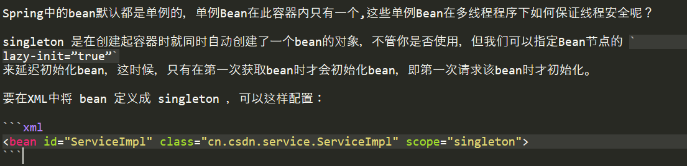

# Bean的作用域

    最新的spring中bean的作用域是6种: singleton, prototype,request,session,application,websocket
    
    最后四种request,session,application,websocket仅在Web应用程序中可用。后4种在实际中用的也不多.

# Bean不同作用域的适用场景

    其中: request, session and global-session scopes不适用于独立应用程序,仅仅适用于web应用查询.
    singleton和prototype scope的能用于独立的java非web应用程序.

# Singleton和Prototype的bean分别是什么时候被创建

    Singleton：Spring容器共享这个实例。使用此范围时，请确保bean没有共享成员变量，否则可能导致数据不一致问题

# 通过注解指定bean的作用域

# 向一个Singleton Bean注入一个Prototype Bean，后者会被实例化几次？

    答: 比如在一个singleton的Controller中注入一个prototype类型的Service,
    如果是单纯的在Controller中使用这个Service,则就实例化一次, 
    如果通过调用ioc容器的getBean()方法,则每调用一次,就实例化一次.
    
>示例: spring-bean-scope    