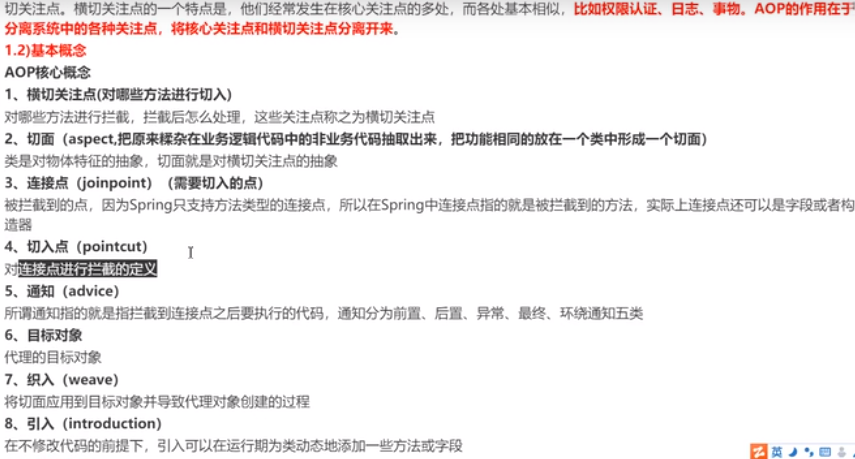
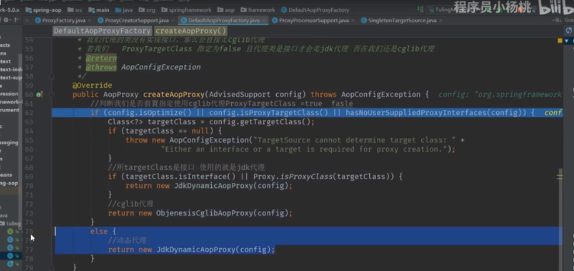
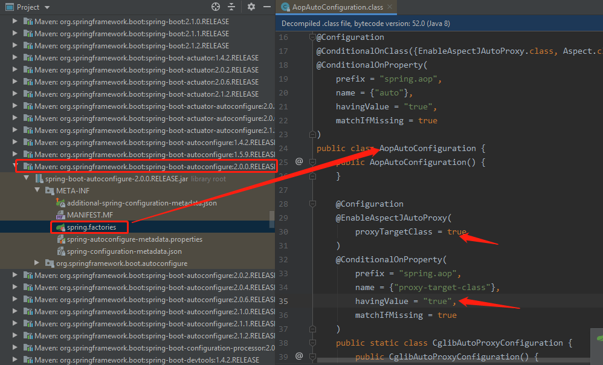
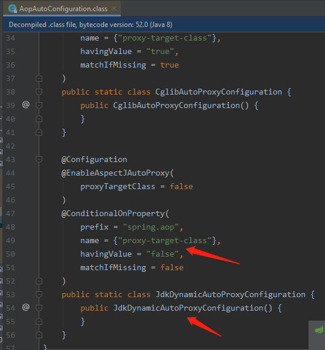

# AOP核心概念



    aop: 就是在不侵入原始的业务代码的情况下,把这些功能代码,比如说日志打印/参数校验的功能/权限认证功能/事务,等功能抽取出来,
    形成一个个切面.这个过程叫抽取横切关注点.把相同功能的横切关注点抽取出来,形成一个个的切面.

    AOP中的基本概念：5种类型的通知（Before，After，After-returning，After-throwing，Around）

# spring aop什么时候使用jdk代理,什么时候使用cglib?在可选的情况下,如何进行指定?

    Spring AOP 同时支持 CGLIB、JDK动态代理
    
    spring默认使用的是jdk的代理,但是有一个前提,是目标类要实现接口.JDK动态代理模式只能代理接口而不能代理类

    如果我们代理的类实现了接口，Spring AOP 将会采用 JDK 动态代理来生成 AOP 代理类
    
    如果我们代理的类没有实现接口，Spring AOP 将直接采用 CGLIB 来生成 AOP 代理类

    如何强制使用cblib代理? 
    @EnableAspectJAutoProxy(proxyTargetClass = true) // true: 强制使用cblib代理
    如果我们将proxyTargetClass固定为false 且代理类实现了接口才会走jdk代理







# Spring AOP的实现原理?

    AOP是基于 动态代理,说spring aop,肯定要牵扯到设计模式->动态代理模式.

AOP的实现，最关键的有两步：

1. 得到代理对象
2. 利用递归责任链执行前置以及后置的advice(通知)及目标方法

IOC容器初始化时，对于涉及AOP操作的目标类，其实Spring返回的是代理对象，而不是目标类的实例。

代理对象proxy其实包含了很多东西，比如：

- 目标对象
- 增强器

代理对象最终都会间接调用目标对象的同名方法，比如proxy.add() --> target.add(),但代理对象允许在调用add()前后添加一些增强代码，作为功能扩展
即，调用代理对象的方法最终都会“转嫁”成调用目标方法，但是在调用前后会执行一些其他操作，我称这些其他操作为“增强代码”，本质上就是上面提到的增强器。

>代理对象方法 = 拦截器链 + 目标对象方法

假设代理对象proxy调用了某个方法，而这个方法会触发CglibAopProxy.intercept()。先不要理会为啥会触发这个方法，反正人家就是这样设定的。我们来看看intercept()方法：


intercept()如果没有拦截器链,直接执行目标方法,如果有拦截器链,就传入拦截器链和目标对象，最终new CglibMethodInvocation(...).proceed(),我们主要考虑有拦截器链的情况。

intercept()说穿了，就干了两件事：收集拦截器，做成链,然后把拦截器链和目标对象等传入，执行new CglibMethodInvocation(...).proceed()

>new CglibMethodInvocation(proxy, target, method, args, targetClass, chain, methodProxy).proceed();

这里new了一个CglibMethodInvocation对象，包括目标对象、拦截器链啥的。


简化后的示意图：


也就是说，只要拦截器链没执行完，就不会执行目标方法。即：

- 先执行全部的拦截器
- 最后执行目标方法

我知道你看到这里，会有什么疑问：既然拦截器都在目标方法前执行，怎么会出现AOP的后置调用呢?

```java
before... 
target.add() 
afterReturning... ...
```

别急，我们看看拦截器的invoke()干了啥。

刚才说过了，拦截器是对增强的包装。我们增强方法有哪些来着？Before/AfterReturning...等等，所以拦截器肯定也有对应的Before/AfterReturning...

我们先看Before拦截器：


- 先调用了this.advice.before()。即，反射执行@Before方法。
- 再调用了mi.proceed()。这个mi，就是我上一个截图传入的this，也就是CglibMethodInvocation对象。

再看After拦截器：


- 先调用mi.proceed()
- 后反射调用@After方法

先别管具体上下文环境以及方法含义，我就问你，单纯看语句调用顺序，Before拦截器和After拦截器有何不同？

答案是：

- Before拦截器是先反射调用@Before，再调用mi.proceed()。
- 而After拦截器是先调用mi.proceed()，再反射调用@AfterRetruning方法。(因为finally是目标对象的方法返回之后才带调用,这里就是aop的精华)

>其实，只有Before是特殊的，其他拦截器都是先调用proceed()，再反射调用通知方法。

AOP递归责任链：


跟着调用栈，可以看到顺序是before---target.add()---after...,流程解读：

1. proxy.add()触发CglibAopProxy.intercept()
2. intercept()中获取所有的拦截器，排好序后做出拦截器链（顺序和AOP执行顺序相反，before反而放链的末尾！）
,传入拦截器链和目标对象，new CglibMethodInvocation()并调用proceed()
3. proceed()先执行全部拦截器，最后执行目标方法
4. 目标方法的return是整个递归责任链的精华所在
