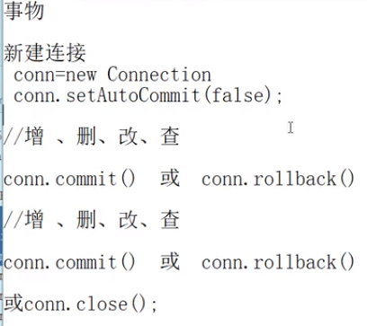
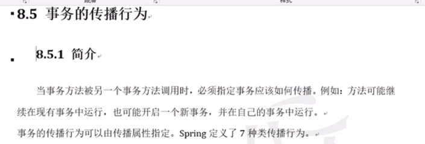
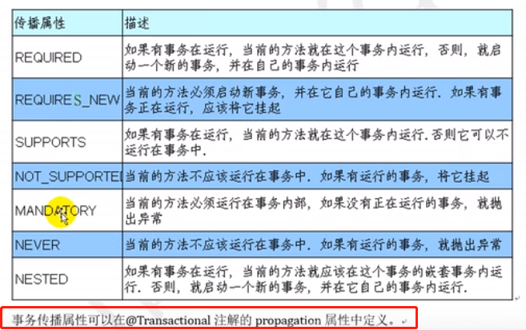
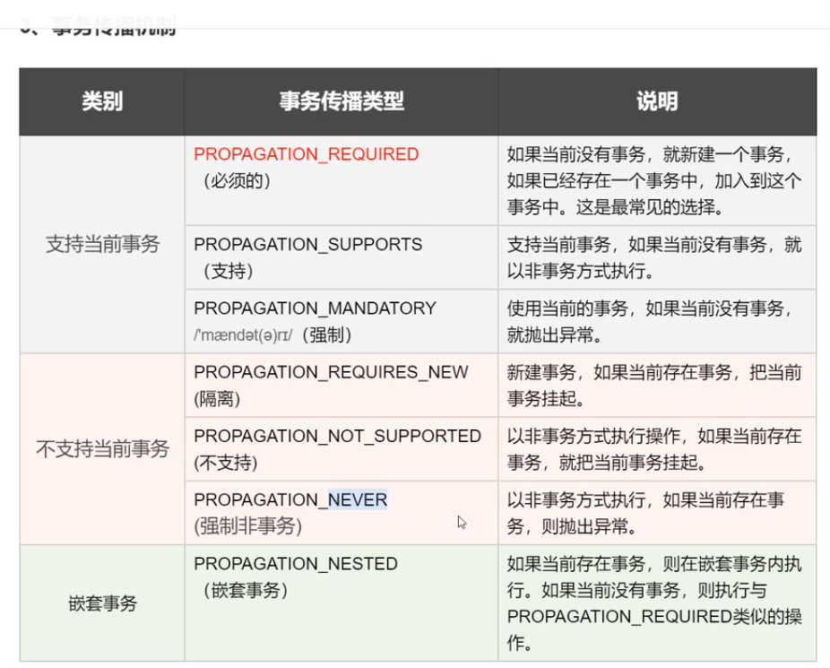
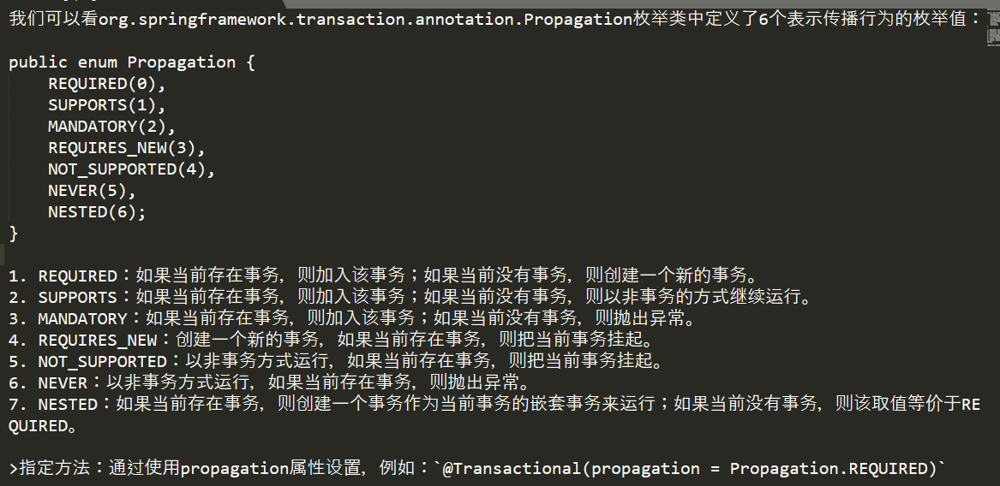

# 什么叫同一事务

# 什么是事务的传播行为

    一个方法运行在了一个开启了事务的方法中时，当前方法是使用原来的事务还是开启一个新的事务
    这个就是事务的传播行为

# 事务的传播行为如何设置呢?

    事务的传播行为 使用@Transactional中的一个属性叫Propagation来设置.

# 事务的传播行为分类

    面试: 事务的隔离级别都要记住, 传播行为记住required即可.(其他的一般不怎么配置.)
