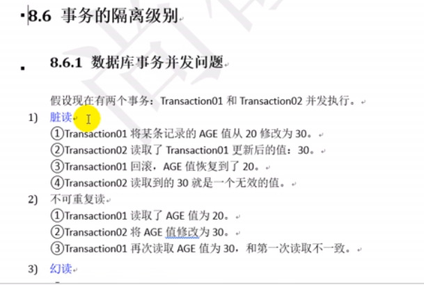
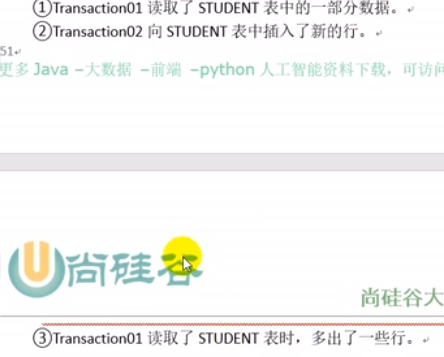
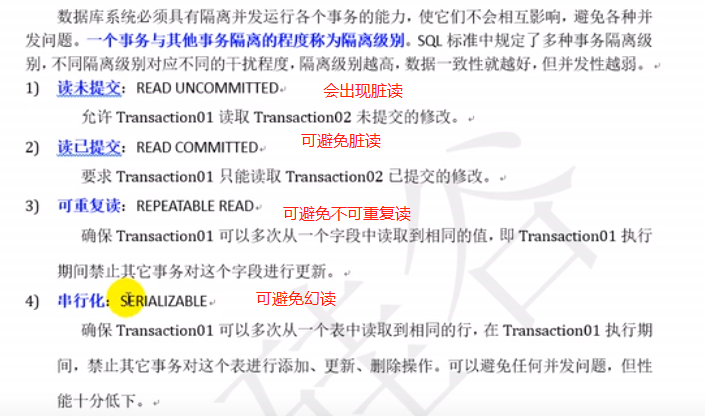
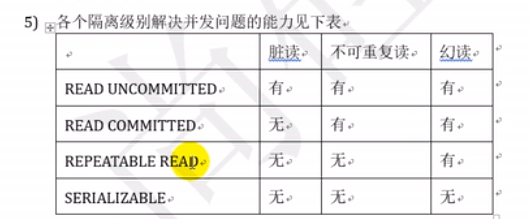
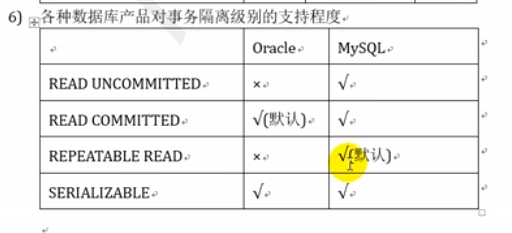

# 数据库事务并发问题

    脏读: 当前事务读到了其他事务更新,但是还没有提交的值,如果其他事务回滚了,那么当前事务读到的值就是无效的.
    
    注意： 只有脏读是当前事务 读到 其他事务没有commit到数据库的值，不可重复读和幻读都是读到其他事务已经commit到数据库的值。

    不可重复读： A事务读取age为20，然后B事务将age改为30，并且已经commit到数据库，然后A事务再次读取age为30，
    和第一次读取不一致。

    幻读: 事务A第一次读到明明是2行,再读的时候变成了4行,感觉好像出现了幻觉.(这中间 事务B插入了新的数据)

# 事务隔离级别

    读未提交: 可以读到别人没有提交的值.
    

    读已提交: 只要是别人提交的数据,我都可以读到.
    
    repeatable_read: 相当于在读的时候这个数据上一把锁,其他的事务更新不了这个数据
    但是依然会出现幻读,因为 其他事务虽然不能更新数据,但是可以插入一些新的行.
    
    serializable: 可以认为是把这个表给上了一把锁,其他人不能插入新的内容了,也不能更新这个表的相关字段了.
    
    并不是隔离级别越高越好,实际开发中一般使用 读已提交,因为其他事务已经提交过了,这个数据就是真实有效的.这个是我们常用的值.
        隔离级别越高,性能越差.

    mysql默认隔离级别是可重复读,也就是在一个事务中读到的值是一样的.

