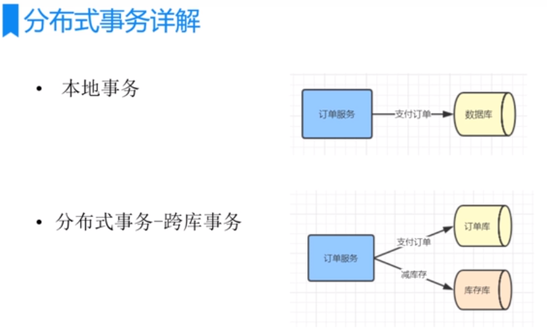

# 分布式事务

    本地事务: 如果订单和库存都是在同一个数据库中,直接使用spring事务管理就可以解决事务问题.
    
    同一个库使用的是同一个数据源: jdbc:mysql://localhost:3306/mydb,所以可以使用spring的@Transactional即可解决.

    单系统的跨库的分布式事务/微服务系统下跨系统的分布式事务.

    最早都是使用叫做 "两阶段提交协议(2PC)" 来解决分布式事务的提交问题的.(2pc面试的重点)

    大部分的分布式事务用的底层解决方案的最底层原理大部分就是两阶段提交.

# XA/JTA规范

    XA/JTA规范都是基于"两阶段提交协议"定制的规范标准.就是针对这个"两阶段提交协议"做具体的代码实现去解决分布式事务问题.

    单系统的跨数据库的事务也算做一种分布式事务,
    因为用我们常规的spring事务管理器是没办法帮我们解决垮裤事务问题的.我们可以使用两阶段提交来解决(2pc).

# 两阶段提交协议

举例单系统跨库的分布式事务: 我们希望"支付订单+减库存"2个事务要么同时都成功,要么都不成功.

比如说支付订单成功了,但是减库存失败了,具体的失败原因可能是:

- 库存不够减
- 执行减库存的时候,库存库给挂了.

这样就会导致2个事务不一致.

如果是第一步支付订单的时候就报错了,就直接抛异常了,就不会再进行减库存了.一般出现事务不一致的情况就是第一步操作支付订单成功了,第二步减库存失败了.这种情况下,比较容易出现.

两阶段提交协议是怎么帮我们解决跨库的事务一致性问题是怎么做的呢?

首先会引入一个叫事务管理器的东西(也就是一个事务中间协调者的概念),我们在执行完订单支付和减库存操作后,注意这里不是把订单和减库存马上提交,而是执行完了之后,把执行的结果(你是执行成功还是执行失败)告诉事务管理器,也就是把sql执行以下,但是还没有执行commit操作,订单和减库存都先这么做.先把sql执行,都先不要commit,然后把执行的结果告诉事务中间协调者.

然后如果中间协调者收到了跨库每个库的sql操作都执行成功之后,如果这些跨库的sql都是执行成功的,然后事务中间协调者会正常的通知订单库和库存库去提交各自的事务.

第一阶段: 预提交(预先锁定资源-这里就是锁定库存,订单数据,预先校验数据库,缓存中间件服务是否都是正常),并不是真正的提交,就是sql执行完,只要不提交,其他的事务是看不到你的提交数据的.这个跟事务隔离级别有关,也就是在数据库里面,你还看不到订单数据被修改,但是sql语句已经执行了,说白了就是把资源给锁住了,把订单和库存的那行数据给锁住了,但是还没有提交.(这里库存库执行成功意思就是库存是够减的,这样2阶段就可以避免因为库存不够减而导致的不一致)

如果第一阶段2个事务都成功了,那么第二阶段做的就是commit操作,也就是由我们的事务管理器去通知所有的数据库去提交数据.

如果第一阶段中,有一个提交报错了,只要有任何一个报错了,第二阶段做的就是数据的rollback操作.

一般第一阶段成功后,第二阶段成功的概率非常高.

这就是2阶段提交的底层思想.

可能出现的问题: 第二阶段如果通知订单库提交数据成功了,但是通知库存库提交事务给失败了.

分布式事务不可能100%的解决,无论任何公司,只可能尽量提高成功概率,99.99%,4个9,很多情况下是不可能100%的解决的,但是我要尽量提高成功的概率.

2pc可以大大提高执行成功的概率.

2阶段可以避免因为库存不够减而导致的不一致,如果第一阶段减库存失败.第二阶段直接回滚了,不会产生数据不一致性.

第一阶段执行完后马上就执行第二阶段,这个速度是很快的.

有一个问题: 第一阶段2个都执行成功了,但是执行第二阶段的时候,库存库给挂了,就没法commit成功了,这个怎么办?

实际上第一阶段和第二阶段之间执行的时间间隔非常短,可能用了几毫秒的时间,或者几十毫秒,实际上你第一阶段执行的好好的,过了几十毫秒,执行第二阶段的时候,数据库挂掉出现的概率是很小很小的,这种情况我们忽略

还有一种情况,第一阶段提交成功,但是第二阶段通知订单库成功了,但是通知库存库时因为网络问题,导致没有通知成功,也会导致数据不一致,这种情况下,事务中间协调者会进行重试提交,假如一直重试不成功,就要把这些情况记录日志(根据日志发报警,短信通知到人工,让人工介入,),后来通过定时任务去补偿,要么就是人工介入.
这种就是极端情况下出现的问题,就需要人为写脚本解决了.

分布式事务不可能100%的解决,只能尽可能的提高成功的概率.

# 解决方案

传统软件公司喜欢用atomkos这个框架(开源的解决分布式事务的中间件).这个框架可以解决跨库的事务的问题,它的底层实现就是2pc.

atomikos在互联网公司用的很少.互联网公司用的都是tcc两阶段补偿型方案解决. 

