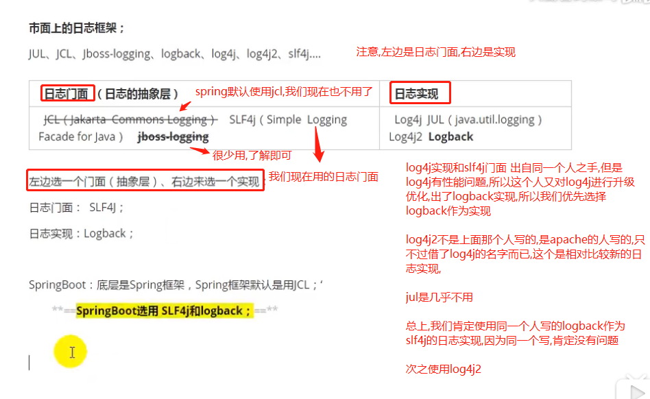
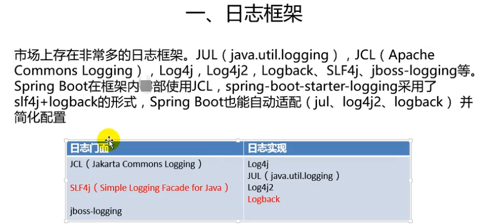

# 市面上的日志框架对比

    这三个都属于日志门面:
        JCL（Jakarta  Commons Logging）: JCL来源于名字的缩写,最后一次更新是2014年,廉颇老矣,尚能饭否,也不用.
        SLF4j（Simple  Logging Facade for Java）    
        jboss-logging: 这个用的太少了,生来就不是给普通程序员用的,hibernate使用的日志门面就是jboss-logging

    SLF4j和Log4j,以及logback都是出自同一个人.SLF4j门面,log4j和logback是实现,logback是对log4j的优化升级.

    SpringBoot底层是Spring框架，Spring框架默认是用JCL(使用的JCL门面的具体实现是commons-logging.jar)
    而SpringBoot和我们一样机智,选用 SLF4j和logback
    注意区分springboot和spring,spring框架的jar的groupId都是org.springframework,
    而springboot框架的jar的groupId都是org.springframework.boot

    Spring（commons-logging）、Hibernate（jboss-logging）

    具体使用的时候,我们要导入日志门面的jar包和具体实现的jar包
    
    比如使用SLF4J作为日志门面,对应的jar就是slf4j-api.jar,应用层调用的就是这个jar的接口.
    
    然后给项目导入具体日志实现的jar.
    
    SLF4J: Simple logging Facade For Java

# 参考

- [slf4j理解](https://www.slf4j.org/manual.html)