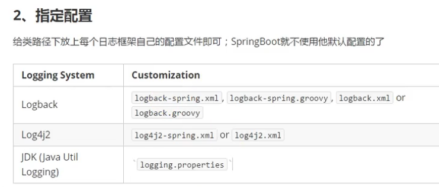
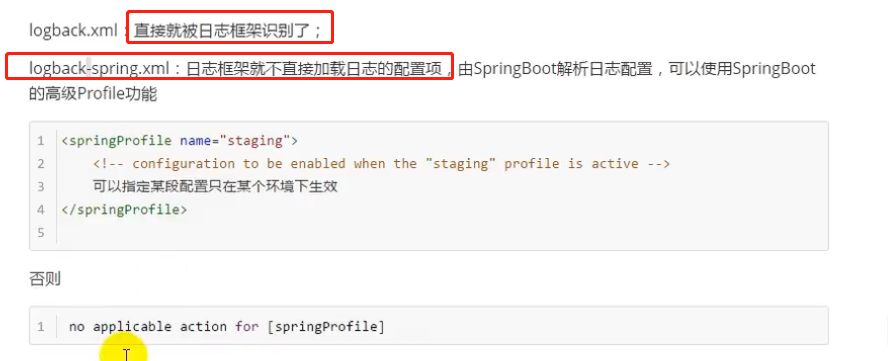
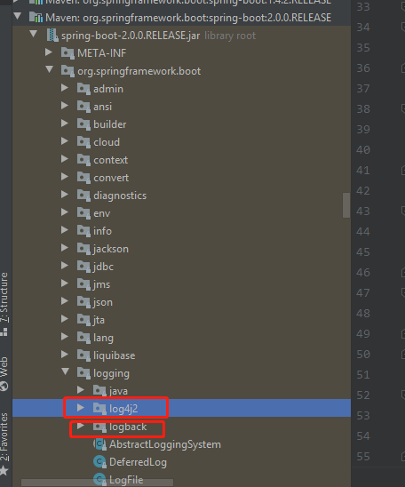
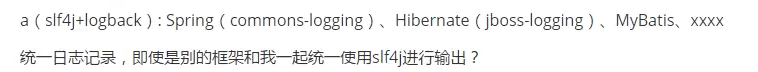
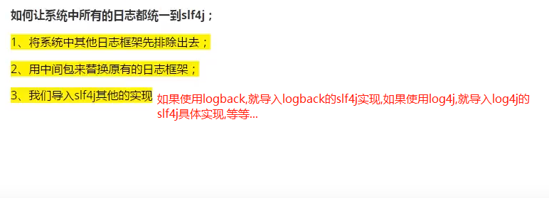
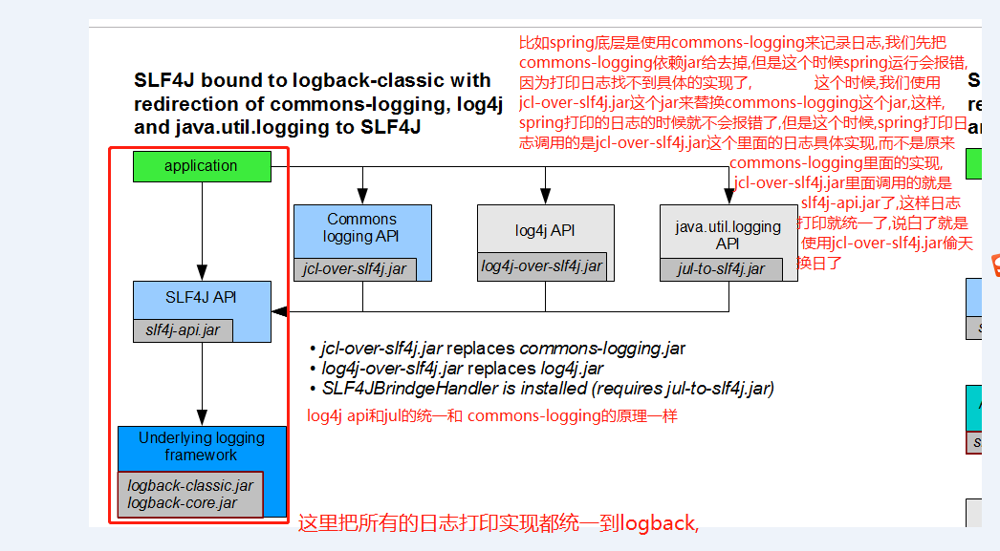
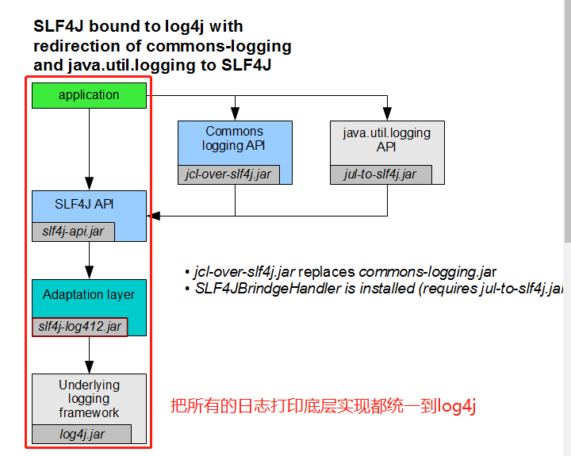
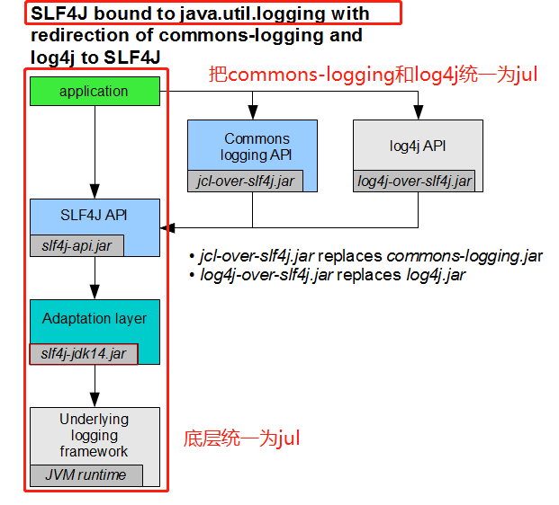

# 市面上的日志框架对比

    注意: spring底层使用的日志门面是JCL(Jakarta Commons Logging)
    使用的JCL的具体实现是commons-logging.jar
    
    hibernate使用的日志门面就是jboss-logging

    具体使用的时候,我们要导入日志门面的jar包和具体实现的jar包
    
    比如使用SLF4J作为日志门面,对应的jar就是slf4j-api.jar,应用层调用的就是这个jar的接口.
    
    然后给项目导入具体日志实现的jar.
    
    SLF4J: Simple logging Facade For Java

# SLF4J的使用原理

    我们以SLF4J+logback为例

# SLF4J门面实现框架的配置文件

    Logback：logback-spring.xml, logback-spring.groovy, logback.xml, logback.groovy
    Log4j：log4j-spring.properties, log4j-spring.xml, log4j.properties, log4j.xml
    Log4j2：log4j2-spring.xml, log4j2.xml
    JDK (Java Util Logging)：logging.properties

# 如何把其他框架中使用的日志框架转化成我们应用自己使用的日志框架?

比如,开发a系统的时候我使用slf4j+logback的方式,但是开发a系统的时候,我要依赖spring,hibernate,mybatis等框架,但是每一个框架底层也用到了日志框架,而且各不相同,比如spring底层就是使用JCL(Jakarta Commons Logging)来做日志记录的,hibernate使用jboss-logging来记录日志的,所以我们想统一日志的打印为slf4j,想让spring,hibernate等框架也是用slf4j+logback来打印日志,这样我们就可以只写logback的配置文件了,不用写其他框架的日志配置文件了,这样怎么来做了?

    把其他框架中使用的日志框架都统一成logback

    把其他框架中使用的日志框架都统一成log4j

    把其他框架中使用的日志框架都统一成jul

# 参考

- [slf4j理解](https://www.slf4j.org/manual.html)
- [日志框架的选择](https://www.bilibili.com/video/av63346402)
- [slf4j的使用原理](https://www.bilibili.com/video/av63346691)