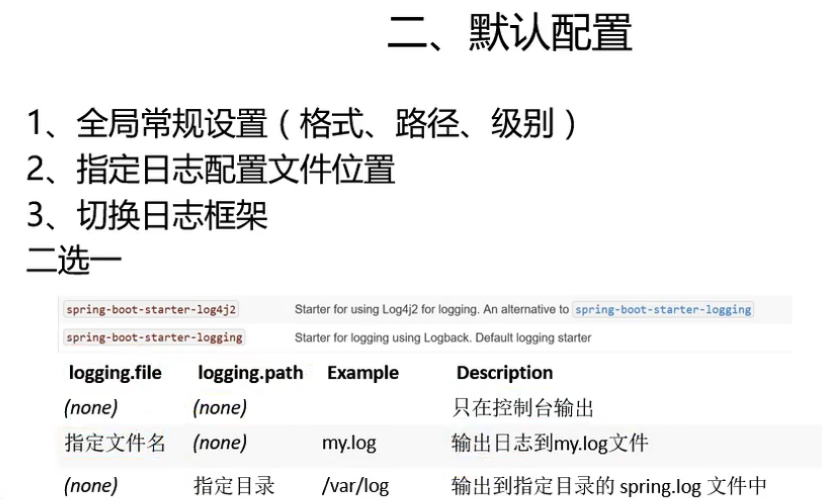

# springboot日志框架的底层依赖关系

    springboot默认使用SLF4J+logback来打印日志
    
    其中日志框架门面是SLF4J(对应slf4j-api这个jar包)。
        
    slf4j门面的具体实现是Logback(logback-classic.jar实现了slf4j)
    
    调用日志记录的方法，不应该直接调用实现类，而是调用日志抽象层里面的方法。

    

# Logback

>示例: logging-example