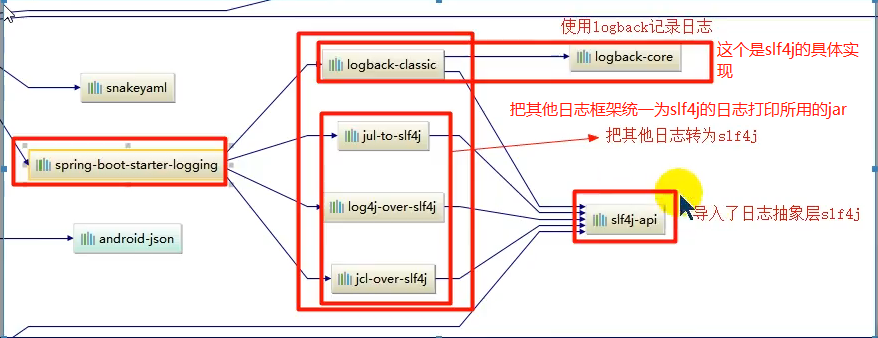
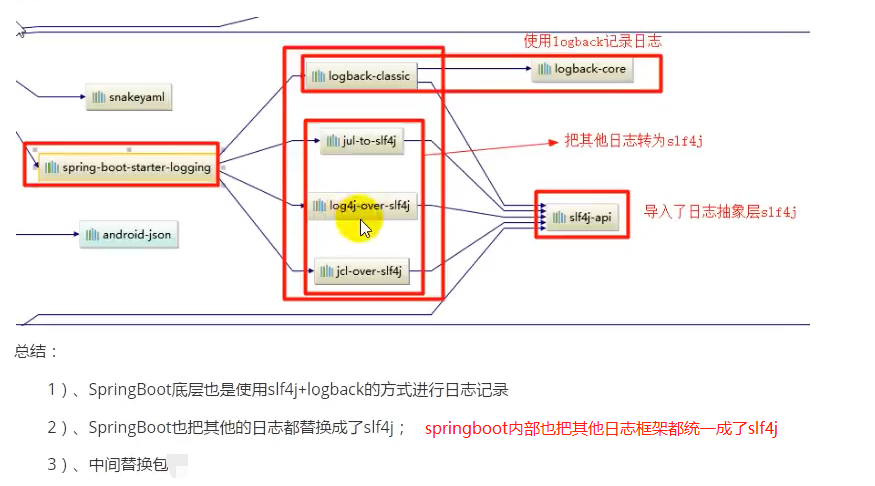
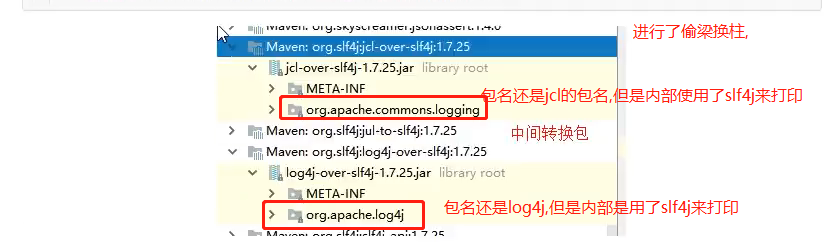
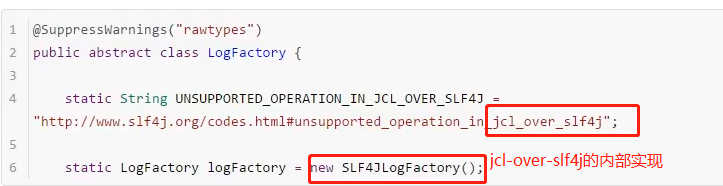
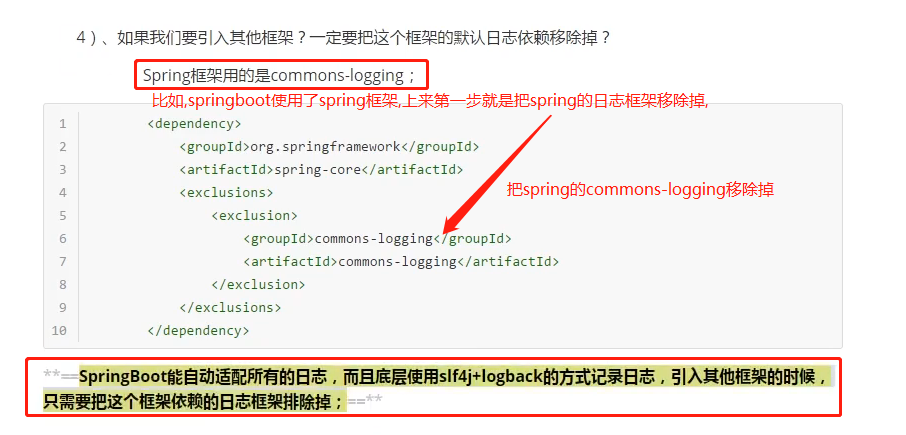

# springboot使用的日志框架

    springboot默认使用SLF4J+logback来打印日志
    
    其中日志框架门面是SLF4J(对应slf4j-api这个jar包)。
        
    slf4j门面的具体实现是Logback(logback-classic.jar 和 logback-core.jar实现了slf4j)
    
    调用日志记录的方法，不应该直接调用实现类，而是调用日志抽象层里面的方法。

    
    spring-boot-starter这个jar中帮我们自动导入了spring-boot-starter-logging.
    
# 接下来看一下 spring-boot-starter-logging是如何统一日志框架为slf4j+logback的?
    
    1) SpringBoot底层也是使用slf4j+logback的方式进行日志记录
    2) logback-core就是slf4的具体实现.
    3) SpringBoot中默认自动把其他的日志框架都统一成都成了slf4j
    4）jul-to-slf4j/log4j-to-slf4j/jcl-over-slf4j都是为了统一日志框架,中间转换的jar包.
    

    统一之后,其他日志框架打印用的底层具体实现就是logback

# 这里以jcl-over-slf4j为例,看一下内部实现.看看是如何统一的.

    Spring框架用的日志门面是jcl,用的具体实现是commons-logging；
    
    如果要同一日志框架为slf4j+logback.第一步就是要移除这个spring使用的日志框架的具体实现commons-logging.
    

    SpringBoot能自动适配所有的日志，而且底层使用slf4j+logback的方式记录日志，
    引入其他框架的时候，只需要把这个框架依赖的日志框架的具体实现的jar 排除掉即可,这样就能统一使用slf4j+logback了
