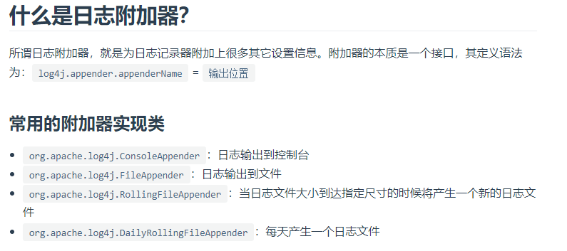

# SLF4J各种实现的具体配置文件

    给类路径下放上slf4j每个具体实现自己的配置文件即可；SpringBoot就不使用他默认配置的了

    Logback：logback-spring.xml, logback-spring.groovy, logback.xml, logback.groovy
    Log4j：log4j-spring.properties, log4j-spring.xml, log4j.properties, log4j.xml
    Log4j2：log4j2-spring.xml, log4j2.xml
    JDK (Java Util Logging)：logging.properties

    springboot对于常用框架,比如logback/log4j2/jdk,都是由默认的配置文件的,具体配置文件所在位置:

    如果你使用了对应的框架,而且没有在yml/properties配置文件中修改日志相关的属性的话,就会使用上图中的默认配置.

# logback的配置文件

    logback.xml：这个配置文件可以 直接被logback日志框架识别,不用通过springboot就可以识别
    
    logback-spring.xml：就不能直接被logback框架所识别和加载, 而是由SpringBoot解析和识别，这样可以使用SpringBoot的高级Profile功能

# log4j配置文件说明

>示例: aop-springboot