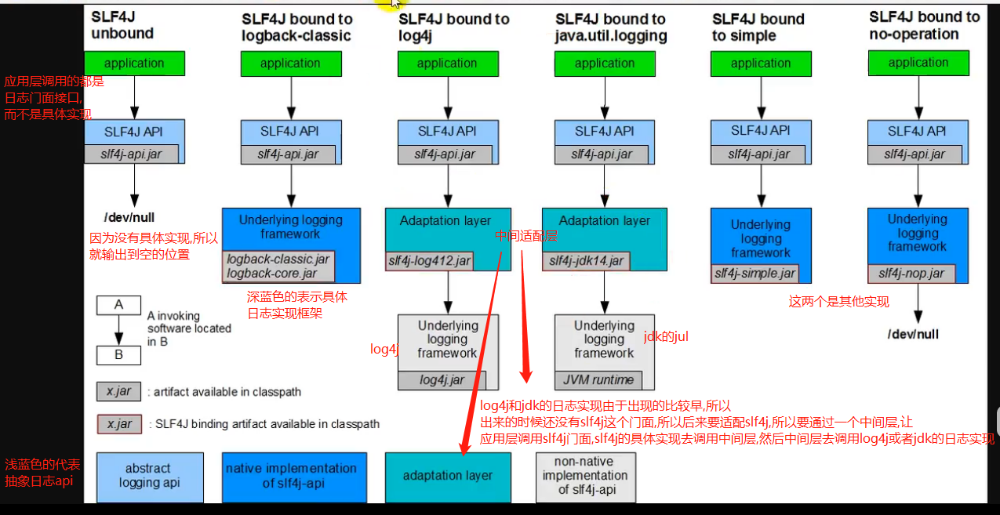

# logback/log4j/log4j2/jdk通过导入什么jar来成为slf4j的具体实现?

    看图可知:
    slf4j-api.jar 定义了slf4j接口,这个是统一都要导入的.
    
    - logback需要导入logback-classic和logback-core
    
    - log4j需要导入org.slf4j.slf4j-log4j12这个jar,这是一个中间适配的jar,
    这个jar内部导入了slf4j-api.jar,log4j.jar
    
    - jdk需要导入slf4j-jdk14.jar
