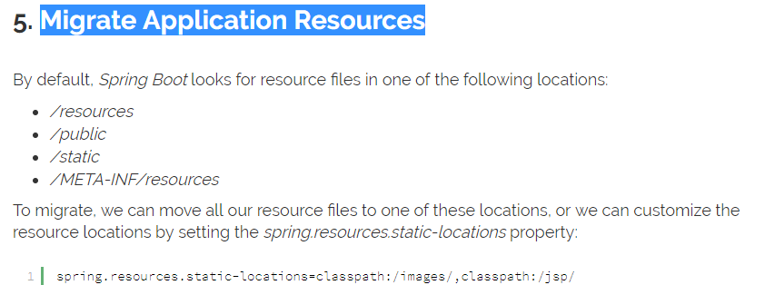
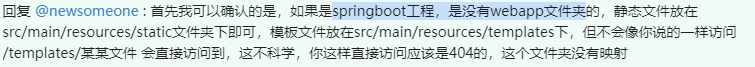
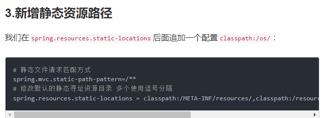
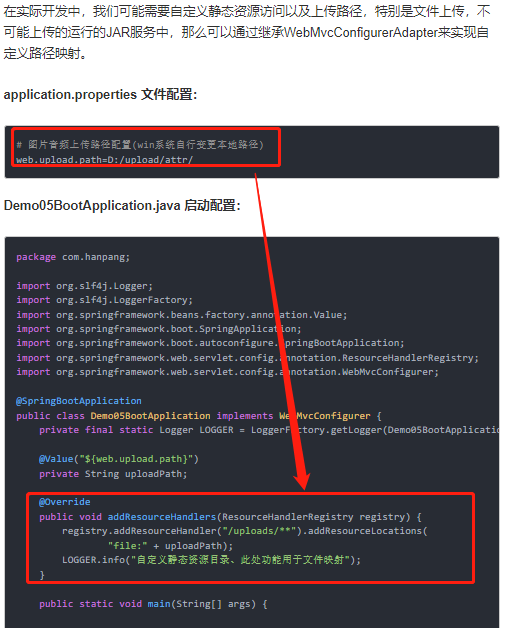
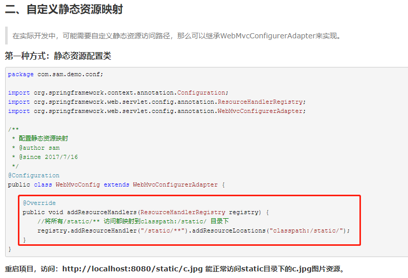
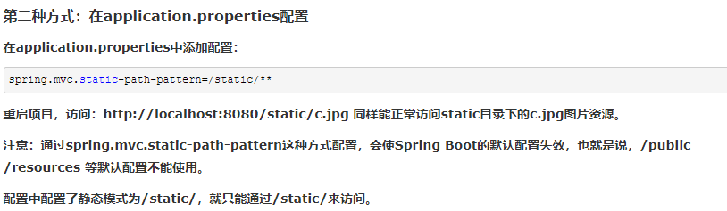

# 传统的基于web.xml静态资源

# Spring Boot Web项目中的静态资源

在我们开发Web应用的时候，需要引用大量的js、css、图片等静态资源。Spring Boot默认情况下,将放置在classpath下的以下文件夹中的文件视为静态资源文件，并将其映射为一个唯一的URL：

- classpath:/static
- classpath:/public
- classpath:/resources
- classpath:/META-INF/resources

我们可以在src/main/resources/目录下创建static，在该位置放置一个图片文件。启动程序后，尝试访问http://localhost:808/D.jpg。如能显示图片，配置成功。

# 新增静态资源路径

# 自定义静态资源映射

