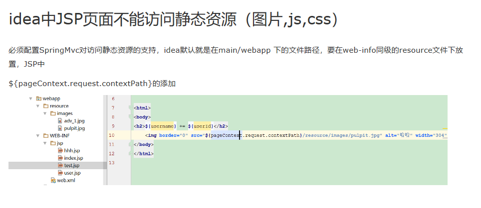
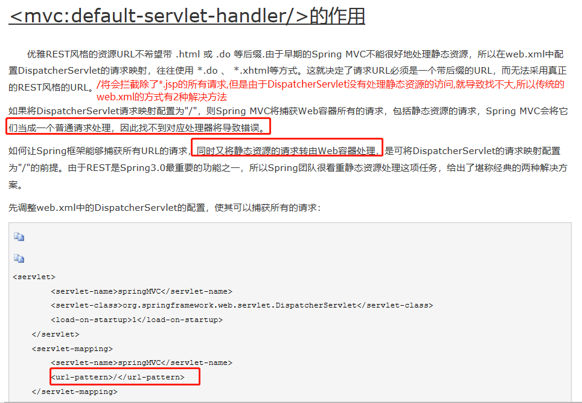
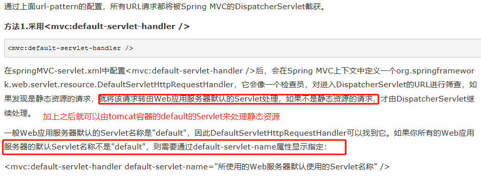
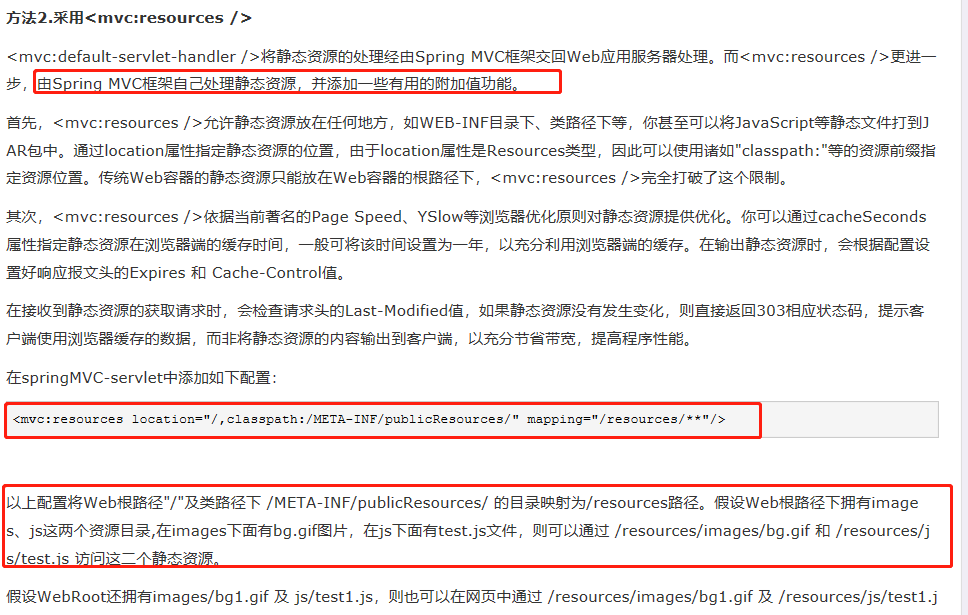

# 传统的基于web.xml的项目中静态资源的配置









```xml
    <!-- resources标签定义了我们可以放置静态文件的位置 -->
    <!-- Handles HTTP GET requests for /resources/** by efficiently serving
        up static resources in the ${webappRoot}/resources directory -->
    <resources mapping="/resources/**" location="/resources/"/>
```           
