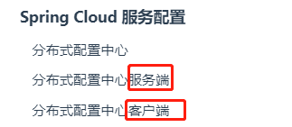
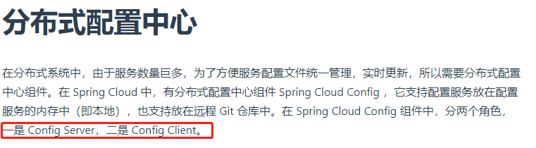
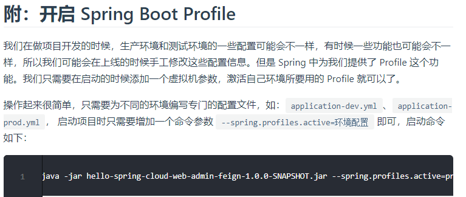
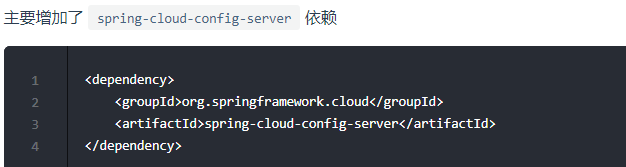
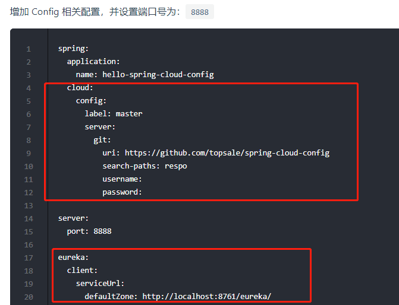
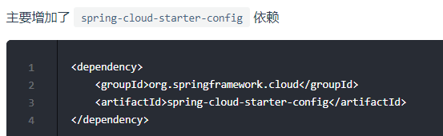
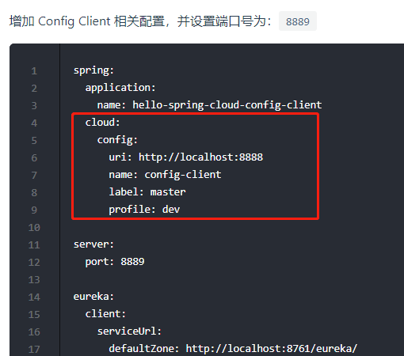

# 分布式配置中心

# Spring Cloud Config Server

# Spring Cloud Config Client

# SpringCloudConfig作用以及特点

1.  分布面临的问题是配置问题，每一个项目都有一个yml文件，不好运维管理，所有需要一套集中式的配置管理设施，SpringCloud提供了ConfigServer来解决这个问题。`SpringCloud Config是为微服务架构中的微服务提供集中化的外部配置支持。SpringCloud Config分为客户端和服务端，服务端也称分布式配置中心，它是一个独立的微服务应用，`用来连接配置服务器并为客户端提供获取配置信息，加密和解密信息等访问接口，客户端是通过配置中心获取配置信息.
2. Spring Cloud Config实现的配置中心默认采用Git来存储配置信息，所以使用Spring Cloud Config构建的配置服务器，天然就支持对微服务应用配置信息的版本管理，并且可以通过Git客户端工具来方便的管理和访问配置内容
3. 不需要在每一个服务部署的机器上编写文件，服务会向配置中心拉取自己的配置信息
当配置发生变动时，服务不需要重启即可感知配置的变化并应用新的配置
4. 将配置信息以REST接口的形式暴露
